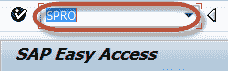
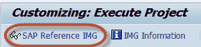
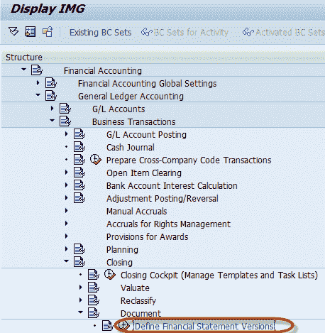
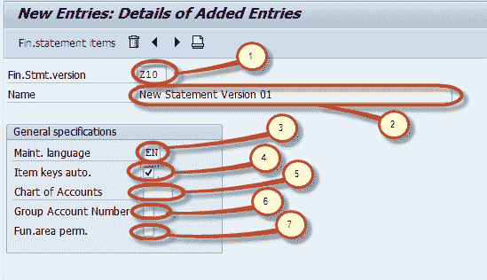
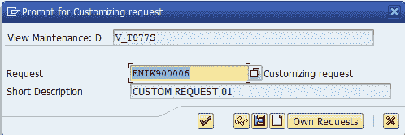
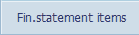
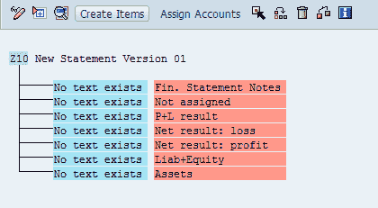
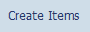

# 如何在 SAP 中创建财务报表版本（FSV）

> 原文： [https://www.guru99.com/how-to-create-financial-statement-version-fsv.html](https://www.guru99.com/how-to-create-financial-statement-version-fsv.html)

本教程将引导您完成创建财务报表版本的步骤

**步骤 1）**在命令字段中输入交易代码 SPRO

**步骤 2）**在下一个屏幕中，选择 SAP 参考 IMG

**步骤 3）**在下一个屏幕“显示 IMG”中导航以下菜单路径 SAP 自定义实施指南->财务[会计](/accounting.html)->总帐[会计](/accounting.html)->商业交易->结算->文档->定义财务报表版本

**步骤 4）**在下一个屏幕中，选择新条目

**步骤 5）**在下一个屏幕中，输入以下内容

1.  输入 FSV 密钥
2.  输入 FSV 的描述
3.  输入语言键指定显示文本，输入文本和打印文档的语言。
4.  输入此指示器，该指示器指定在定义财务报表版本时是手动分配还是自动分配 f.s 项目的键。
5.  如果在此处指定 COA，则在定义财务报表时只能分配此会计科目表中的科目。 如果未指定会计科目表，则在定义财务报表时可以分配多个会计科目表中的科目。
6.  输入此指标，该指标指定在定义财务报表版本时应分配组帐号而不是帐号。
7.  输入此指示符是因为可以在财务报表版本中分配功能区域或科目。

**步骤 6）**保留字段后，按保存  

**步骤 7）**保存财务报表版本后，您可以通过选择财务报表项目按钮
 编辑其结构项目

**步骤 8）**在下一个屏幕中，您可以维护版本对象中的节点一个新版本默认具有七个基本节点，如下所示

1.  财务报表附注
2.  未分配
3.  P + L 结果
4.  净结果：亏损
5.  净结果：利润
6.  负债+股权
7.  资产

我们可以通过双击节点来维护节点文本。 我们可以通过选择节点并按下创建项目按钮  为该节点创建子项目。新项目将被创建为所选节点的子节点。 我们可以通过选择节点并按 Assign Accounts 来将一个帐户或一组帐户分配给一个节点。  

以下是此类分配的示例。

1.  主节点“资产”
2.  子节点“现金&现金等价物”分配给资产。“零用现金”是分配给现金&现金等价物的子节点。其他节点也分配给现金&现金等价物，例如：支票，花旗银行帐户， 加拿大花旗银行梅隆银行
3.  用于分配帐户的帐户密钥图表
4.  分配给节点 Petty Cash 的帐户范围
5.  账户范围

**步骤 9）**维护结构后，按保存  ，我们已经成功创建了财务报表版本。