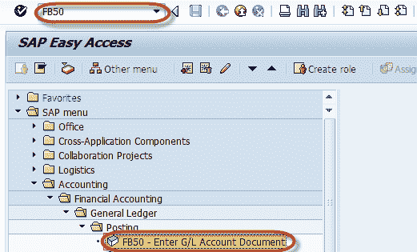
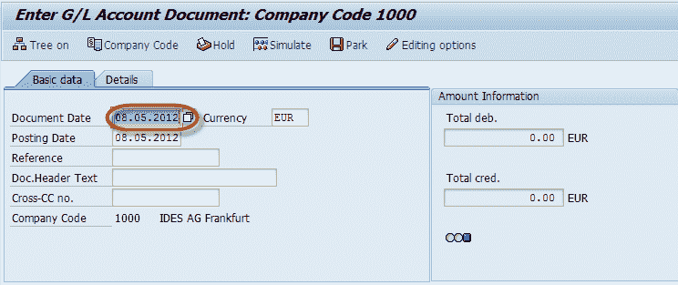
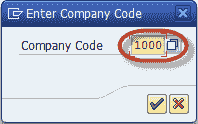
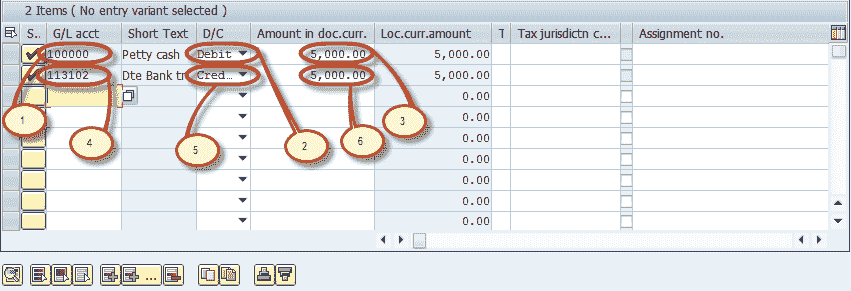
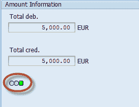
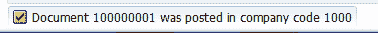
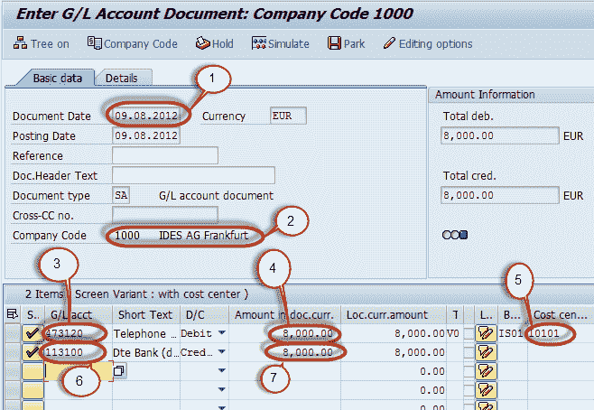

# 如何在 SAP 中执行日记帐分录 FB50

> 原文： [https://www.guru99.com/how-to-perform-a-journal-entry-posting.html](https://www.guru99.com/how-to-perform-a-journal-entry-posting.html)

在本教程中，您将学习-

1.  使用成本中心在 SAP 中进行总帐过帐
2.  过帐到 SAP 中的成本中心

## 使用成本中心在 SAP 中进行总帐过帐

我们将进行样本业务交易进行过帐。

Post General Ledger 5000 units of local currency are drawn from the house bank account in cash and put into petty cash.

**Step 1)** Enter the transaction code FB50

**步骤 2）**在下一个屏幕的标题部分
中输入凭证日期。

**步骤 3）**下一步选择按钮公司代码

**步骤 4）**输入交易的公司代码

在项目详细信息部分中，输入以下内容

1.  输入现金帐户作为借方
2.  选择借方
3.  输入要借的金额
4.  输入要贷记的银行帐户
5.  选择信用
6.  输入贷记金额

**步骤 5）**现在检查金额信息部分
中凭证的状态

**步骤 6）**在状态栏中生成凭证编号，以确认凭证过帐。

## 过帐到 SAP 中的成本中心

**步骤 1）**在 SAP 命令字段中输入事务代码 FB50

**步骤 2）**在下一个屏幕中，输入以下内容

1.  输入文件日期
2.  输入公司代码
3.  输入借项条目的总账科目，该科目将过账到成本中心
4.  输入借方金额
5.  输入要在其中过帐金额的成本中心
6.  输入总账科目以输入贷项
7.  输入信用额

**步骤 3）**按 SAP 标准工具栏的“保存”按钮以过帐凭证

**步骤 4）**在状态栏上查看成功输入的文档编号。

