# 在 SAP 中创建会计年度变式&分配给公司代码：完整教程

> 原文： [https://www.guru99.com/how-to-create-a-fiscal-year-variant.html](https://www.guru99.com/how-to-create-a-fiscal-year-variant.html)

在本教程中，您将学习-

*   如何创建会计年度变式
*   如何将公司代码分配到会计年度变式

## 如何创建会计年度变式

**步骤 1）**在 SAP 命令字段中输入事务代码 SPRO，然后按 Enter 键

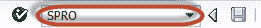

**步骤 2）**在下一个屏幕中，选择 SAP 参考 IMG

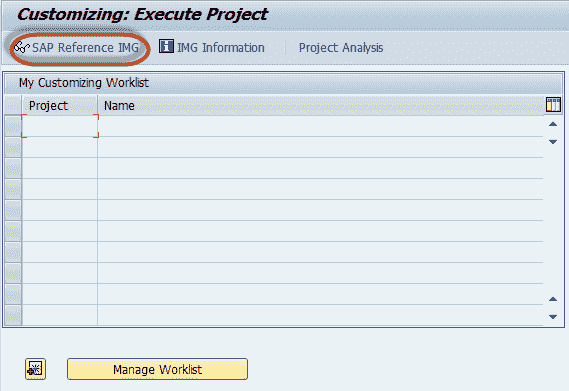

**步骤 3）**在下一个屏幕“ Display IMG”中，浏览以下菜单路径：

SAP 定制实施指南财务[会计](/accounting.html)->财务会计全局设置->会计年度->保持会计年度变化（保持缩短的会计年度）

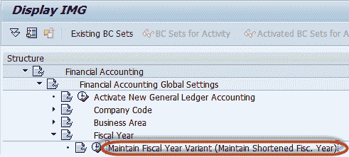

**步骤 4）**在下一个屏幕中，从应用程序工具栏中选择“新条目”

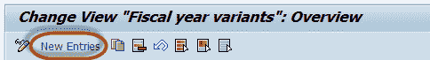

**步骤 5）**在下一个屏幕中，输入以下数据

1.  输入两位数的唯一会计年度变式密钥
2.  输入创建的变式的描述。
3.  如果“会计年度”取决于年份，即会计年度的开始日期和结束日期在各年之间发生变化，则选择此选项，通常用于缩短的会计年度。
4.  如果会计年度与日历年相同，即 Jan-Dec，则选择此选项。
5.  输入该会计年度的过帐期间数
6.  输入此会计年度的特殊过帐期间数，用于结束活动。

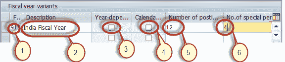

**步骤 6）**输入所有必需数据后，从标准工具栏中按保存

**步骤 7）**在下一个屏幕中，输入定制请求编号，您已经创建了新的会计年度变式

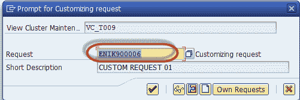

**步骤 8）**对于维护期间日期，即如果会计年度变式不是日历年，那么我们可以通过以下方式维护过帐期间：

1.  选择要维护期间的会计年度变式
2.  选择期间文件夹

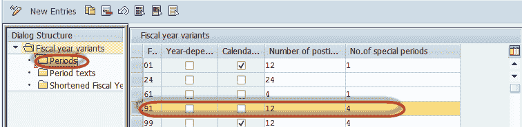

**步骤 9）**在下一个屏幕中，按升序维护会计年度的期间

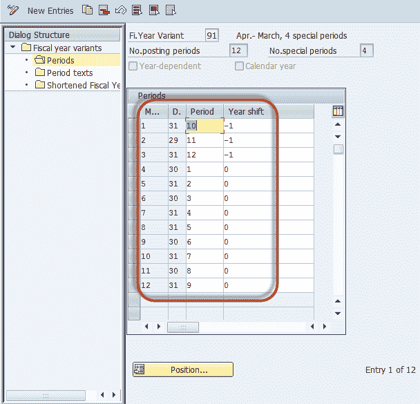

**步骤 10）**维护期间后，在 SAP Standard Toolbar 中按“保存”

## 如何将公司代码分配到会计年度变式

**Step 1)** Enter the Transaction code SPRO in the SAP Command Field and Press Enter

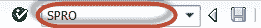

**Step 2)** In the next screen Select SAP reference IMG

**Step 3)** In next screen-"Display IMG" navigate the following menu path :

SAP 自定义实施指南->财务会计->财务会计全局设置->会计年度->将公司代码分配给会计年度变式

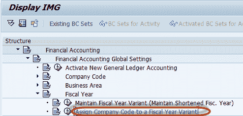

**步骤 4）**在下一个屏幕中，为列表中的公司代码分配相应的会计年度变式

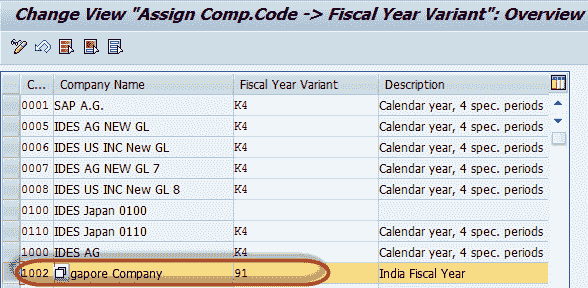

**步骤 5）**分配后，从 SAP Standard 工具栏中按“保存”

**步骤 6）**在下一个屏幕中，输入定制请求编号

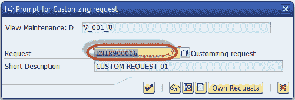

您已成功将公司代码分配给会计年度变式

您还可以通过公司代码全局参数设置在公司代码中分配会计年度变式。