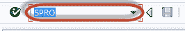
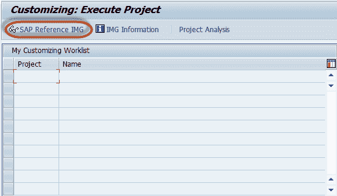
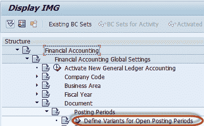
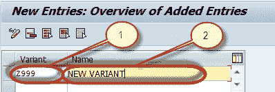

# 如何在 SAP 中定义过帐期间变式

> 原文： [https://www.guru99.com/how-to-define-posting-period-variant.html](https://www.guru99.com/how-to-define-posting-period-variant.html)

Enter the Transaction code SPRO in the SAP Command Field and Press Enter

在下一个屏幕中，选择 SAP 参考 IMG。

在下一个屏幕“显示 IMG”中，浏览以下菜单路径：

SAP 自定义实施指南->财务[会计](/accounting.html)->财务[会计](/accounting.html)全局设置->文档->过帐期间->定义未清过帐的变式 期间

在下一个屏幕中，按“新条目”按钮

在下一个屏幕中，输入以下内容

1.  输入唯一的过帐期间变式密钥
2.  输入变体说明

保留上述信息后，从 SAP Standard Toolbar 中按“保存”

在下一个屏幕中，输入定制请求编号

您已经成功定义了过帐期间变式