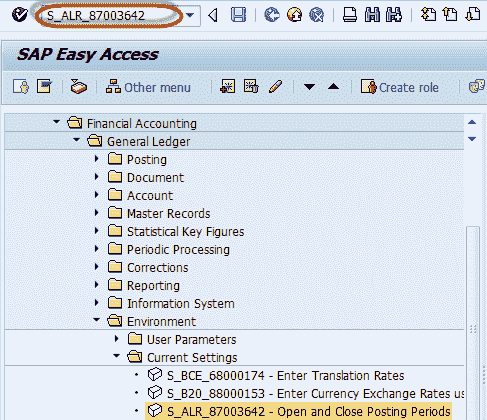
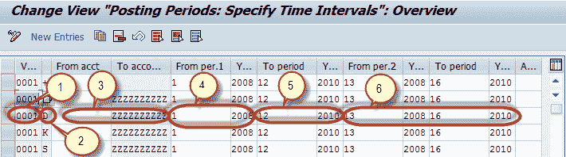
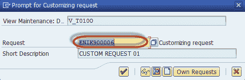

# 如何在 SAP 中过帐期间变式中打开和关闭期间

> 原文： [https://www.guru99.com/how-to-open-and-close-periods-in-posting-period-variant.html](https://www.guru99.com/how-to-open-and-close-periods-in-posting-period-variant.html)

Enter the Transaction Code S_ALR_87003642 in the SAP Command Field

在下一个屏幕中，定位要维护的变式以及要打开或关闭期间的帐户类型。

通过以下步骤更改期间

1.  选择过帐期间变式
2.  选择账户类型
3.  输入您要更改期间的帐号范围
4.  根据分配给过帐期间变式的公司代码的会计年度变式输入打开期间。
5.  输入要过帐的期间
6.  输入您要打开的任何特殊期间

对于上述帐户范围，所有其他期间将保持关闭状态，以便过帐

维护期间后，从 SAP Standard Toolbar 中按“保存”

在下一个屏幕中，输入定制请求编号

您已成功维护过帐期间变式中的期间