# 如何在 SAP 中定义字段状态变式&字段状态组

> 原文： [https://www.guru99.com/how-to-define-field-status-variant-and-field-status-group.html](https://www.guru99.com/how-to-define-field-status-variant-and-field-status-group.html)

在本教程中，您将学习-

*   如何定义字段状态变式和字段状态组
*   如何将字段状态变量分配给公司代码

## 如何定义字段状态变式和字段状态组

**Step 1)** Enter the Transaction code SPRO in the SAP Command Field and Press Enter

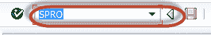

**步骤 2）**在下一个屏幕中，选择 SAP 参考 IMG

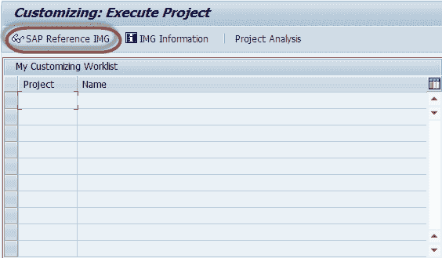

**步骤 3）**在下一个屏幕“ Display IMG”中，浏览以下菜单路径：

SAP 定制实施指南->财务[会计](/accounting.html)->总分类帐[会计](/accounting.html)->业务事务->总账科目过帐->进行和 检查文档设置->定义字段状态变式

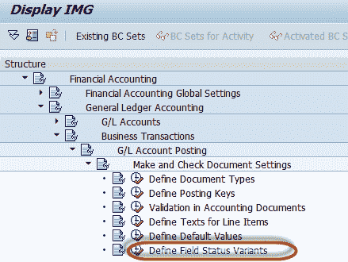

**步骤 4）**在下一个屏幕中，从应用程序工具栏中选择“创建”

**步骤 5）**在下一个屏幕中，输入以下内容

1.  输入唯一的字段状态变体键
2.  输入描述以用于字段状态变式

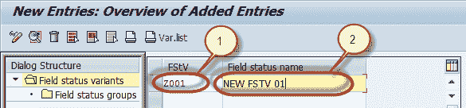

**步骤 6）**在下一步中，

1.  选择新的字段状态变式
2.  选择字段状态组文件夹

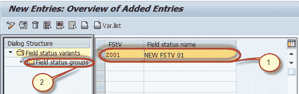

**步骤 7）**在下一个屏幕中，

1.  输入字段状态组作为字段状态变式
2.  选择字段状态组，然后按选择详细信息按钮

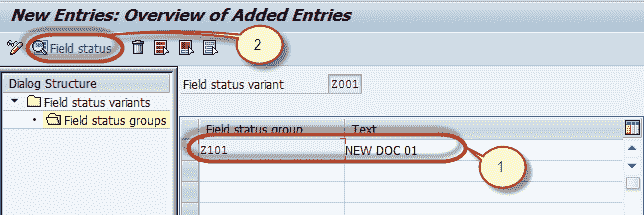

**步骤 8）**在下一个屏幕中，选择字段组以保持状态

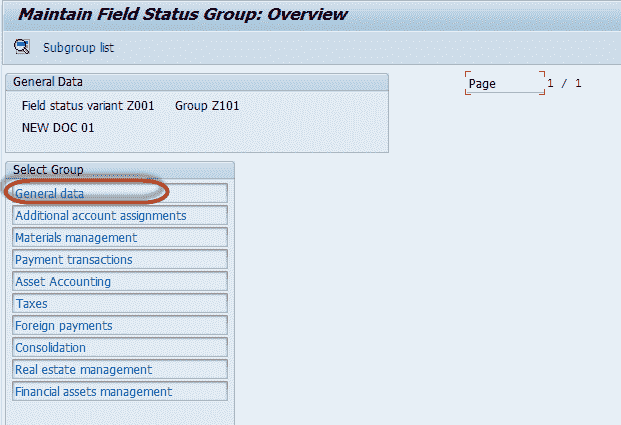

**步骤 9）**在下一个屏幕中，维护组字段的字段状态

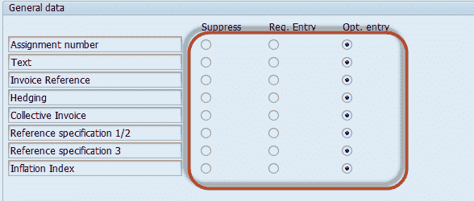

**第 10 步）**按“返回”以使用 SAP Standard Toolbar

同样，维护其他字段组，维护完所有组和字段状态组后，从 SAP Standard Toolbar 中按“保存”

**步骤 11）**在下一个屏幕中，输入定制请求编号

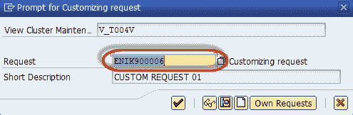

您已经成功创建了字段状态变式及其字段状态组

## 如何将字段状态变量分配给公司代码

**Step 1)** Enter the Transaction code SPRO in the SAP Command Field and Press Enter

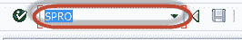

**Step 2)** In the next screen Select SAP reference IMG

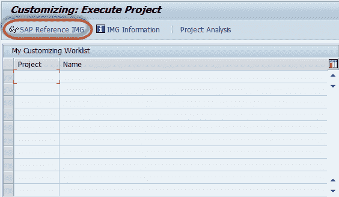

**Step 3)** In next screen-"Display IMG" navigate the following menu path :

SAP 自定义实施指南->财务会计->总帐会计->商业交易->总帐科目过帐->进行并检查单据设置->将公司代码分配到字段 状态变体

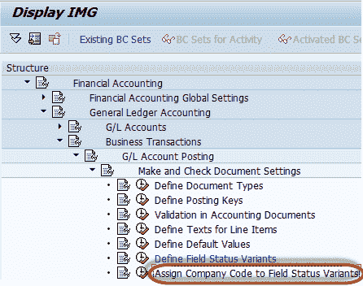

**步骤 4）**在下一个屏幕中，维护列出的公司代码的适当字段状态变式

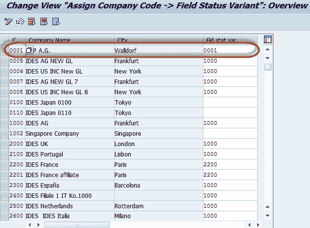

**步骤 5）**维护公司代码的字段状态变式后，从 SAP Standard Toolbar 中按“保存”

**步骤 6）**在下一个屏幕中，输入定制请求编号

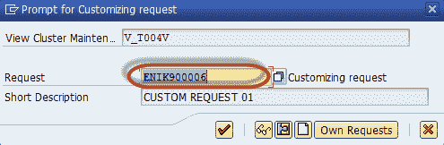

您已成功为公司代码分配了字段状态变量。