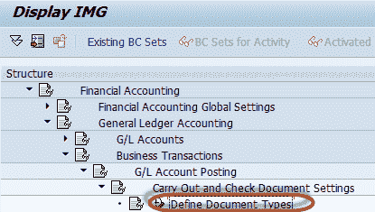
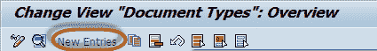
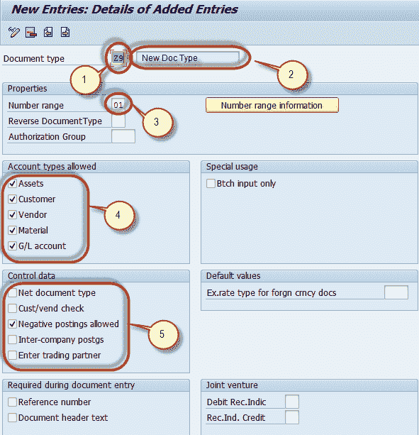
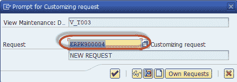
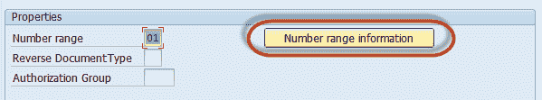
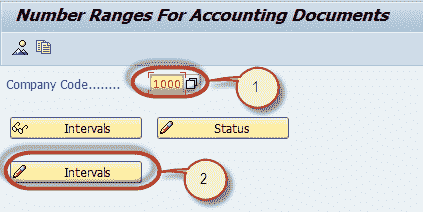
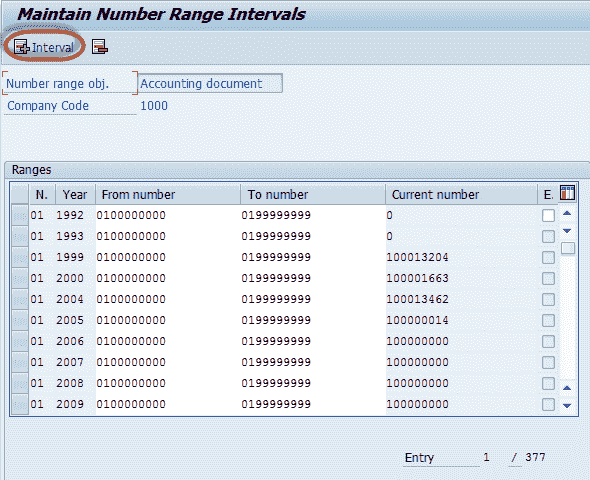
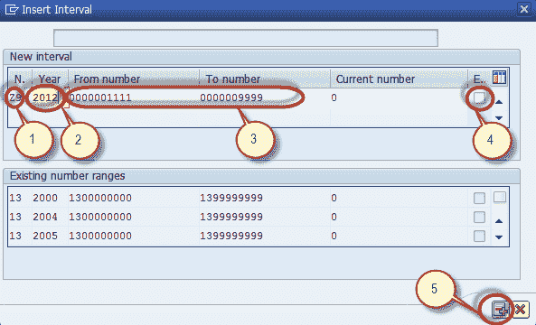
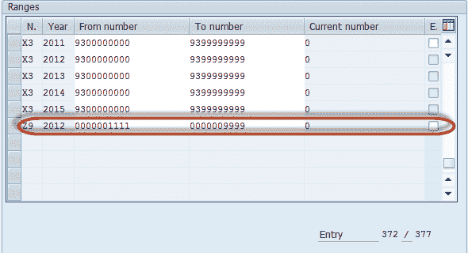

# 如何在 SAP FICO 中定义文档类型和编号范围

> 原文： [https://www.guru99.com/how-to-define-document-type-and-number-range.html](https://www.guru99.com/how-to-define-document-type-and-number-range.html)

在本教程中，我们将学习

*   如何定义文件类型
*   如何定义数字范围

**Step 1)** Enter Transaction Code SPRO in SAP Command Field

**步骤 2）**在下一个屏幕中，选择“ SAP Reference IMG”

**步骤 3）**在下一个屏幕“显示 IMG”中，遵循菜单路径

财务[会计](/accounting.html)->总帐会计->商业交易->总帐科目过帐->执行并检查凭证设置->定义凭证类型

**步骤 4）**在下一个屏幕中，按应用程序工具栏中的“新条目”按钮

**用于维护新文档类型**

**步骤 5）**在下一个屏幕中，输入以下内容

1.  输入唯一的文档类型密钥
2.  输入文件类型说明
3.  为文档类型选择一个数字范围
4.  在“允许的帐户类型”部分中，选择要过帐的帐户类型。
5.  在控制数据部分中输入适当的选择

**步骤 6）**按“保存”按钮

**步骤 7）**在下一个屏幕中，输入定制请求编号以创建新的总帐凭证类型

**用于维护新的数字范围**

**步骤 8）**在属性部分按“数字范围信息”按钮

**步骤 9）**在下一个屏幕中，

1.  输入您要维护其号码范围的公司代码
2.  按“更改间隔”按钮

**步骤 10）**在下一个屏幕中，按“插入间隔”按钮

**步骤 11）**在下一个屏幕中，

1.  输入唯一的数字范围键
2.  输入定义范围的会计年度
3.  输入范围的开始编号和结束编号，不要与其他编号范围重叠
4.  如果要在创建文档期间手动插入文档编号，请将其标记为外部
5.  按“插入”按钮

**Step 12)** In the next screen , the new number range is listed

## 带有说明的帐户类型清单

SAP 中的**标准文档类型**

| 帐户类型 | 描述 |
| 一个 | 资产 |
| d | 顾客 |
| 至 | 供应商 |
| 中号 | 材料 |
| 小号 | 总帐科目 |

**如何定义数字范围**

| SAP 中的凭证类型 | SAP 中文档类型的描述 |
| AA | 资产过帐 |
| 从 | 会计凭证 |
| 自动曝光 | Accounting doc |
| 的 | 部门 贴子 |
| 一个 | 净资产过帐 |
| C1 | 关闭 GR / IR 帐户 |
| CI | 客户发票 |
| CP | 客户付款 |
| DA | 顾客 |
| D B | 客户定期录入 |
| DE | Customer invoice |
| 危险品 | 客户贷项凭证 |
| 博士 | Customer invoice |
| DZ | Customer payment |