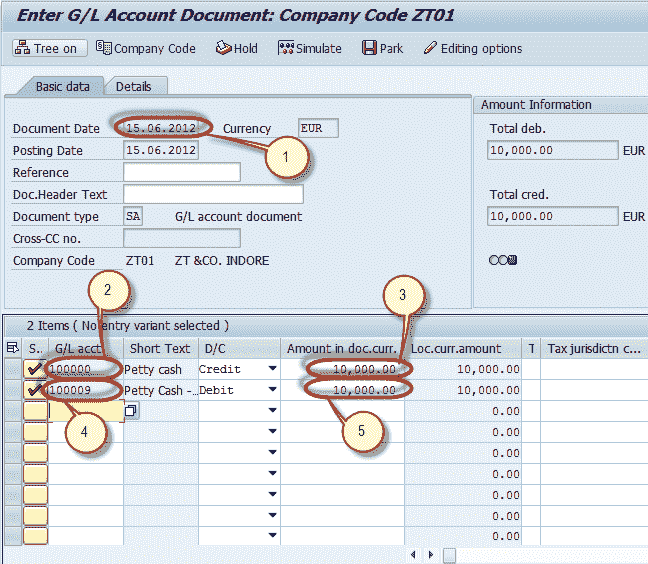
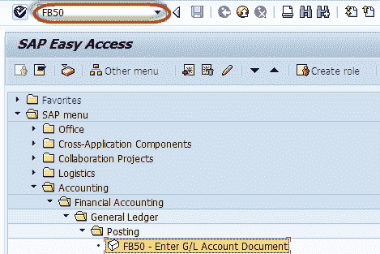
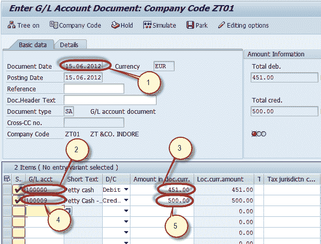
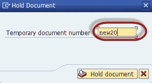
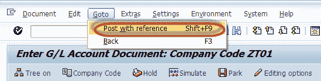
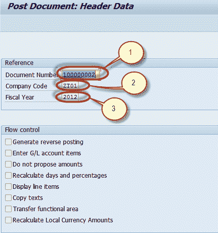
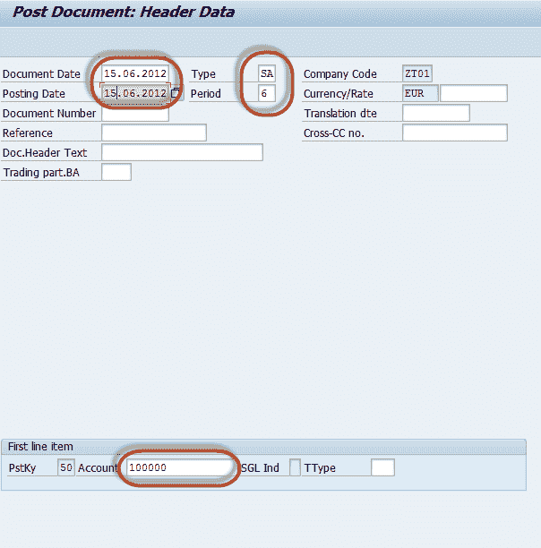
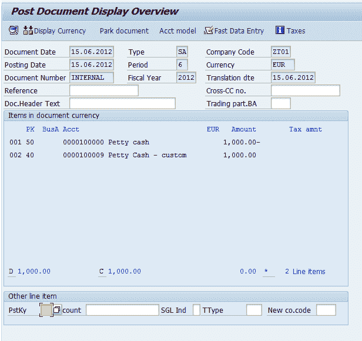

# 总帐凭证教程：在 SAP 中暂留，暂存，过帐过帐

> 原文： [https://www.guru99.com/how-to-post-a-document-with-reference.html](https://www.guru99.com/how-to-post-a-document-with-reference.html)

在本教程中，您将学习-

*   如何暂存总帐凭证过帐
*   如何进行总帐凭证过账
*   如何在 SAP 中过帐带有参考的文档

## 如何暂存总帐凭证过帐

在 SAP 中，可以为用户提供有限的授权金额以进行过帐。

例如，会计人员有权发布最大金额为$ 5000 的文件。 。在送入文件时，他发现该文件的金额为 10000 美元，但他没有权限。

在这种情况下，SAP 为文档提供了**暂存**功能，该功能允许用户保存文档，但金额未在总账科目中过帐。该文档可以稍后使用 由具有适当过帐金额授权的高级授权人员审核。 批准后，该凭证将过账到总账科目中。

这是存放总账科目凭证

的演示

**步骤 1）**在 SAP 命令字段中输入总帐科目过账的交易代码 FB50

**步骤 2）**在下一个屏幕中，输入以下内容

1.  输入文件日期
2.  输入要贷记的总账科目
3.  输入信用额
4.  输入要借记的总账科目
5.  输入借方金额

**步骤 3）**按下驻车按钮

**步骤 4）**检查 Park 文档编号的状态。

## 如何进行总帐凭证过账

用户可能希望在以下情况下临时保存文档

*   总帐凭证不完整
*   用户没有完整或准确的信息
*   用户想在以后完成或更正文档

在这种情况下，您可以保留凭证而无需在总账科目中过帐凭证金额。 这是持有总帐科目凭证的演示

**步骤 1）**在 SAP 命令字段中输入总帐科目过账的交易代码 FB50

**Step 2)** In the next screen , Enter the following

1.  输入文件日期
2.  输入要贷记的总账科目
3.  输入信用额
4.  输入要借记的总账科目
5.  输入借方金额

**步骤 3）**按下保持按钮

**步骤 4）**在下一个屏幕中，输入临时文件编号，然后按保留文件

**步骤 5）**检查状态栏以保留文件

## 如何在 SAP 中过帐带有参考的文档

**Step 1)** Enter Transaction code FB50 in the SAP command Field

**步骤 2）**在下一个屏幕中，从 SAP Standard 菜单栏中选择转到->带参考的过帐

**步骤 3）**在下一个屏幕中，输入以下内容

1.  输入参考文件编号
2.  输入文件过帐的公司代码
3.  输入过帐的会计年度
4.  按 Enter

**步骤 4）**在下一个屏幕中，对文档进行适当的更改

**步骤 5）**按 Enter，在下一个屏幕中，检查文档

**步骤 6）**按保存，以发布新文档

