# 如何安装 SAP IDES for Practice

> 原文： [https://www.guru99.com/install-sap-ides-practice.html](https://www.guru99.com/install-sap-ides-practice.html)

## 什么是 SAP IDES？

IDES 是 SAP AG 开发的演示 SAP 系统，用于学习，培训和目的。 IDES 代表 **I** 互联网 **D** 演示和 **E** 评估 **S** 系统。

SAP IDES 是最终用户或顾问熟悉 SAP 或掌握 SAP ERP 的简便方法。

本文档将向您说明 IDES 服务器的安装，以供学习和练习之用。 安装 IDES EHP6 服务器之前，需要满足一些先决条件。 我们需要安装媒体，媒体列表如下所示：

*   j2sdk-1_4_2_17-windows-amd64.exe
*   IDES EHP6 安装大师
*   IDES EHP6 安装导出
*   NW703 内核 720_Ext
*   SL 控制器 720
*   MS [SQL](/sql.html) RDBMS
*   SAPCRYPTOGRAPHIC 库
*   JCE（Java 密码学扩展）策略

以上介质在 SAP Marketplace 上可用。 将其下载并存储在本地硬盘上。 我们经历的是软件需求，现在让我们专注于硬件需求。 对于安装，我们需要服务器

*   4 GB 以上的 RAM
*   600 GB 硬盘
*   Intel i3 处理器 64 位及以上
*   Windows Server 2006 R2 操作系统。

注意：您也可以在 [Linux](/unix-linux-tutorial.html) ，AIX 和 Sun Solaris 上安装 SAP。下面，我们解释了路线图和 SAP IDES 安装的每个步骤。

许多学习者需要安装步骤的视频，或者无权访问 SAP Marketplace 以下载必要的文件。
对于此类学生，我们建议您按照此[课程](http://click.linksynergy.com/fs-bin/click?id=bt30QTxEyjA&subid=&offerid=323085.1&type=10&tmpid=14537&RD_PARM1=https%3A%2F%2Fwww.udemy.com%2Fhow-to-install-your-own-sap-trial-system-free%2F%3Fpmtag%3D25OFFGURU99)的步骤逐步进行，以在笔记本电脑中安装 SAP。

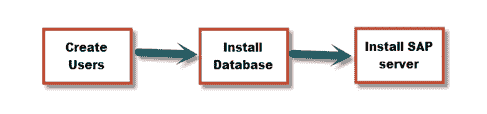 
图。SAP 安装路线图

**安装步骤：**

1.  您要安装 IDES 的服务器的主机名不能超过 13 个字符，否则在安装过程中会出现错误。
2.  将虚拟内存增加到服务器物理内存的三倍，或者理想情况下，可以使其达到 20 GB。
3.  安装 [Java](/java-tutorial.html) -j2sdk-1_4_2_17-windows-amd64.exe 并设置 JAVA_HOME 环境变量。 Windows Server 2008 R2 在操作系统软件包中具有 Java 组件。
4.  在开始安装 SAP IDES 之前，需要确定系统标识符（SID）和实例编号（00）。 在这里，我们将使用 SID = IDS 和实例号= 00。
5.  现在转到安装主介质，并遵循如下所示的路径：SAPCD（F：）/ INST_MAST / IM_WINDOWS_X86_64 / sapinst 并双击“ sapinst”，如图 1 & 2 所示。

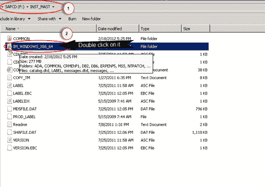

图。1

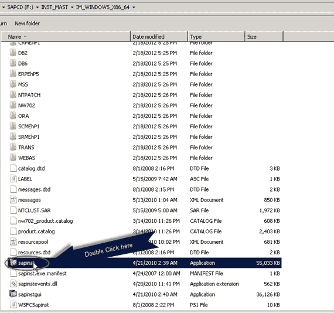

图 2

6.  双击“ sapinst”后，将打开 sap 安装 GUI，如图 3 所示。
7.  现在，按照图 3 所示的路径，选择先决条件检查，然后单击下一步。

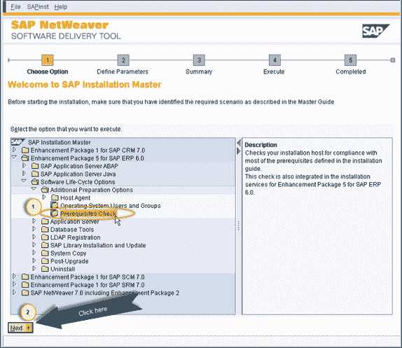

图 3

8.  需要先决条件检查，因为如果缺少任何先决条件，那么它将在此阶段向您显示。 一旦单击了下一个，它将带您进入下一个屏幕，如图 4 所示。在安装母版 DVD 上有一个数据文件可检查先决条件。 一旦转到下一个屏幕，它将自动检测.xml 文件，或者您可以浏览安装主 DVD 的“ PREREQUISITE_CHECK_DATA.XML”，然后单击下一步。

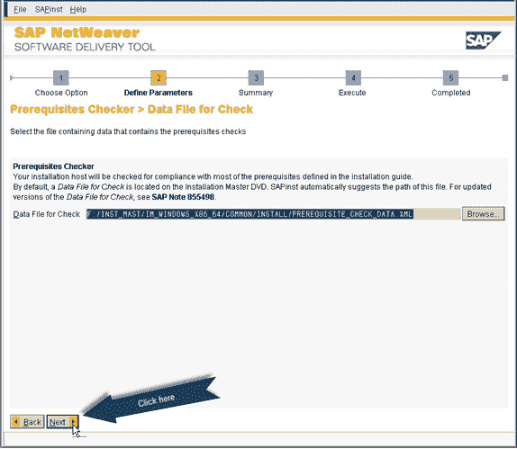

图 4

9.  在安装 ABAP 堆栈时，我们需要检查图 5 中所示的选项，然后单击下一步。

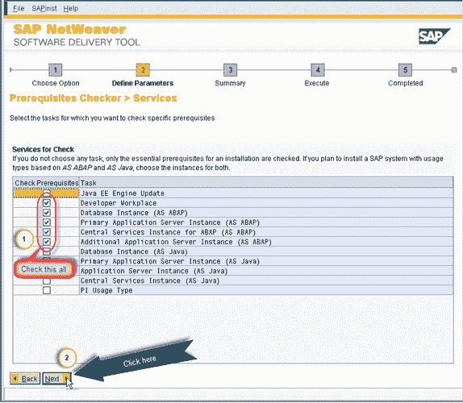

图 5

10.  在图 6 的下一个屏幕上，它将要求数据库提供汁液。 在这里，我们将在 MS SQL 数据库上安装 SAP，因此我们选择了 MS SQL 服务器选项。 如果您打算安装另一个数据库，则可以从图 6 中突出显示的下拉选项中选择它。

图 6

11.  在下一个屏幕上，您必须提到安装 Java 环境的 JAVA_HOME 路径，同时我们还要安装 Unicode，因此请全部选中，然后单击下一步。

图 7

12.  在下一个屏幕图 8 上，它将要求您查看所选的选项。 如果要更改选择，则可以选择“修订”选项。 否则，选择下一步，它将执行前提条件检查。

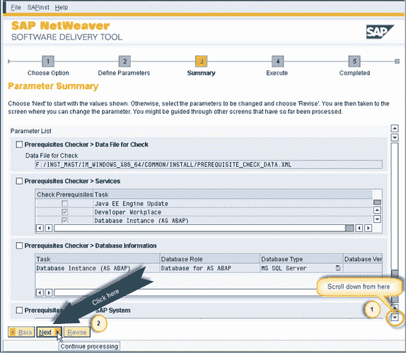

图 8

13.  如果缺少任何先决条件，它将显示在下一个屏幕上，或者将成功完成执行，如图 9 所示。

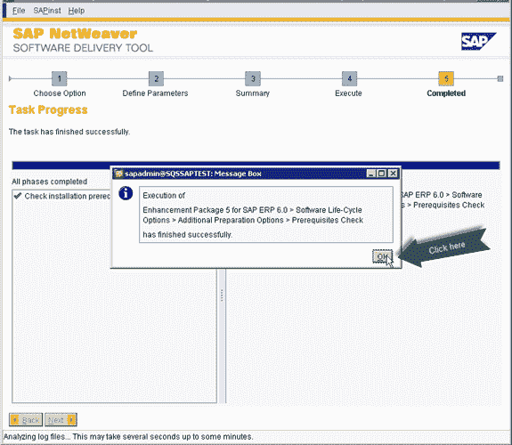

图 9

14.  现在再次重复步骤 5，并从安装主目录执行“ sapinst”，然后从下拉菜单中选择“操作系统用户和组”，如图 10 所示，然后单击下一步。

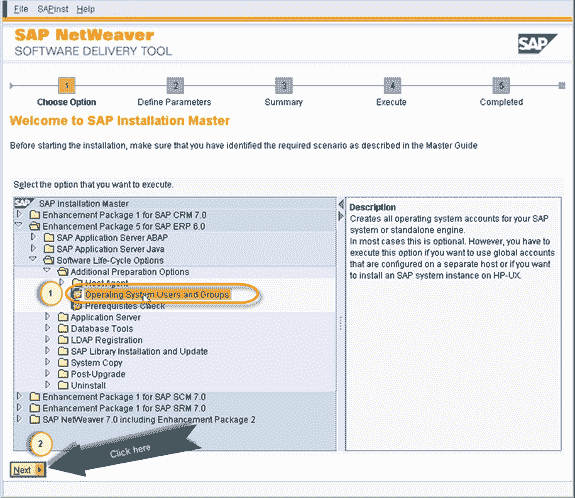

图 10

15.  在下一个屏幕上，它将询问您是要仅为 sap 主机代理创建 OS 帐户，还是要为 sap 管理用户创建 OS 帐户。 选择选项后，单击下一步，如图 11 所示。

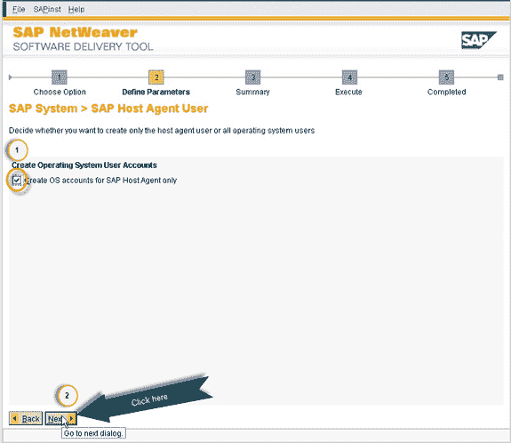

图 11

16.  在下一个屏幕上，它提供 SAP 系统标识符“ IDS”。 选择本地域安装或提供主机服务器的域，如图 12 所示，然后单击下一步。

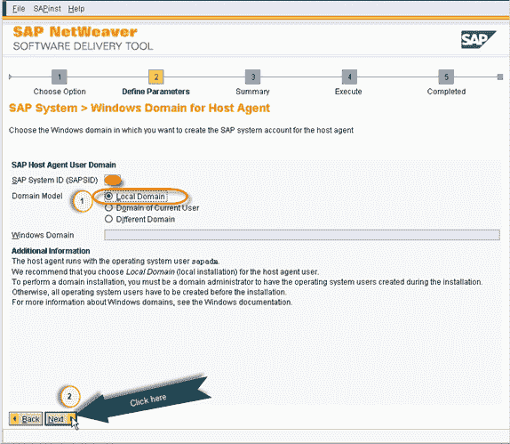

图 12

17.  在下一个屏幕上，设置密码。 密码应与操作系统密码策略兼容。 提及密码后，单击下一步。

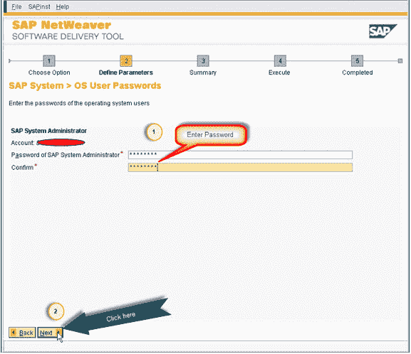

图 13

18.  下一个屏幕（图 14）允许您修改所选的选项。 否则，您可以继续选择的选项，然后单击下一步。

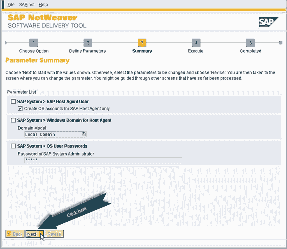

图 14

19.  成功执行此步骤后，将显示以下消息。

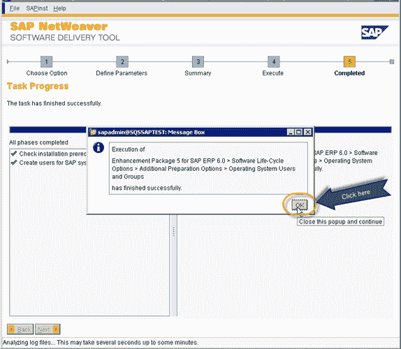

图 15

20.  完成所有先决条件和用户创建之后，我们需要在开始安装 IDES 服务器的中央实例之前安装数据库。 要开始安装数据库，我们需要转到 RDBMS DVD，如图 16 所示。这里我们有 MS SQL 数据库，并且 SAP 为该脚本提供了“ SQL4SAP”脚本，只需双击该脚本即可。 如果您有 Oracle 数据库，则它将在 SAP 安装之间进行安装。

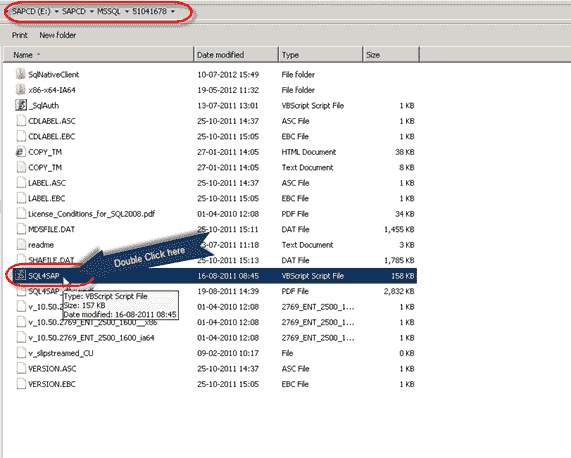

图 16

21.  双击脚本后，它将打开一个窗口并询问数据库实例 SID。 对于 SAP 安装，始终将其保留为默认设置。 因此，它将创建与 SAP SID 相同的 DB SID。 图 17 给出了详细信息。

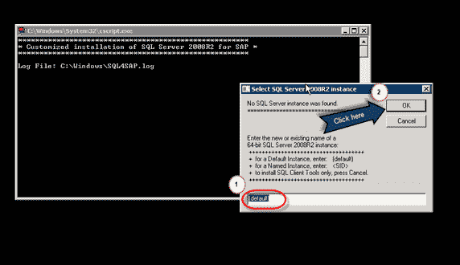

图 17

22.  一旦单击 OK 按钮，它将要求您进行确认，因此请单击 OK，如图 18 所示。

图 18

23.  一旦确认，它将在后台开始安装 MS SQL 数据库并安装在“ C：/”驱动器上。

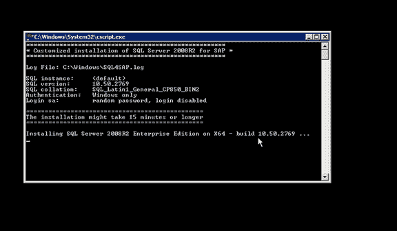

图 19

24.  安装完成后，将显示如图 20 所示的消息。

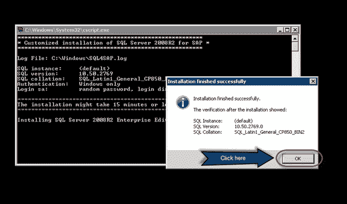

图 20

25.  现在再次重复步骤 5，启动“ sapinst”并选择“ Central Instance”，然后单击下一个并开始安装，如图 21 所示。

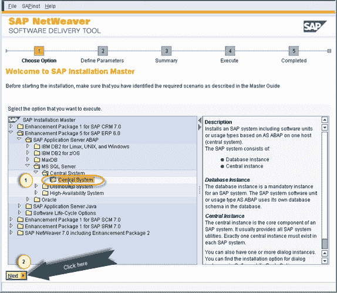

图 21

26.  在下一个屏幕上，它将询问您安装模式。 如果选择“典型”模式，那么 sapinst 将自动选择一些默认设置，这将不允许数据库配置和 SAPDATA 文件选择。 如果您选择“自定义”模式，则将要求此专家设置。 参考 图 22。

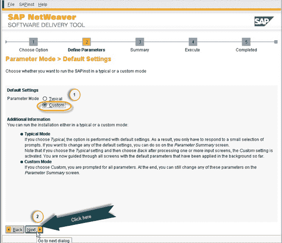

图 22

27.  下一个屏幕图 23 提供了您要安装的 SAP 系统 ID（SID）和安装驱动器（“ \ usr \ sap”所在的位置）。

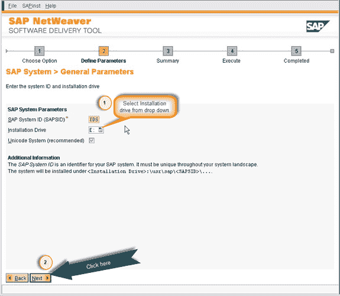

图 23

28.  如图 24 所示，它将询问服务器的完全合格域名（FQDN）。 如果要进行本地服务器安装，请取消选中 FQDN 选项，否则请选中 FQDN 选项并提供服务器的 FQDN。 这里我们要进行本地安装，因此我们未选中该选项。

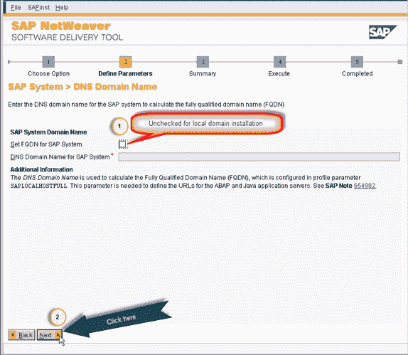

图 24

29.  现在，为您的 SAP 系统输入主密码。 安装期间，该密码将用于所有 SAP 帐户和用户。 您还可以使用此密码与 DDIC 和 SAP *用户一起登录 SAP 系统。

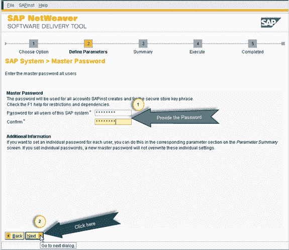

图 25

30.  如前所述，我们将以本地安装方式进行安装。 因此，在下一个屏幕上（图 26），选择本地安装选项，然后单击下一步。

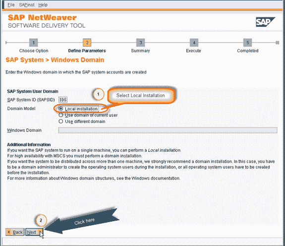

图 26

31.  在图 27 所示的下一个屏幕上，它将询问密码“ < SID > adm”和 SAPservice < SID >。 由于已经提供了主密码，因此可以跳过此步骤，也可以为每个用户设置一个不同的密码。 对于 Oracle 数据库，有“ < SID > adm”和“ ORA < SID >”用户。

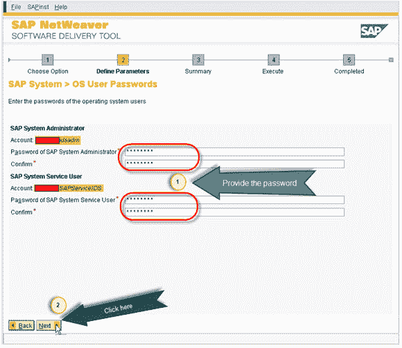

图 27

32.  现在它将要求数据库实例。 由于您先前已经安装了 MS SQL 数据库，因此它将显示数据库的默认实例，选择该实例，然后单击下一个。

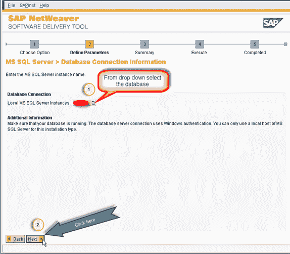

图 28

33.  在此屏幕上，它将显示 DBSID 和 SAPSID 相同的信息消息。 可以，只需单击下一个。

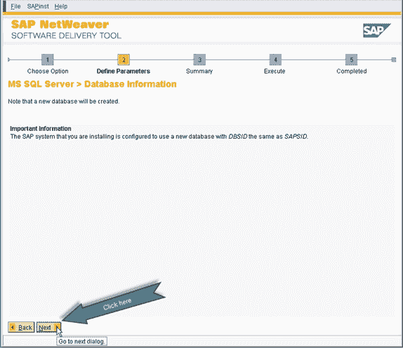

图 29

34.  在下一个屏幕上，它将询问您 Unicode Kernel NW 7.20 的媒体路径。 请通过从“浏览”浏览提供路径，然后单击下一步。

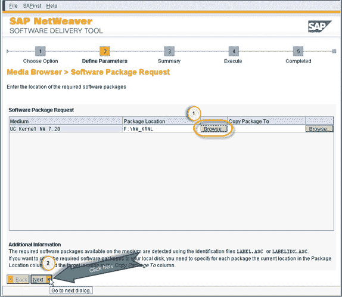

图 30

\

35.  接下来，它将显示将在其中创建“ \ usr \ sap \ PRFCLOG”的安装驱动器。

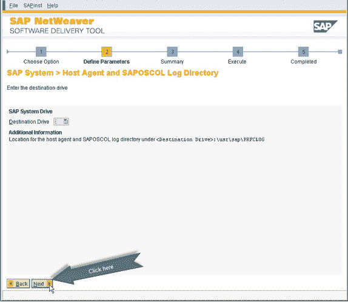

图 31

36.  现在，它将询问 SAP 主机代理的域详细信息。 我们将以本地方式安装，因此选择本地域选项，然后单击下一步。

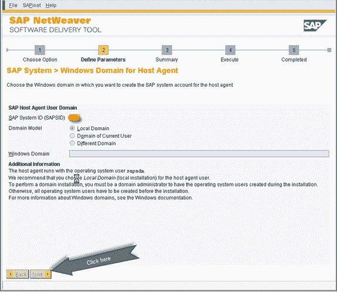

图 32

37.  现在为 sapadm 用户提供密码，否则它将以主密码为默认密码。

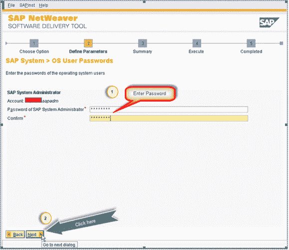

图 33

38.  现在提供安装导出媒体的路径，然后单击下一步。

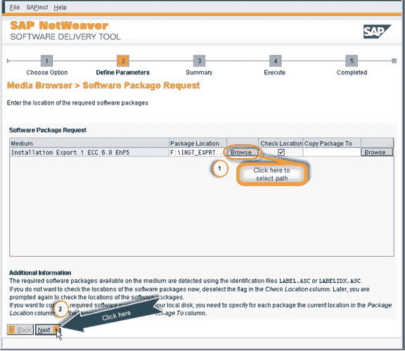

图 34

39.  现在，它将询问数据库 ABAP 架构的密码。 默认情况下，它将使用主密码。

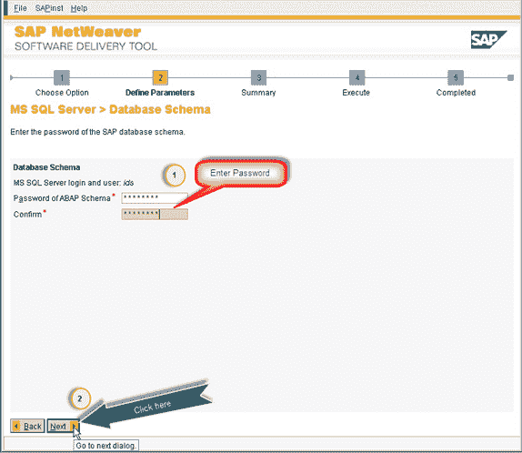

图 35

40.  现在它将询问需要为数据库创建的数据文件的数量。 按照标准，它将为小型系统创建 4 个数据文件，为中型系统创建 8 个数据文件，为大型系统创建 16 个数据文件。 在这里，我们选择了 8 个数据文件。

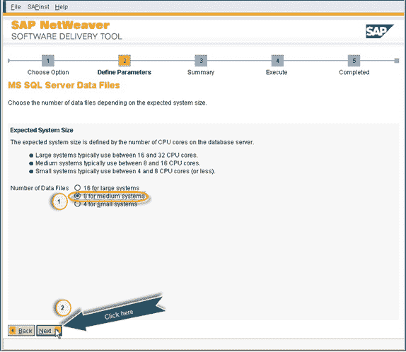

图 36

41.  在下一个屏幕上，它将询问您要存储这些数据文件的路径。 另外，您需要指定数据文件的初始大小。

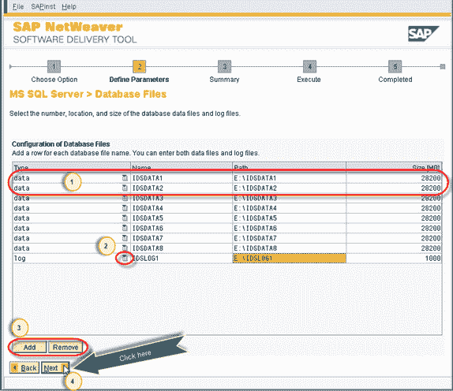

图 37

42.  现在它将询问 tempdev 和 templog 文件的位置和大小，默认情况下它将位于数据库的安装驱动器上。 提供所需的详细信息后，单击下一步。

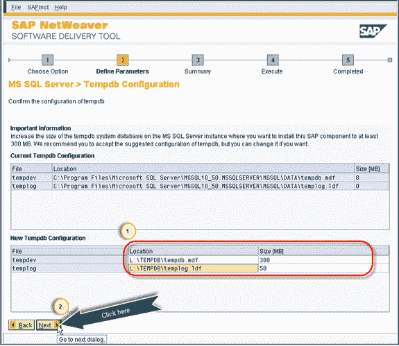

图 38

43.  在这里，您需要提供 ABAP 导入阶段的并行作业数，默认值为 3，但是建议根据服务器资源增加并行作业数。 我们已将作业从 3 增加到 10。SAP 代码页将是默认设置，请勿更改。

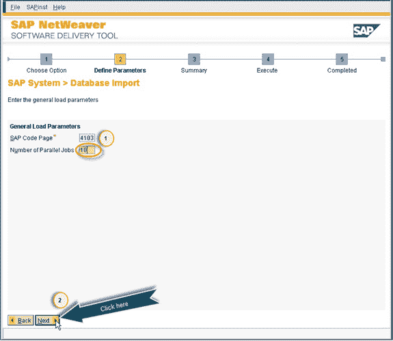

图 39

44.  在这里它将询问中央实例号，您可以选择 00 到 99 之间的任何数字。这里我们选择 00，这是默认值。

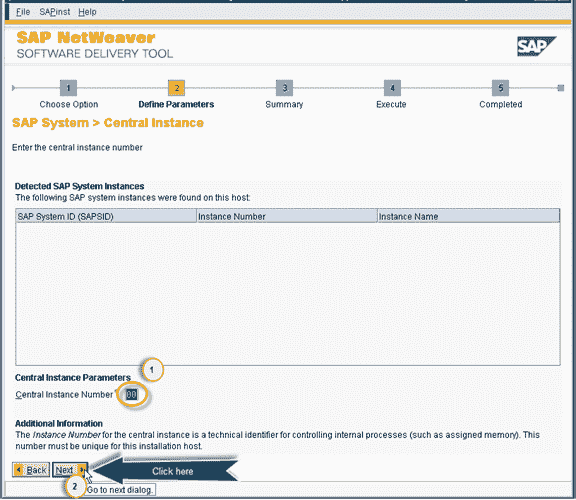

图 40

45.  现在提供 ABAP 消息服务器和内部 ABAP 端口的详细信息。 默认值分别是 3600 和 3900。 我们还需要提供一个用于传输目录的主机，默认情况下它将与您安装服务器的主机相同。 如果存在单个风景的公共传输目录，则可以在此处更改主机。

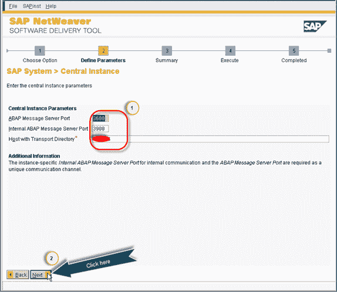

图 41

46.  下一个屏幕将询问密文的媒体路径，并提供相同的媒体路径。 如果您不想安装，请取消选中该选项，然后单击下一步。

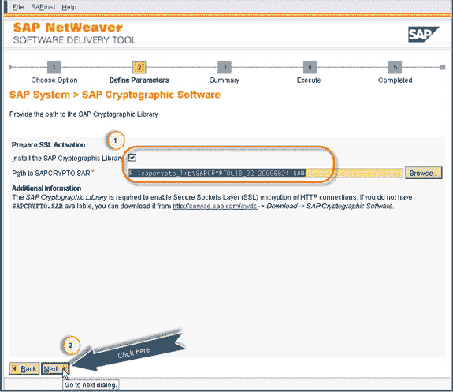

图 42

47.  在此步骤中，它将解压缩密码库的组件。 请选择要打开的每个包装，然后单击下一步。

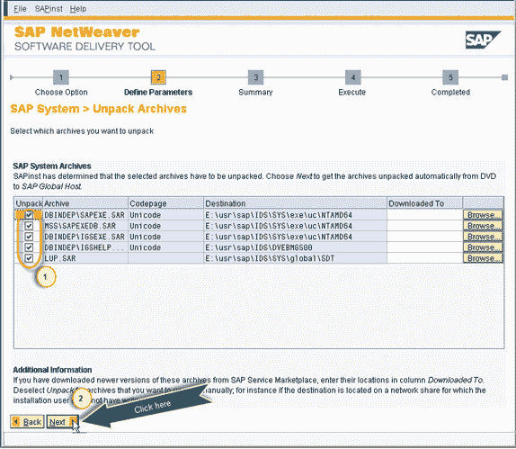

图 43

48.  现在，它将询问诊断代理系统的 SID，默认情况下它将是 DAA，但您可以根据需要提供，也可以更改目标驱动器。

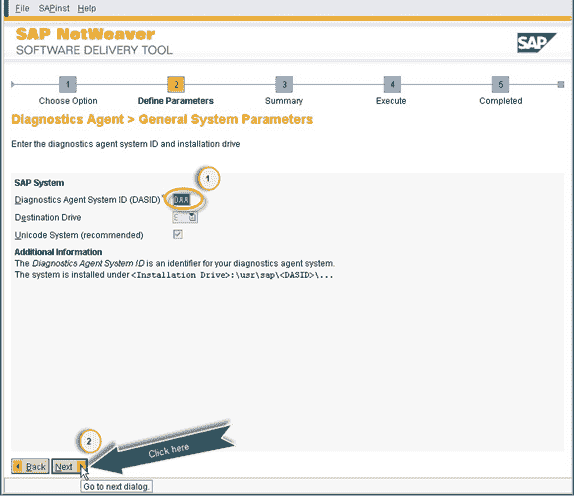

图 44

49.  在这里，我们需要提供 JAVA JCE 策略的媒体路径。

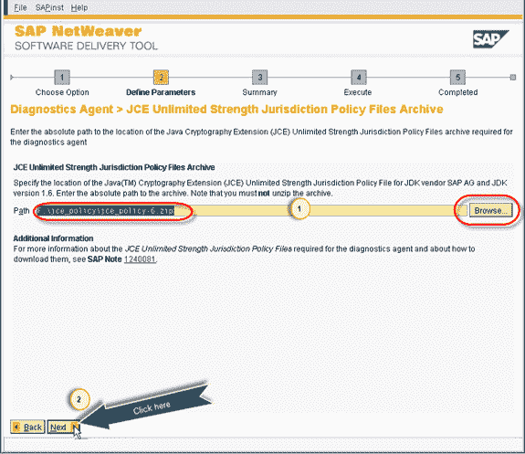

图 45

50.  接下来，它将询问诊断代理程序系统域的详细信息。 如果要作为域安装，请提供域名，然后选择“当前用户的域”或“其他域”选项，否则选择本地安装选项，我们在此处选择了该选项。

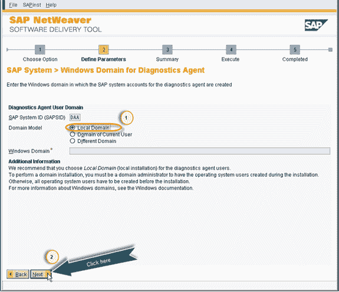

图 46

51.  在此屏幕上，它将询问诊断代理系统的密码。 默认密码将是您之前提供的主密码。

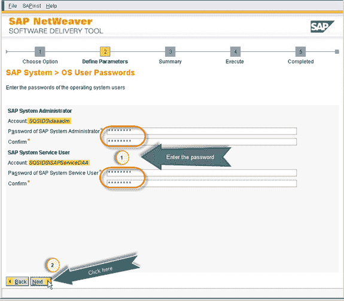

图 47

 ](/images/sap/2013/11/111313_0739_Howtoinstal52.png) [ 

52.  接下来，它将询问诊断代理程序系统的实例号。

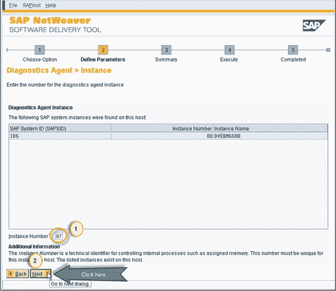

图 48

53.  在下一个屏幕上，它将询问您是否要在现有 SLD 中注册系统。 SLD 是存储所有服务器详细信息的主机。 如果您选择在现有 SLD 中注册，则在下一个屏幕上，它将询问您主机的详细信息。 在这里，我们选择了“无 SLD 目标”选项。 您可以在图 49 和图 50 中找到详细信息。

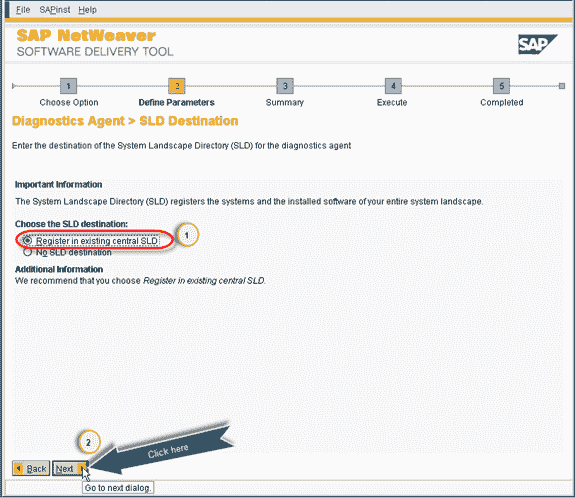

图 49

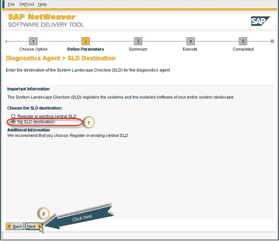

图 50

54.  现在，它将要求解压缩诊断代理系统的档案。 请检查所有内容，然后单击下一步。

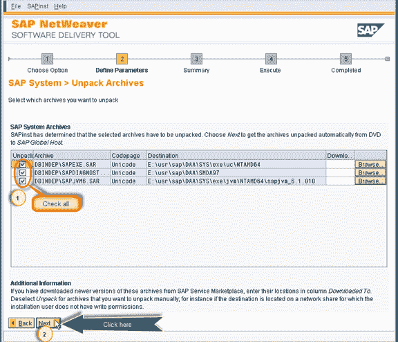

图 51

55.  现在，在此屏幕上，它将向您显示在“定义参数”阶段中选择的所有参数。 您可以根据需要修改输入参数。 修改参数后，可以单击下一个。

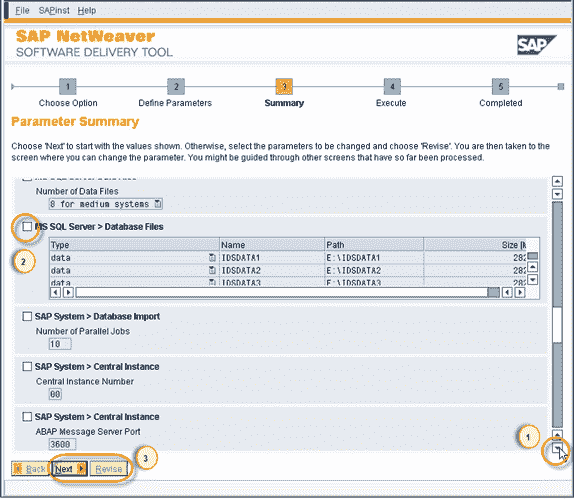

图 52

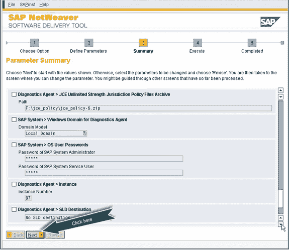

图 53

56.  在此屏幕上，它将询问解决方案管理器密钥。 您需要从 SAP 解决方案管理器生成安装的唯一密钥。 提供解决方案管理器密钥后，单击下一步。

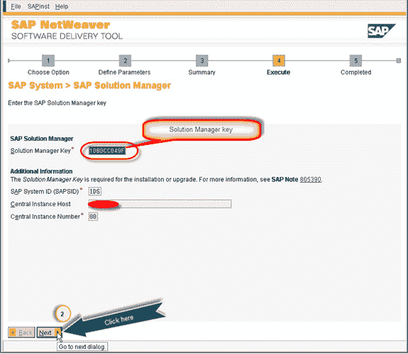

图 54

57.  一旦提供了解决方案管理器密钥，它将开始另一个安装阶段。 最长的阶段将是“导入 ABAP”阶段。 在屏幕底部，您可以找到安装状态。

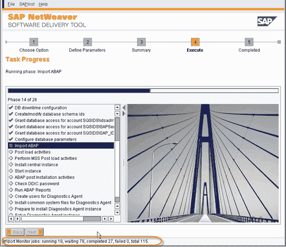

图 55

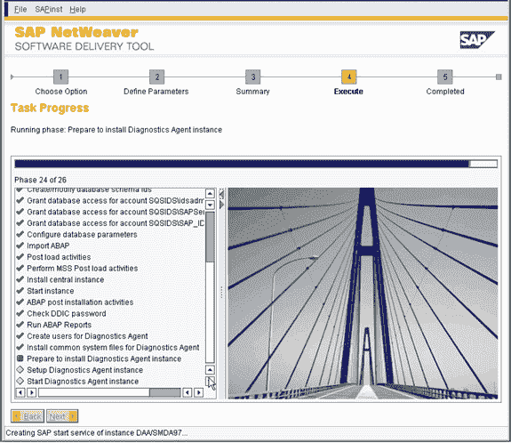

图 56

58.  一旦所有阶段成功完成，它将弹出新窗口，显示成功安装的消息。

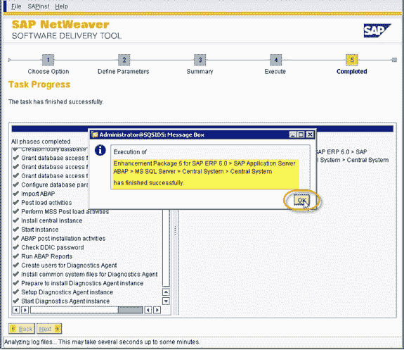

图 57

59.  安装完成后，您可以使用具有主密码的 SAP GUI 使用 DDIC 和 SAP *登录系统。 SAP IDES 服务器具有默认的 000、001、066 和 800 客户端。