# 客户主数据教程：在 SAP 中创建，显示，阻止，删除

> 原文： [https://www.guru99.com/how-to-create-a-customer-master-data.html](https://www.guru99.com/how-to-create-a-customer-master-data.html)

在本教程中，您将学习-

*   如何创建客户主数据

*   如何显示客户主数据中的更改

*   如何阻止或删除客户

## 如何创建客户主数据

**步骤 1）**在 SAP 命令字段中输入事务代码 FD01

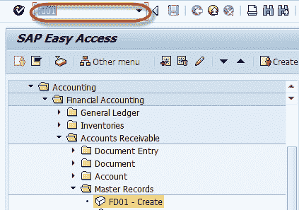

**步骤 2）**在初始屏幕中，输入

1.  选择帐户组
2.  根据帐户组中的号码范围输入唯一的客户 ID
3.  输入您要在其中创建客户的公司代码

**步骤 3）**按 Enter

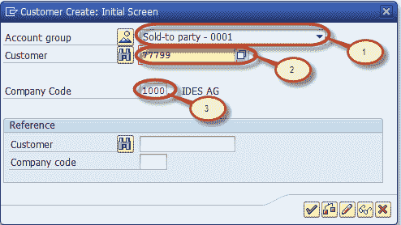

**步骤 4）**在下一个屏幕中，选择“地址”选项卡输入以下内容

1.  输入客户名称
2.  输入搜索词，用于搜索客户 ID
3.  输入街道/门牌号码
4.  输入邮政编码/城市
5.  输入国家/地区

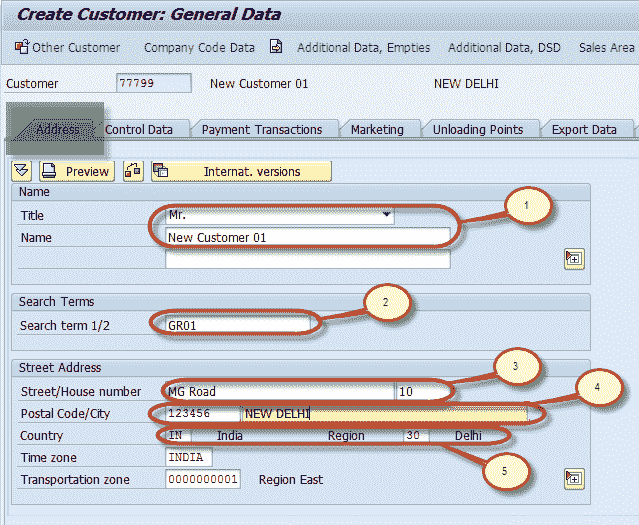

**步骤 5）**选择“控制数据”选项卡页如果客户属于公司组，则输入公司组输入组密钥

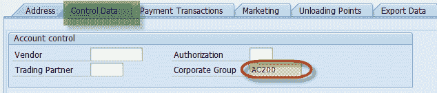

**步骤 6）**选择公司代码数据按钮

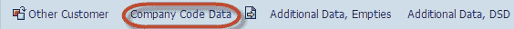

**步骤 7）**选择“帐户管理”选项卡输入对帐帐户

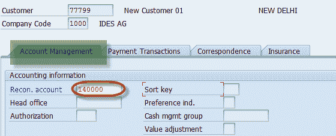

**步骤 8）**选择付款交易选项卡输入付款条款

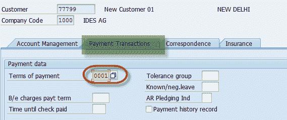

**步骤 9）**选择保存

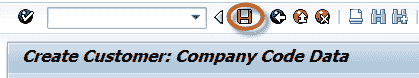

**步骤 10）**检查状态栏，查看是否创建了客户数据

## 如何显示客户主数据中的更改

**步骤 1）**在 SAP 命令字段中输入事务代码 FD04

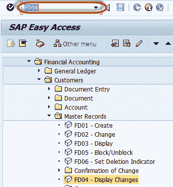

**步骤 2）**在下一个屏幕中，输入以下内容

1.  **步骤 3）**输入客户帐号
2.  **步骤 4）**输入公司代码

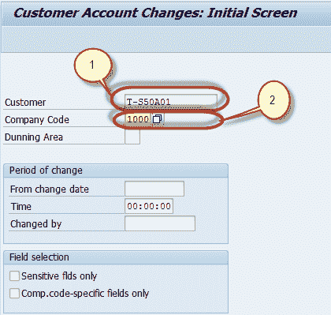

**步骤 5）**在下一个屏幕中，从已更改字段列表中选择字段

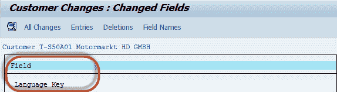

**步骤 6）**在下一个屏幕中，使用字段的新值和旧值生成列表

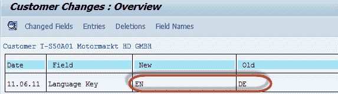

## 如何阻止或删除客户

*   如何阻止客户
*   如何删除客户

**屏蔽客户**

**步骤 1）**在 SAP 命令字段中输入事务代码 FD05

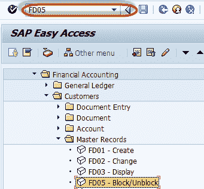

**Step 2)** In the next screen, Enter the Following

1.  **步骤 3）**输入要阻止的客户 ID
2.  **步骤 4）**输入要阻止其公司代码数据的客户的公司代码

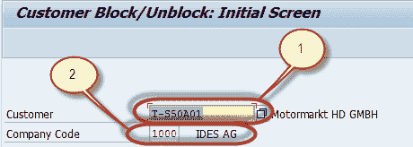

**步骤 5）**在下一个屏幕中，检查“阻止指示器”以查找要阻止的数据

**步骤 6）**按下“保存”按钮，继续执行块

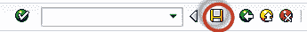

**删除客户**

**步骤 1）**在 SAP 命令字段中输入事务代码 FD06

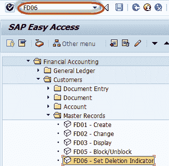

**Step 2)** In the next screen, Enter the Following

1.  输入要删除的客户 ID
2.  输入要删除其公司代码数据的客户的公司代码

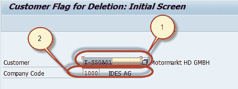

**步骤 3）**在下一个屏幕中，检查“块指示器”中要删除的数据

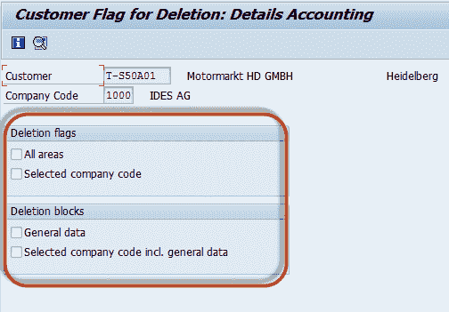

**步骤 4）**按“保存”按钮，继续删除

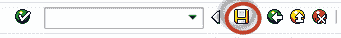