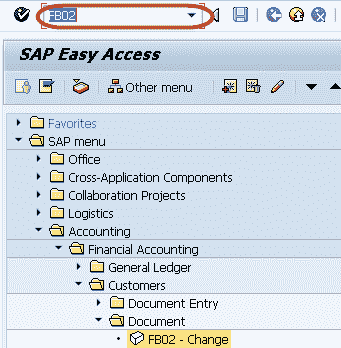
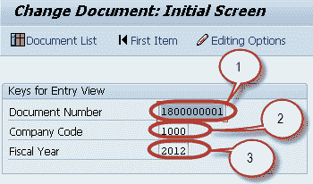
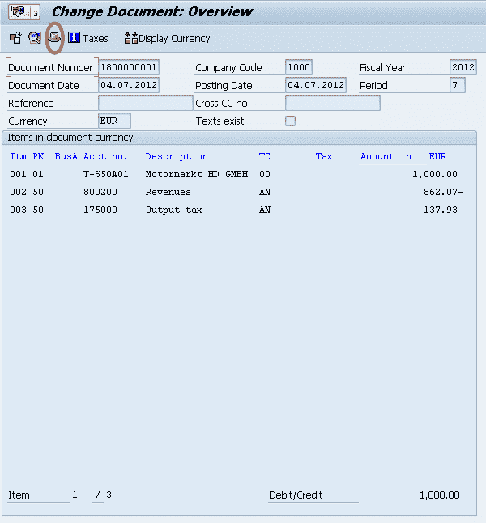
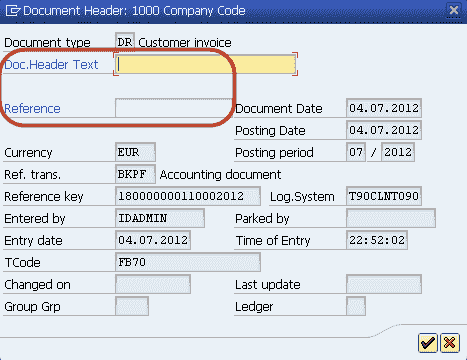
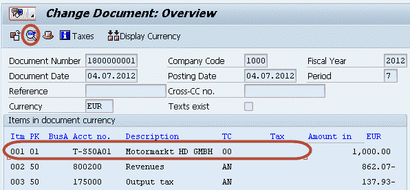
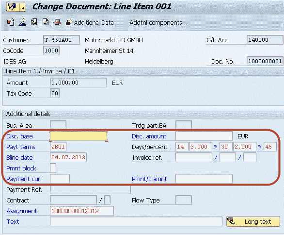

# SAP 中的 FB02：更改客户文档教程

> 原文： [https://www.guru99.com/how-to-change-customer-documents.html](https://www.guru99.com/how-to-change-customer-documents.html)

在本教程中，我们将学习如何更改客户文档。

**步骤 1）**在 SAP 命令字段中输入事务代码 FB02

**步骤 2）**在下一个屏幕中，输入以下内容

1.  输入要更改的凭证的凭证编号
2.  输入过帐凭证的公司代码
3.  输入凭证的会计年度

**步骤 3）**在下一个屏幕中，单击文档标题以编辑文档标题字段

**步骤 4）**在下一个屏幕中，维护可编辑的文档抬头字段，并保留在“定制的文档更改规则”中。

**步骤 5）**然后选择要为其维护凭证项目字段的凭证项目，然后按选择详细信息字段

**步骤 6）**在下一个屏幕中，维护可编辑的文档项目字段，并保留在“定制的文档更改规则”中。

**步骤 7）**更改文档标题和项目后，按 SAP Standard 菜单栏中的“保存”按钮以保存更改的文档。

