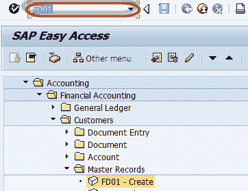
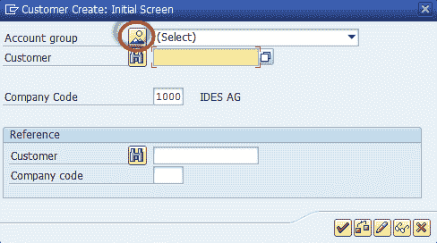
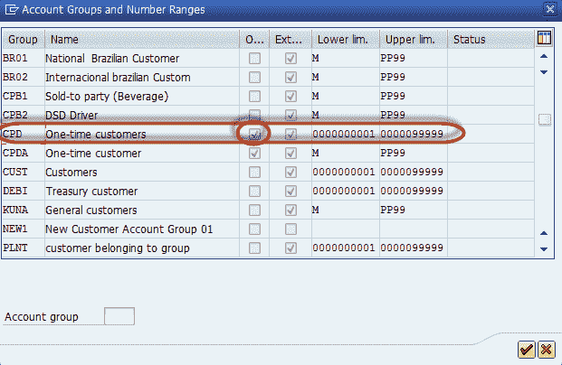
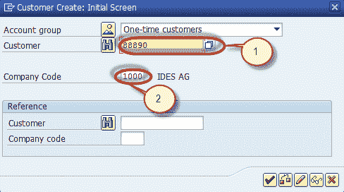
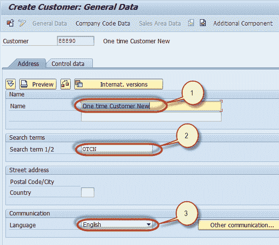
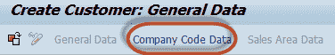
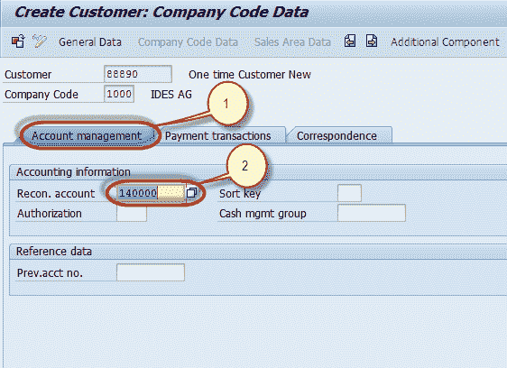
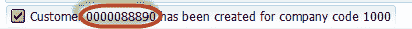

# 如何在 SAP 中创建一次性客户 FD01

> 原文： [https://www.guru99.com/how-to-create-one-time-customer-master.html](https://www.guru99.com/how-to-create-one-time-customer-master.html)

在 SAP 中，我们可以为那些不频繁交易且不希望单独维护其主记录的客户创建一次性客户主记录。 在这种情况下，我们创建了一个一次性客户，在交易时可以维护一般信息（姓名，地址，电话号码等）。

**步骤 1）**要创建一次性客户主数据，请在 SAP 命令字段中输入交易代码 **FD01**

**步骤 2）**在下一个屏幕中，选择“帐户组概述”按钮

**步骤 3）**在下一个对话框中，选择检查一次客户属性的帐户组。

**步骤 4）**在主屏幕中，输入以下内容

1.  根据分配给客户组的号码范围输入客户 ID
2.  输入要在其中创建母版的公司代码

**步骤 5）**在“常规数据-地址”选项卡的下一个屏幕中，输入以下内容

1.  输入一次性客户主数据的名称
2.  输入搜索词
3.  输入交流语言

**步骤 6）**在应用程序菜单中选择公司代码部分

**步骤 7）**在公司代码部分的下一个屏幕中，

1.  选择帐户管理标签
2.  输入对帐总帐帐号

**步骤 8）**按'保存'以创建新的一次性客户主数据

**步骤 9）**检查状态栏以创建新的客户主数据

