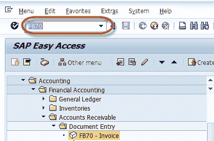
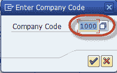
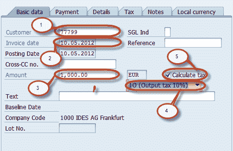
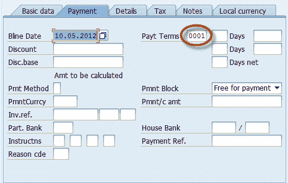
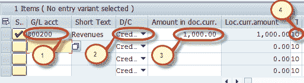

# 如何在 SAP FICO 中创建客户销售发票 FB70

> 原文： [https://www.guru99.com/how-to-post-sales-invoice.html](https://www.guru99.com/how-to-post-sales-invoice.html)

在本教程中，我们将学习如何创建客户销售发票

**步骤 1）**在 SAP 命令字段中输入事务 FB70

**步骤 2）**在下一屏幕中，输入要过帐发票的公司代码。

**步骤 3）**在下一个屏幕中，输入以下内容

1.  输入要开发票的客户的客户 ID
2.  输入发票日期
3.  输入发票金额
4.  选择适用税种的税码
5.  选择税收指示器“计算税收”。

**步骤 4）**在“付款”标签页中检查付款条款

**步骤 5）**在“项目详细信息”部分中，输入以下内容

1.  输入销售收入帐户
2.  选择信用
3.  输入发票金额
4.  检查税码

**步骤 6）**完成上述输入后，检查文档的状态

**步骤 7）**按下标准栏中的发布按钮  并等待文档编号生成并显示在状态栏中以进行确认

您已成功过帐销售发票