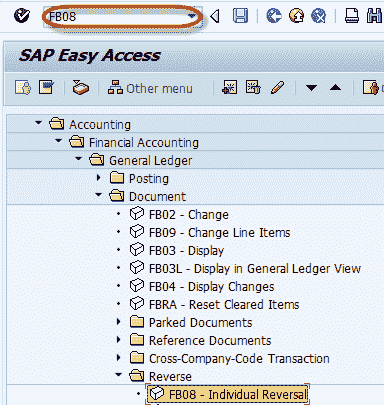
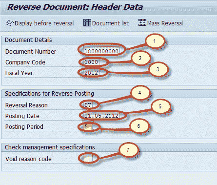
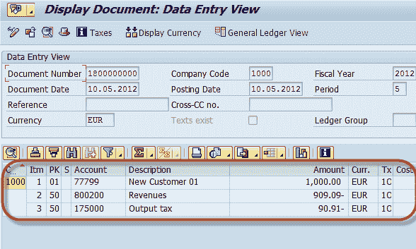

# SAP 中的凭证冲销 FB08：分步指南

> 原文： [https://www.guru99.com/how-to-perform-document-reversal.html](https://www.guru99.com/how-to-perform-document-reversal.html)

本教程将带您完成执行文档冲销的步骤。

**步骤 1）**在命令字段中输入交易代码 FB08

**步骤 2）**在下一个屏幕中，输入以下数据

1.  输入要冲销的凭证的凭证编号
2.  输入凭证过帐的公司代码
3.  输入会计年度
4.  输入冲销代码（冲销原因）
5.  输入过帐日期
6.  或输入过帐期间
7.  如果 Document 已分配支票付款，请输入原因码以使支票无效。

**步骤 3）**通过按“反转前显示”检查文档

**步骤 4）**检查文件

**步骤 5）**返回上一屏幕，然后从标准工具栏中按保存

**步骤 6）**检查状态栏是否生成了冲销凭证编号

您已成功完成文档冲销。