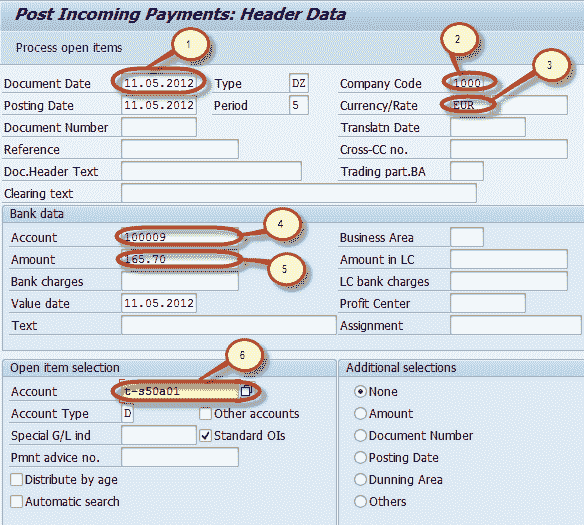

# 如何在 SAP 中过帐客户收款 F-28

> 原文： [https://www.guru99.com/how-to-post-customer-incoming-payments.html](https://www.guru99.com/how-to-post-customer-incoming-payments.html)

在本教程中，我们将学习如何过帐收款

**步骤 1）**在命令字段中输入交易代码 F-28

**步骤 2）**在下一个屏幕中，输入以下数据

1.  输入文件日期
2.  输入公司代码
3.  输入付款货币
4.  输入现金/银行帐户付款要过帐
5.  输入付款金额
6.  输入付款客户的客户 ID

**步骤 3）**按“处理未清项目”按钮显示“待处理发票”列表

**步骤 4）**将付款金额分配给适当的发票，以使付款与发票金额保持平衡

**步骤 5）**按标准工具栏中的过帐以过帐付款

**步骤 6）**在状态栏中检查要生成的凭证编号

您已成功过帐收款