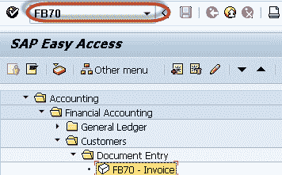
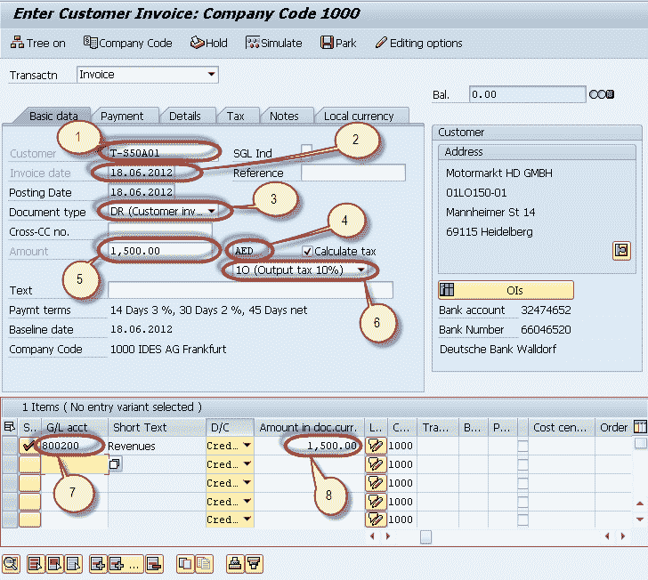
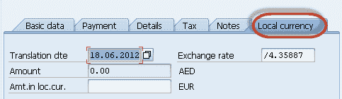
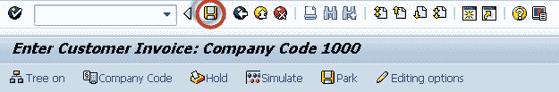

# 如何在 SAP 中过帐外币发票 FB70

> 原文： [https://www.guru99.com/how-to-post-a-foreign-currency-invoice.html](https://www.guru99.com/how-to-post-a-foreign-currency-invoice.html)

在本教程中，我们将学习 SAP 中的外币发票

**步骤 1）**在 SAP 命令字段中输入事务代码 FB70

**步骤 2）**在下一个屏幕中，输入以下数据

1.  输入要过帐发票的客户的客户 ID。
2.  输入发票日期
3.  输入单据类型作为客户发票
4.  输入要过帐发票的货币（凭证货币）
5.  输入发票金额
6.  输入发票中适用的税码
7.  输入要记入的销售收入总账科目
8.  输入信用额度

**步骤 3）**我们可以在“本地货币”标签中调整汇率

**步骤 4）**维持汇率后，按“保存”以过帐凭证

**步骤 5）**检查状态栏上生成的文件编号

