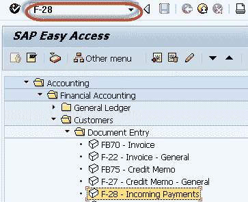
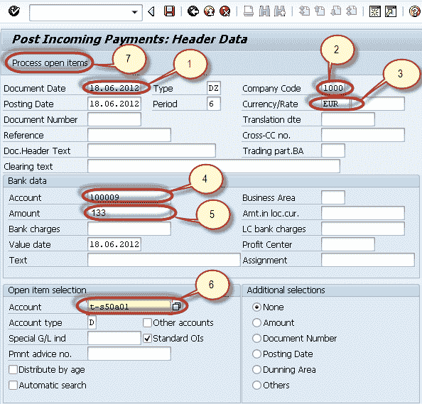
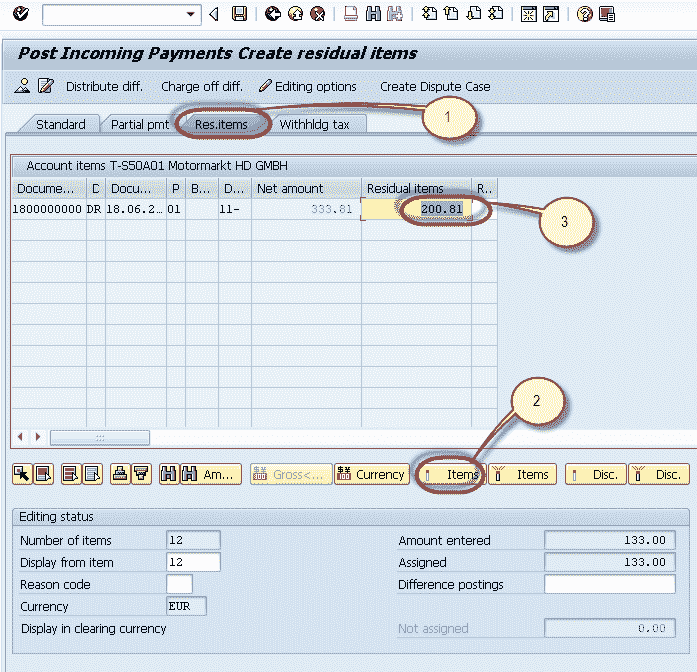
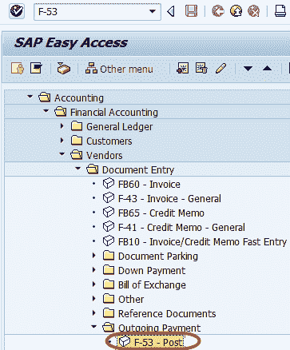
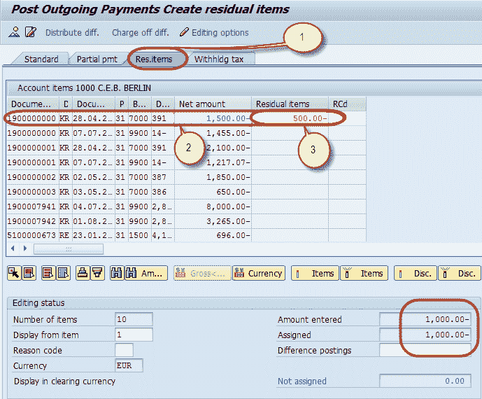

# 剩余方法：将&收款转入 SAP 中的部分付款

> 原文： [https://www.guru99.com/how-to-post-incoming-partial-payments-by-residual-method.html](https://www.guru99.com/how-to-post-incoming-partial-payments-by-residual-method.html)

在本教程中，我们将学习使用残差方法的收款&收款部分付款过账

## 收款部分过帐

在 SAP 中，当将客户的部分付款过帐到未清凭证作为残差项目时，系统清除该凭证并创建带有剩余金额的新凭证作为未清项目。

**此处是如何通过残值方法过帐部分付款的演示**

**步骤 1）**在 SAP 命令字段中输入事务代码 F-28

**步骤 2）**在下一个屏幕中，输入以下数据

1.  输入文件日期
2.  输入要在其中过帐付款的公司代码
3.  输入付款币种
4.  输入要在其中过帐付款的现金/银行帐户
5.  输入付款金额
6.  输入付款客户的客户 ID
7.  按“处理未清项目”

**步骤 3）**在下一个屏幕中，

1.  选择“剩余项目”选项卡
2.  选择并激活已针对其进行部分付款的发票。
3.  输入剩余金额

**步骤 4）**按“保存”以发布付款凭证

**步骤 5）**检查状态栏上生成的文件编号。

## 过帐部分付款过帐

**步骤 1）**在 SAP 命令字段中输入事务代码 F-53

**Step 2)** In the next screen, Enter the following data

1.  输入文件日期
2.  输入要在其中过帐付款的公司代码
3.  输入要在其中过帐付款的现金/银行帐户
4.  输入付款金额
5.  输入进行付款的供应商的供应商 ID
6.  按“处理未清项目”

**Step 3)** In the next screen ,

1.  选择“剩余项目”选项卡
2.  选择并激活已针对其进行部分付款的发票。
3.  输入剩余金额

**步骤 4）**按“保存”以发布付款

 文件

**步骤 5）**检查状态栏上生成的文件编号。

