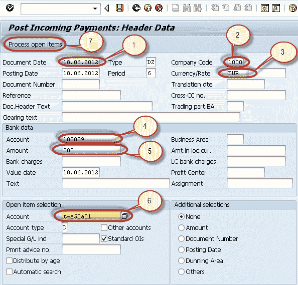
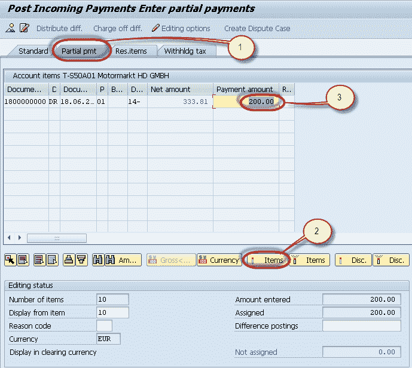
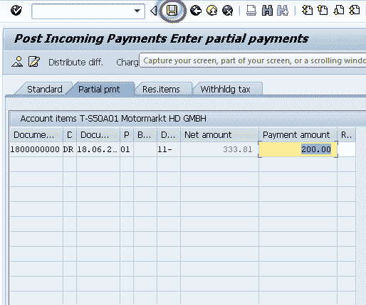
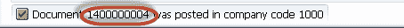
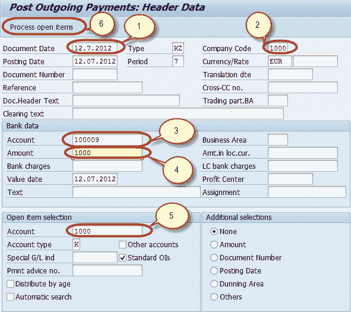
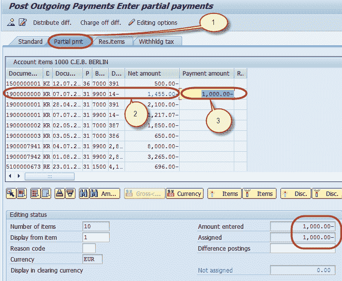
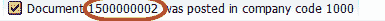

# 部分方式：SAP 中收款&的部分付款过帐

> 原文： [https://www.guru99.com/how-to-post-incoming-partial-payments-by-partial-payment-method.html](https://www.guru99.com/how-to-post-incoming-partial-payments-by-partial-payment-method.html)

在本教程中，我们将学习使用部分方法进行收款&的部分付款过账

## 收款部分过帐

在 SAP 中，我们可以将收款付款过帐为部分付款。 部分付款将作为单独的未清（未清）项目过账。 例如，客户的未付清款为 1000，他支付了 400 的部分付款，那么将有两个单独的未清（未清）项目，分别为 1000 **Dr** 和 400 **Cr** 。 文档已创建。

**这是一个演示如何通过部分付款方式**发布部分付款的演示

**步骤 1）**在 SAP 命令字段中输入交易代码 F-28

**步骤 2）**在下一个屏幕中，输入以下数据

1.  输入文件日期
2.  输入要在其中过帐付款的公司代码
3.  输入付款币种
4.  输入要在其中过帐付款的现金/银行帐户
5.  输入付款金额
6.  输入付款客户的客户 ID
7.  按“处理未清项目”

**步骤 3）**在下一个屏幕中，

1.  选择部分付款标签
2.  选择并激活已针对其进行部分付款的发票。
3.  输入部分金额

**步骤 4）**按“保存”以发布付款凭证

**步骤 5）**检查状态栏上生成的文件编号。

## 过帐部分付款过帐

**步骤 1）**在 SAP 命令字段中输入交易代码 F-53

**Step 2)** In the next screen, Enter the following data

1.  输入文件日期
2.  输入要在其中过帐付款的公司代码
3.  输入要在其中过帐付款的现金/银行帐户
4.  输入付款金额
5.  输入进行付款的供应商的供应商 ID
6.  按“处理未清项目”

**Step 3)** In the next screen ,

1.  选择部分付款标签
2.  选择并激活已针对其进行部分付款的发票。
3.  输入部分金额

**Step 4)** Press 'Save' to post the Payment Document

**Step 5)** Check the Status bar for the Document Number Generated.

