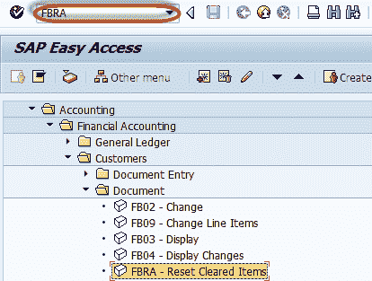
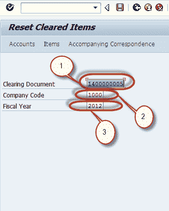
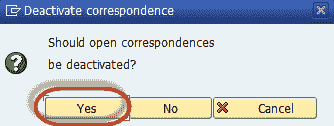
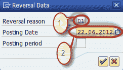
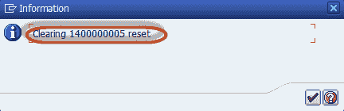
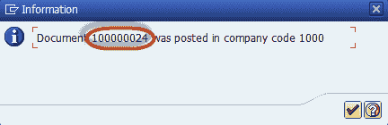
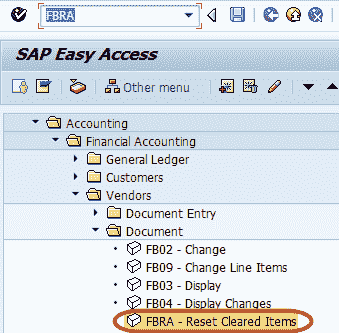
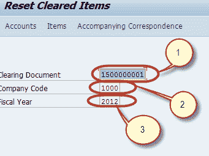
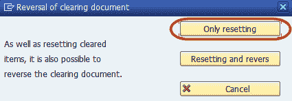

# FBRA：如何在 SAP 中重置已清除的项目

> 原文： [https://www.guru99.com/how-to-reset-ar-cleared-items.html](https://www.guru99.com/how-to-reset-ar-cleared-items.html)

在本教程中，您将学习-

*   如何重设 AR 清除项目
*   如何重置汁液中的已清除项目

## 如何重设 AR 清除项目

In SAP If a Customer Payment is made against incorrect invoice and then it can be Reset.**Step 1)** Enter Transaction Code FBRA in the SAP Command Field

**步骤 2）**在下一个屏幕中，输入以下内容

1.  输入清算项目的清算凭证编号
2.  输入过帐的公司代码
3.  输入过帐的会计年度

**步骤 3）**按“保存”按钮重置项目的已清除状态

**步骤 4）**确认用于取消打开通信对应的模式对话框

**步骤 5）**在下一个对话框中，输入以下内容

1.  输入清算项目的冲销原因
2.  输入过帐日期

**步骤 6）**在下一个对话框中，确认重置清算凭证

**步骤 7）**在下一个对话框中，检查冲销凭证编号以确认已清算项目的重置。

## 如何重置汁液中的已清除项目

在 SAP 中，如果针对不正确的发票进行了供应商付款，则可以将其重置。

**步骤 1）**在 SAP 命令字段中输入事务代码 FBRA

**步骤 2）**在下一个屏幕中，输入以下内容

1.  输入清算项目的清算凭证编号
2.  输入过帐的公司代码
3.  输入过帐的会计年度

**步骤 3）**按“保存”按钮重置项目的已清除状态

**步骤 4）**在下一个对话框中，确认重置清算凭证

**步骤 5）**检查状态栏以确认重置

