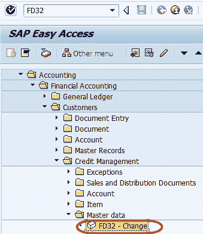
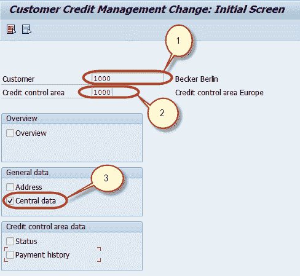
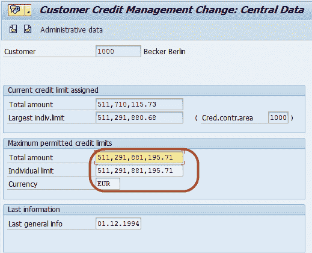

# SAP 中的 FD32：信用控制范围教程

> 原文： [https://www.guru99.com/credit-control-for-the-customer.html](https://www.guru99.com/credit-control-for-the-customer.html)

多个未偿还的应收款或坏账可能会对公司的业绩产生重大影响。

使用信用控制，您可以通过为客户定义信用额度来最大程度地降低信用风险。

在 SAP 中，信用和风险管理在信用控制区域中进行。 如果您的信用管理是集中式的，则可以为所有公司代码定义一个信用控制区域。 另一方面，如果您的信用策略需要分散的信用管理，则可以为每个公司代码或每组公司代码定义信用控制区域。

信用控制区域，用于定义和控制客户信用限额。

我们可以维护客户的信用控制区主数据：

**步骤 1）**在 SAP 命令字段中输入交易代码 FD32

**步骤 2）**在下一个屏幕中，输入以下内容

1.  输入要显示其信用额度的客户的客户 ID
2.  进入信用控制区
3.  检查中央数据部分

**步骤 3）**在下一个屏幕中，维护客户的信用管理数据

**步骤 4）** ??按下 SAP Standard Toolbar 中的“保存”按钮以保存信用额度中的更改

