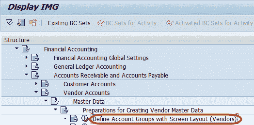
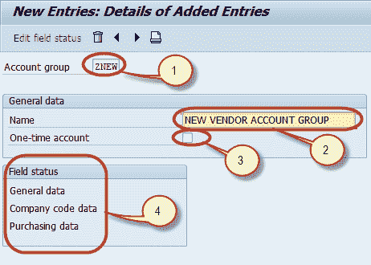
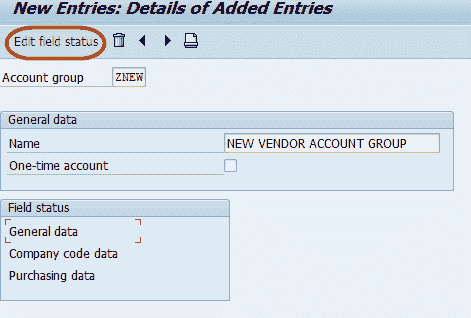
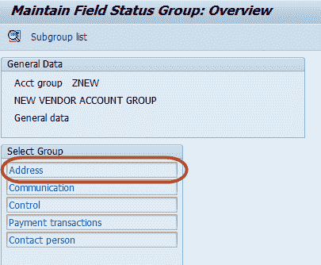
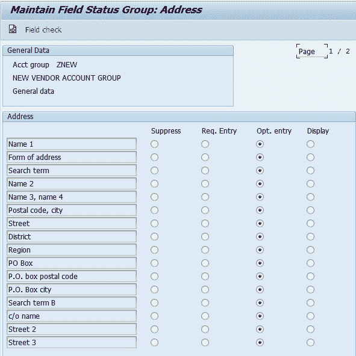
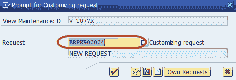

# 如何在 SAP FICO 中创建供应商帐户组

> 原文： [https://www.guru99.com/how-to-create-a-vendor-account-group.html](https://www.guru99.com/how-to-create-a-vendor-account-group.html)

在本教程中，我们将学习如何在 SAP 中创建供应商帐户组。

**步骤 1）**在 SAP 命令字段中输入事务代码 SPRO

**步骤 2）**在下一个屏幕中，选择“ SAP Reference IMG”按钮

**步骤 3）**在下一个屏幕中，“显示 IMG”选择菜单路径财务[会计](/accounting.html)->应收帐款和应付帐款->供应商帐目-[ >主数据->创建供应商主数据的准备->使用屏幕布局定义帐户组（供应商）

**步骤 4）**在下一个屏幕中，从应用程序菜单栏中选择“新条目”按钮

**步骤 5）**在下一个屏幕中，输入以下内容

1.  输入唯一密钥作为帐户组密钥
2.  输入帐户组的简短说明
3.  选中此选项以为一次性供应商创建帐户组
4.  选择要为其维护字段状态的主数据部分

**步骤 6）**按下“编辑字段状态”按钮以维护所选主数据部分的字段状态

**步骤 7）**在下一个屏幕中，选择要维护的字段组。

**步骤 8）**在下一个屏幕中，维护所选组的字段的字段状态

同样，您可以维护其他主数据部分及其组的字段状态。 维护字段状态后，在 SAP 标准菜单中按“保存”以创建帐户组

**步骤 9）**在下一个屏幕中，输入自定义请求编号创建供应商帐户组。

