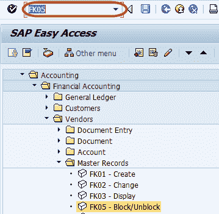
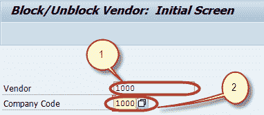
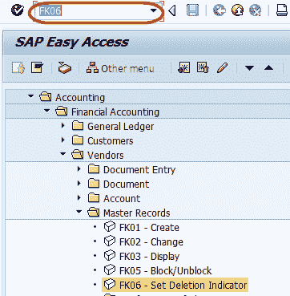
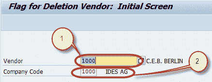
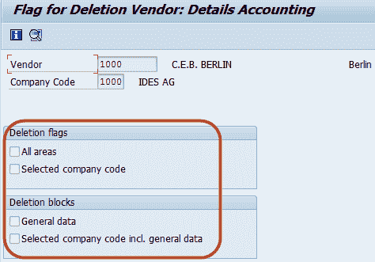

# 如何在 SAP FICO 中阻止或删除供应商

> 原文： [https://www.guru99.com/how-to-block-or-delete-a-vendor.html](https://www.guru99.com/how-to-block-or-delete-a-vendor.html)

在本教程中，我们将学习

*   如何阻止供应商
*   如何删除供应商

## 阻止供应商

**步骤 1）**在 SAP 命令字段中输入事务代码 FK05

**步骤 2）**在下一个屏幕中，输入以下内容

1.  输入要阻止的供应商 ID
2.  输入要阻止其公司代码数据的供应商的公司代码

**步骤 3）**在下一个屏幕中，检查“阻止指示器”以查找要阻止的数据

**步骤 4）**按下“保存”按钮，继续执行块

## 删除供应商

**步骤 1）**在 SAP 命令字段中输入事务代码 FK06

**Step 2)** In the next screen, Enter the Following

1.  输入要删除的供应商 ID
2.  输入要删除其公司代码数据的供应商的公司代码

**步骤 3）**在下一个屏幕中，检查“块指示器”中要删除的数据

**步骤 4）**按“保存”按钮，继续进行删除

