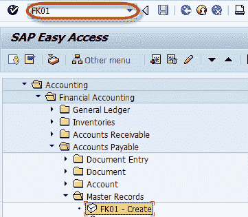
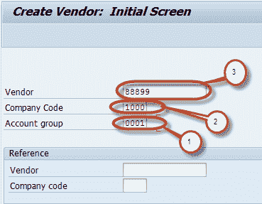
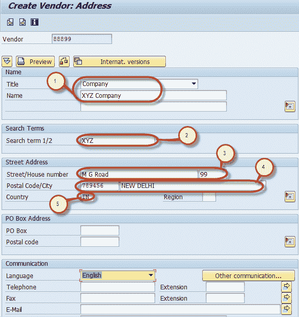
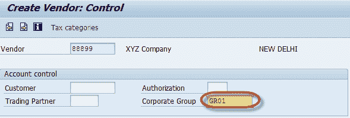
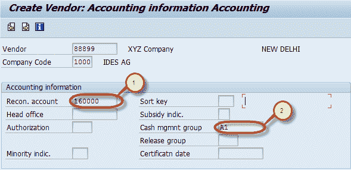
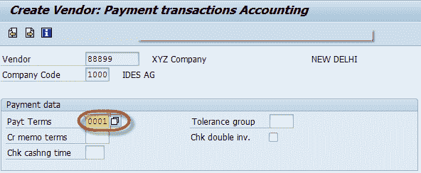
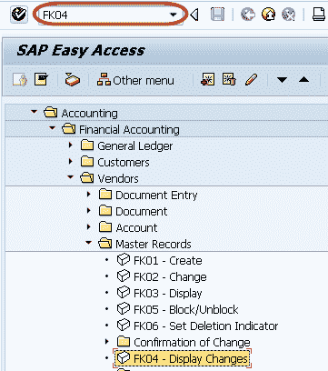
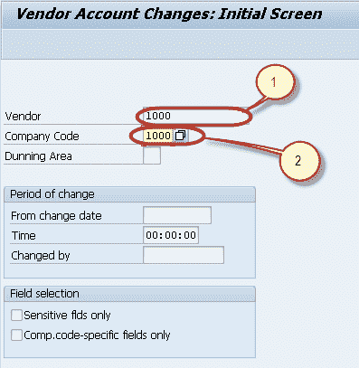
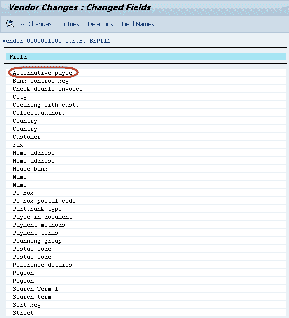
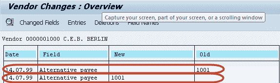

# 在 SAP 中创建供应商主数据的分步指南

> 原文： [https://www.guru99.com/how-to-create-vendor-master-data.html](https://www.guru99.com/how-to-create-vendor-master-data.html)

在本教程中，我们将学习，

*   如何创建供应商
*   如何显示供应商主数据中的更改

## 如何创建供应商

本教程将引导您完成创建供应商主数据的步骤

**步骤 1）**在 SAP 命令字段中输入事务代码 FK01

**步骤 2）**在初始屏幕中，输入

1.  选择帐户组
2.  输入要在其中创建供应商的公司代码
3.  根据帐户组中的编号范围输入唯一的供应商 ID。您还可以将**供应商**字段留空。 保存数据时系统将分配一个数字

可选-在“参考”部分中：

1.  如果详细信息与新供应商相似，则可以在供应商字段中输入参考供应商。
2.  在公司代码字段中，您可以输入参考供应商的公司代码。

In this tutorial we will create a vendor without a reference. Click the Enter button.

按 Enter

**步骤 3）**在下一个屏幕的“地址”选项卡中，输入以下内容

1.  输入供应商名称
2.  输入搜索词，用于搜索供应商 ID
3.  输入街道/门牌号码
4.  输入邮政编码/城市
5.  输入国家/地区

**步骤 4）**在“帐户控制”部分页面中，如果供应商属于公司组，则输入公司组。

**步骤 5）**帐户管理部分中的下一步

1.  输入对帐帐户
2.  进入现金管理组

**步骤 6）**在付款[会计](/accounting.html)部分中，输入付款条件

**步骤 7）**从标准工具栏中选择保存

检查状态栏，确认已成功创建供应商主文件。

> **更改**现有供应商帐户-交易 **FK02**
> 
> **显示**供应商帐户-交易 **FK03**

## 如何显示供应商主数据中的更改

在 SAP 命令字段中输入交易代码 FK04

在下一个屏幕中，输入以下内容

1.  输入供应商帐号
2.  输入公司代码

在下一个屏幕中，从“已更改的字段”列表中选择“字段”

在下一个屏幕中，使用字段的新值和旧值生成列表

