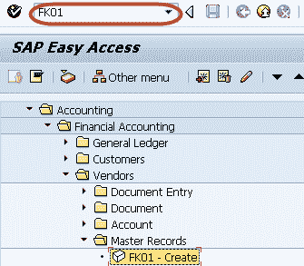
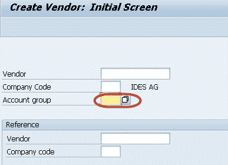
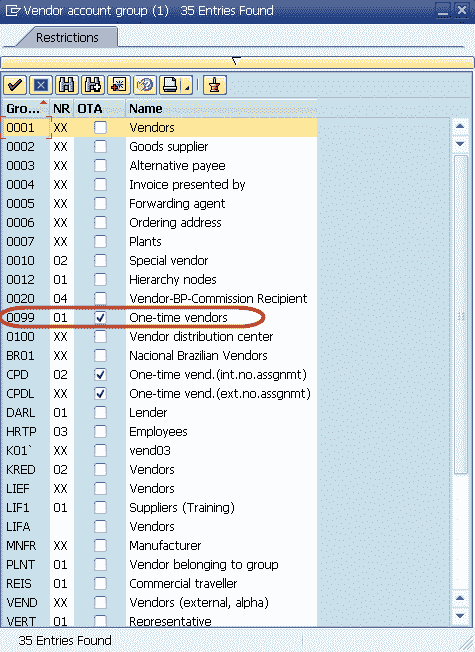
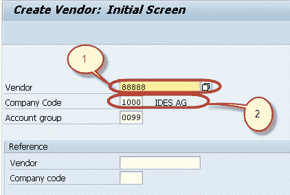
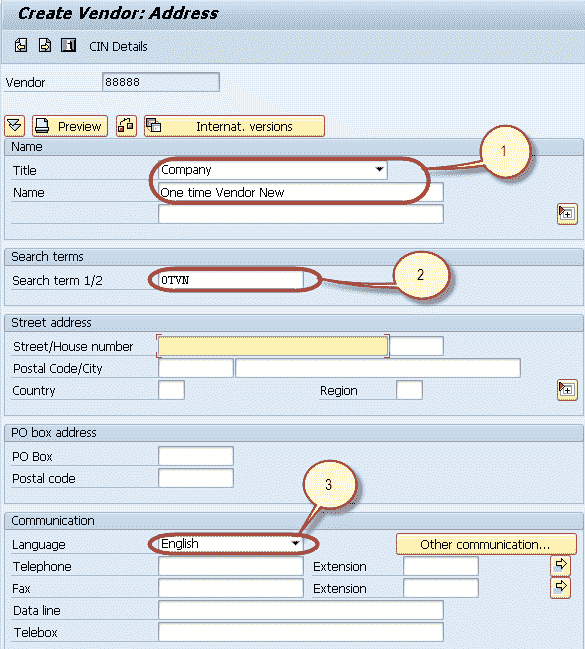
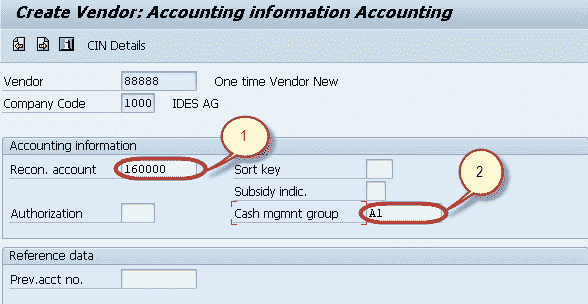

# 如何在 SAP 中创建一次性供应商 FK01

> 原文： [https://www.guru99.com/how-to-create-one-time-vendor-master-data.html](https://www.guru99.com/how-to-create-one-time-vendor-master-data.html)

In SAP , we can create One Time Vendor Master Record for those Vendors who do not have frequent transactions and we do not want to maintain their master records separately. In such cases we create One Time Vendor in which General Information(Name , Address, Phone no etc ) can be maintained at the time of transaction.To Create a One Time Vendor Master -**Step 1)** Enter Transaction Code FK01 in SAP Command Field

**步骤 2）**在下一个屏幕中，选择“帐户组”，然后按 F4 键获得帮助

**步骤 3）**在下一个对话框中，选择检查一次供应商属性的帐户组。

**步骤 4）**在主屏幕中，输入以下内容

1.  根据分配给帐户组的编号范围输入供应商 ID
2.  输入要在其中创建母版的公司代码

**步骤 5）**在“常规数据-地址”选项卡的下一个屏幕中，输入以下内容

1.  输入一次性供应商主文件的名称
2.  输入搜索词
3.  输入交流语言

**步骤 6）**在“公司代码”部分的下一个屏幕中，在“帐户管理”选项卡中

1.  输入对帐总帐帐号
2.  进入现金管理组

**步骤 7）**按“保存”以创建新的一次性供应商主数据

**步骤 8）**检查状态栏以创建新的供应商主数据

