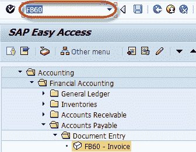
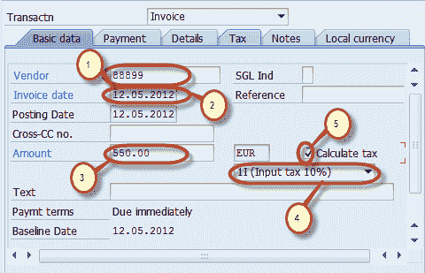
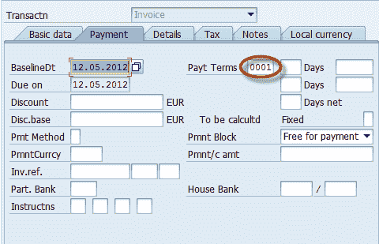
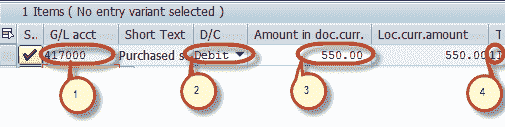
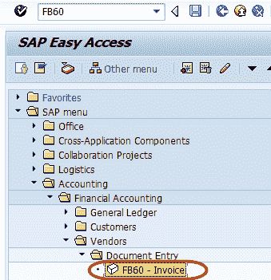
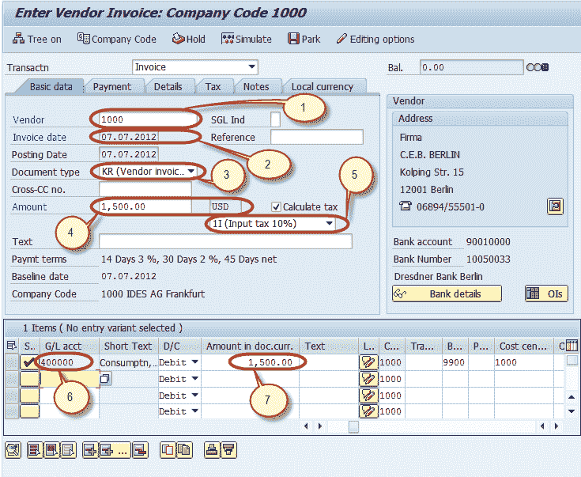
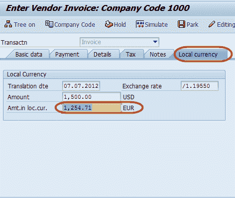
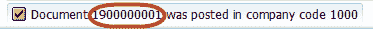

# SAP 中的 FB60：如何过帐采购发票

> 原文： [https://www.guru99.com/how-to-post-a-purchase-invoice.html](https://www.guru99.com/how-to-post-a-purchase-invoice.html)

在本教程中，您将学习-

*   如何过帐采购发票
*   如何过帐外币供应商发票

## 如何过帐采购发票

**步骤 1）**在 SAP 命令字段中输入事务 FB60

**步骤 2）**在下一屏幕中，输入要过帐发票的公司代码

**步骤 3）**在下一个屏幕中，输入以下内容

1.  输入要开发票的供应商的供应商 ID
2.  输入发票日期
3.  输入发票金额
4.  选择适用税种的税码
5.  选择税收指示器“计算税收”。

**步骤 4）**在“付款”标签页中检查付款条款

**步骤 5）**在“项目详细信息”部分中，输入以下内容

1.  输入购买帐户
2.  选择借方
3.  输入发票金额
4.  检查税码

**步骤 6）**完成上述输入后，检查文档的状态

**步骤 7）**按标准栏中的发布按钮

**步骤 8）**并等待文档编号生成并显示在状态栏上以进行确认

您已成功过帐采购发票

## 如何过帐外币供应商发票

**步骤 1）**在 SAP 命令字段中输入事务代码 FB60

**步骤 2）**在下一个屏幕中，输入以下数据

1.  输入要过帐发票的客户的供应商 ID。
2.  输入发票日期
3.  输入凭证类型作为供应商发票
4.  输入将要过帐发票的币种的发票金额（凭证货币）
5.  输入发票中适用的税码
6.  输入要借记的采购总账科目
7.  输入借方金额

**步骤 3）**我们可以在“本地货币”标签中调整汇率

**步骤 4）**维持汇率后，按“保存”以过帐凭证

**步骤 5）**检查状态栏上生成的文件编号

