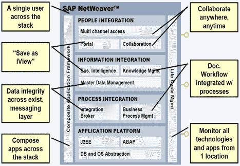

# SAP NetWeaver：10 分钟学习

> 原文： [https://www.guru99.com/what-is-netweaver.html](https://www.guru99.com/what-is-netweaver.html)

## 什么是 NetWeaver？

NetWeaver 是 SAP 的**集成技术平台，本身不是产品**。实际上，新的基础版本称为 Netweaver。

它是 mySAP 套件中所有产品的基础技术。

mySAP 套件中的所有产品都可以在 NetWeaver 的 SAP Web 应用程序服务器（也称为“ SAP WEBA”）的单个实例上运行。

**Netweaver 使使用简单的 HTTP 协议甚至移动设备访问 SAP 数据成为可能。** 这样就无需安装 SAP 客户端软件，而更重要的是进行培训。

SAP NetWeaver 的核心功能是人员，信息和流程的集成

## 人员整合

It simply means that it enables you to bring people together and help them work more efficiently.

**范例：-**

*   **门户：**-提供行业领先的门户技术，可提供统一，个性化和基于角色的用户访问权限
*   **协作：**-协作通过使用虚拟团队室（Collaboration Rooms），实时通信（聊天和应用程序共享）以及使用第三方组件和同步协作工具（例如 Microsoft）来促进企业中的合作 Exchange，Lotus Notes 和 WebEx）
*   **多通道访问：-**使用多通道访问，您可以通过基于 Web 的语音，移动，消息传递或射频技术连接到企业系统。

## 信息整合

意味着您可以将来自各个位置的信息汇总在一起，并在您的同事每天都在做什么的背景下变得有意义！ **范例：-**

*   **商业智能**：-它为您提供了可靠的工具，用于创建单独的交互式报告和应用程序。
*   **BI 内容& BI 内容扩展**：-使用 SAP Business Intelligence 中的预配置角色和面向任务的信息模型，可以更快地实施。
*   **知识管理**：-允许对分布式存储环境中的非结构化信息和文档进行通用访问，例如**搜索，分类，订阅，版本控制** ..
*   **搜索和分类（TREX）：-**为 SAP 应用程序提供大量服务，用于在大量文档（非结构化数据）中进行搜索，分类和文本挖掘，以及在业务对象（结构化）中进行搜索和汇总 数据）。

## 流程整合

这意味着协调跨部门，部门以及公司之间的工作流程。 使用类型流程集成包括 SAP NetWeaver Exchange 基础结构以前涵盖的所有功能，可用于实现跨系统业务流程。 这种 SAP NetWeaver 用法类型使来自运行在不同平台（例如 Java ABAP 等）上的不同供应商的 SAP 和非 SAP 系统的不同版本可以相互通信。 SAP NetWeaver 基于开放式体系结构，主要使用开放标准（尤其是来自 XML 和 Java 环境的标准），并提供异构和复杂系统环境中必不可少的服务。 其中包括用于交换消息的运行时基础结构，用于管理业务流程和消息流的配置选项，以及在消息到达接收者之前映射消息的选项。

## 应用平台

SAP Web Application Server 提供了完整的开发基础架构，您可以在其上开发，分发和执行与平台无关，健壮且可扩展的 [Web 服务](/web-services-tutorial.html)和业务应用程序。 SAP Web Application Server 支持 ABAP，Java 和 Web 服务。