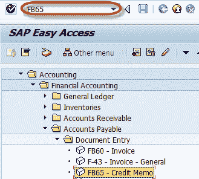
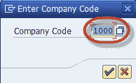
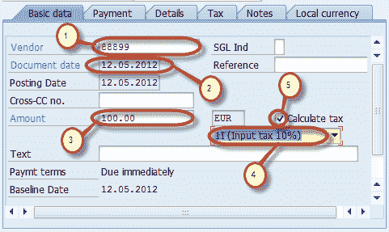
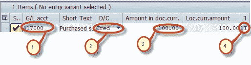

# 如何在 SAP FI 中过帐采购退货 FB65

> 原文： [https://www.guru99.com/how-to-post-a-purchase-returns-credit-memo.html](https://www.guru99.com/how-to-post-a-purchase-returns-credit-memo.html)

在本教程中，我们将学习在 SAP 中过帐采购退货

**步骤 1）**在命令字段中输入事务代码 FB65

**步骤 2）**在下一个屏幕中，输入要为其过帐凭证的公司代码

**步骤 3）**在“基本数据”选项卡中，输入以下数据

1.  输入要向其发行贷项凭证的卖方的卖方 ID
2.  输入文件日期
3.  输入要贷记的金额
4.  输入原始发票中使用的税码
5.  选中计算税额复选框

**步骤 4）**在“项目详细信息”部分中，输入以下数据

1.  输入原始发票的采购帐户
2.  输入要借的金额
3.  选择信用
4.  检查税码

**步骤 5）**检查文件状态

**步骤 6）**按下标准工具栏中的发布按钮

**步骤 7）**在状态栏上查看要生成的文件编号

您已成功为采购退货
过帐供应商贷项通知单