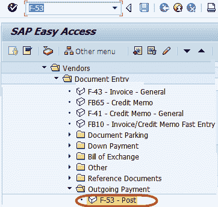
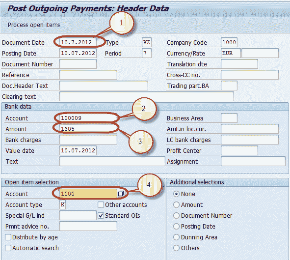
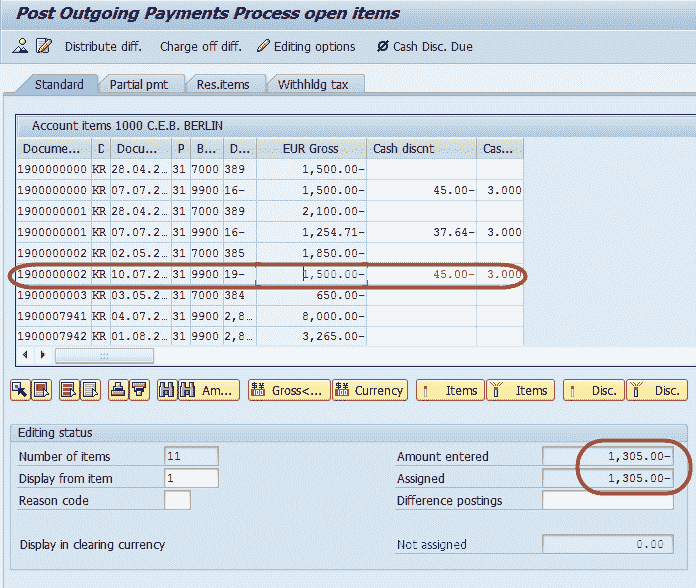
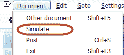
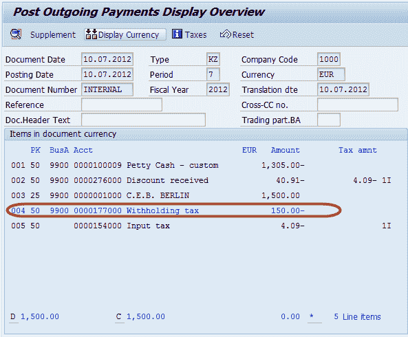
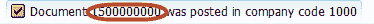
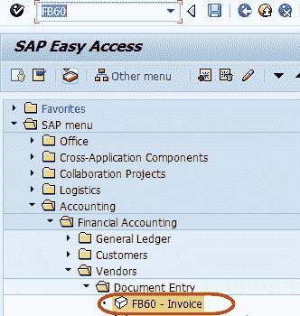
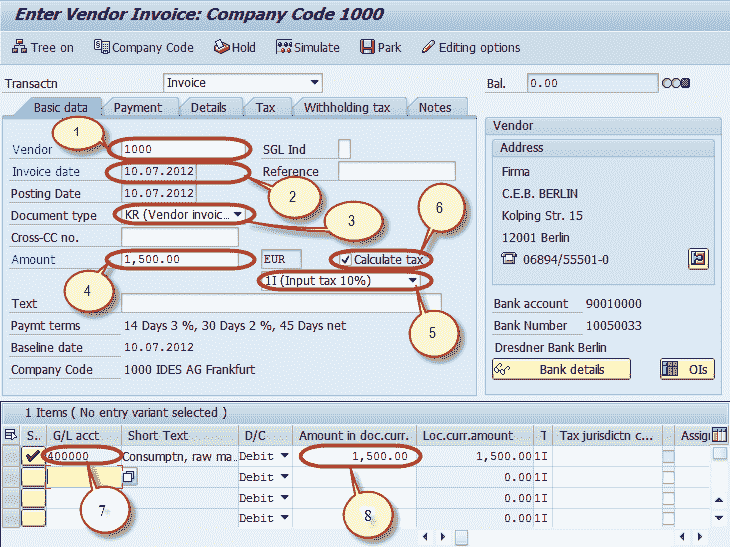
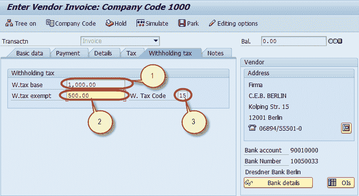
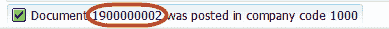

# 供应商发票&付款过帐期间 SAP 中的预扣税

> 原文： [https://www.guru99.com/how-to-post-withholding-tax-during-vendor-invoice-posting.html](https://www.guru99.com/how-to-post-withholding-tax-during-vendor-invoice-posting.html)

在本教程中，您将学习-

*   供应商发票过帐期间过帐预扣税
*   付款过帐期间过帐预提税

## 供应商发票过帐期间过帐预扣税

**步骤 1）**在命令字段中输入交易代码 F-53

**步骤 2）**在下一个屏幕中，输入以下数据

1.  输入文件日期
2.  输入现金/银行帐户付款要过帐
3.  输入付款金额
4.  输入接收付款的供应商的供应商 ID

**步骤 3）**在下一个屏幕中，将付款金额分配给适当的发票，以使付款与发票金额保持平衡

**步骤 4）**从“标准菜单”栏中，导航到模拟清算凭证

**步骤 5）**在下一个屏幕中，我们可以根据发票中输入的基本金额检查是否已预扣代扣税。

**步骤 6）**按标准工具栏中的过帐以过帐付款

**步骤 7）**在状态栏上检查要生成的凭证编号

## 付款过帐期间过帐预提税

**步骤 1）**在 SAP 命令字段中输入事务 FB60

**步骤 2）**在下一屏幕中，输入要过帐发票的公司代码

**步骤 3）**在下一个屏幕中，输入以下内容

1.  输入要开发票的供应商的供应商 ID（已启用预扣税）
2.  输入发票日期
3.  检查凭证类型供应商发票
4.  输入发票金额
5.  选择适用税种的税码
6.  选择税收指示器“计算税收”。
7.  输入购买帐户
8.  输入发票金额

**步骤 4）**完成以上输入后，选择“预扣税”选项卡并输入以下内容

1.  输入税基金额
2.  输入免税额
3.  检查预扣税代码

**步骤 5）**按标准栏中的发布按钮

**步骤 6）**并等待文档编号生成并显示在状态栏上以进行确认

