# 自动付款程序运行 F110：SAP 教程

> 原文： [https://www.guru99.com/all-about-automatic-payment-run.html](https://www.guru99.com/all-about-automatic-payment-run.html)

**简介**
付款流程包括以下步骤

1.  输入发票
2.  分析未结发票的到期日
3.  准备应付发票
4.  付款被批准或修改
5.  发票已付款

始终需要处理大量的发票。 必须按时支付应付帐款发票才能获得可能的折扣。 [会计](/accounting.html)部门希望自动执行此发票处理。 自动付款程序是一种可以帮助用户管理应付帐款的工具。 SAP 为用户提供了自动执行以下操作的选项：

1.  选择要付款或收款的未结（待处理）发票
2.  要过帐的付款凭证
3.  打印付款媒体或生成 EDI

自动付款程序已针对与供应商和客户进行的国内和国际付款交易而开发，可处理付款和收款。 **配置**我们可以通过选择付款程序（Tcode-F110）来配置付款程序。应用程序菜单环境->维护配置

[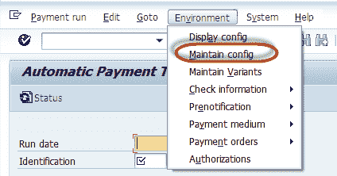](/images/sap/2012/07/AutoPay01.png)

自动付款程序的设置分为以下类别：

1.  所有公司代码
2.  支付公司代码
3.  付款方式/国家
4.  付款方式/公司代码
5.  银行选择
6.  房屋银行

[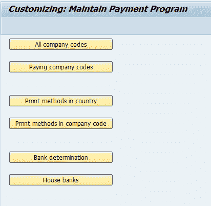](/images/sap/2012/07/AutoPay021.png)

**所有公司代码：**在此部分中，我们执行以下设置

1.  公司间付款关系
2.  公司对处理付款进行编码
3.  现金折扣
4.  付款的宽容天数
5.  要处理的客户和供应商交易

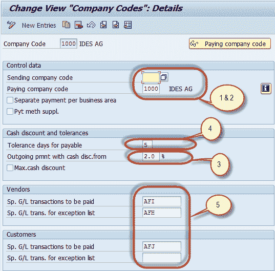

**支付公司代码：**在此部分中，我们执行以下设置

1.  收款和付款的最低金额
2.  汇票参数
3.  付款通知书和 EDI 表格

[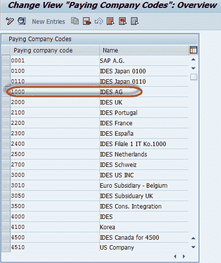](/images/sap/2012/07/AutoPay042.png)

[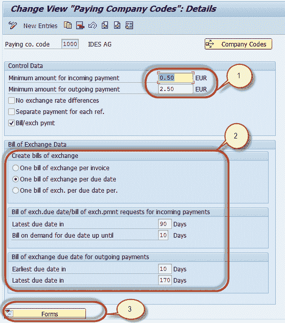](/images/sap/2012/07/AutoPay052.png)

**付款方式/国家/地区：**在此部分中，我们执行以下设置

1.  付款方式-支票，银行转帐等
2.  个别付款方式的设定-
    1.  主记录要求
    2.  过帐的凭证类型
    3.  允许的货币
    4.  打印程序

[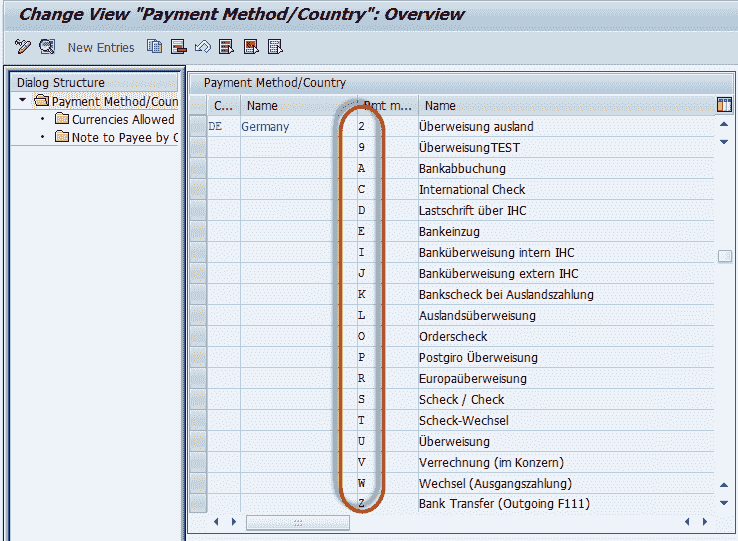](/images/sap/2012/07/Autopay062.png)

[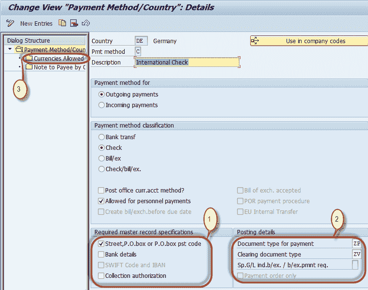](/images/sap/2012/07/Autopay07.png)

**付款方式/公司代码：**在本部分中，我们执行以下设置

1.  最低和最高付款金额
2.  是否允许国外付款和外币付款
3.  分组选项
4.  银行优化
5.  支付媒体表格

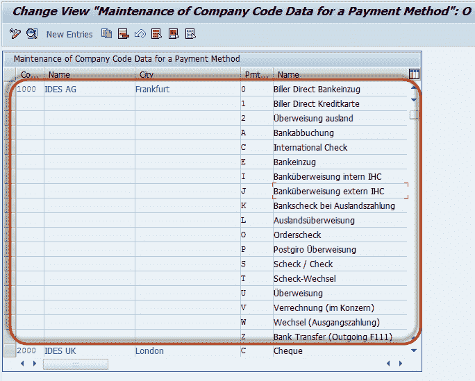

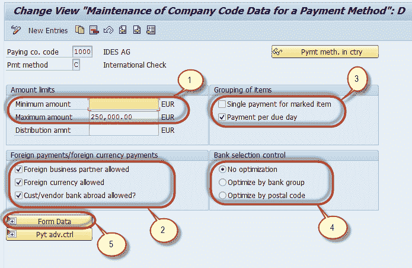

**银行选择：**

1.  排名顺序
2.  金额
3.  帐目
4.  收费标准
5.  起息日

[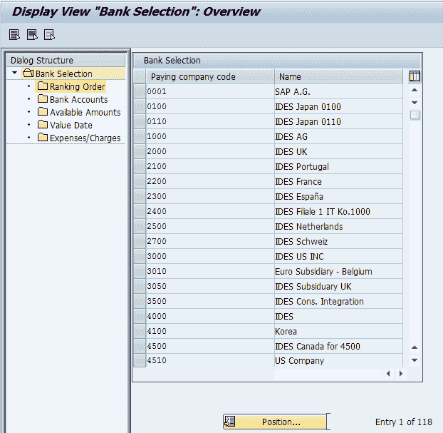](/images/sap/2012/07/Autopay10.png)

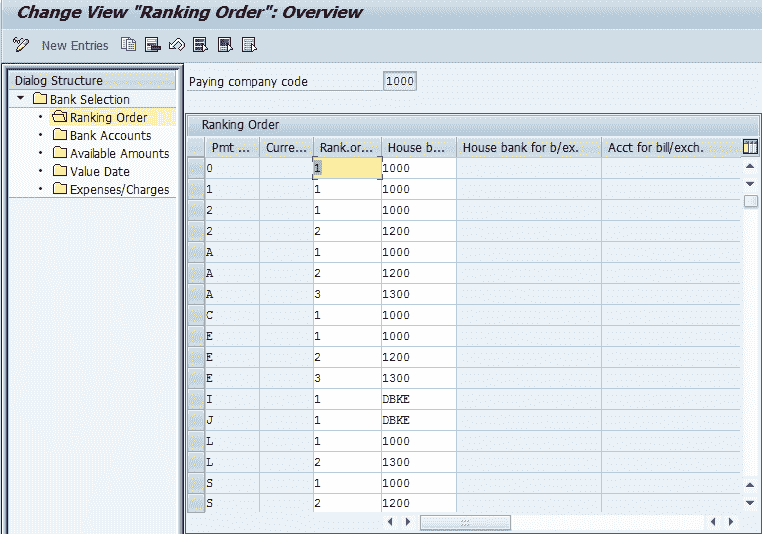

排名顺序

[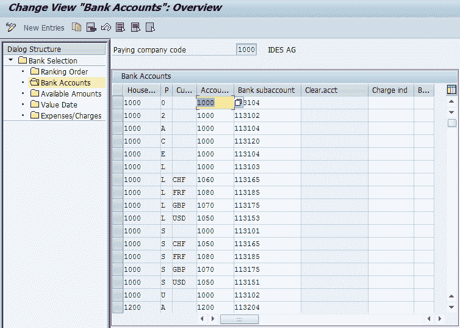](/images/sap/2012/07/Autopay122.png)

银行账户

[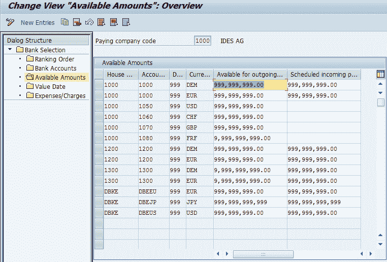](/images/sap/2012/07/Autopay13.png)

可用金额

[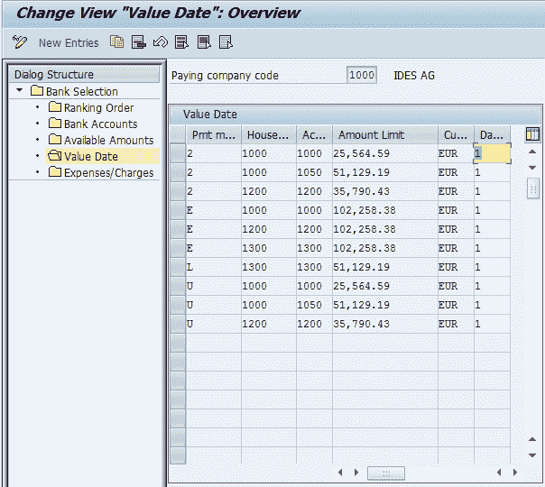](/images/sap/2012/07/Autopay14.png)

Value Dates

[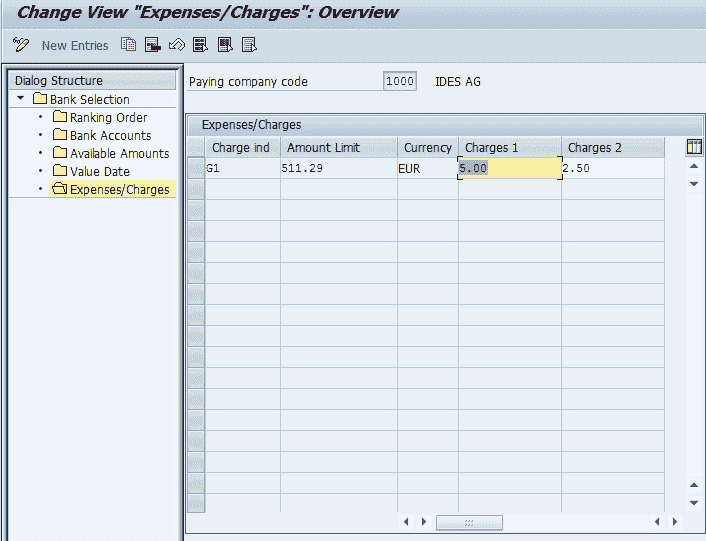](/images/sap/2012/07/Autopay15.png)

Expenses / Charges

**执行：**配置付款流程后，我们将输入参数以执行程序。 在 SAP 命令字段中输入交易代码 F110

[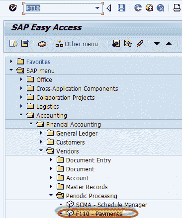](/images/sap/2012/07/Autopay16.png)

每个付款程序运行都由两个字段标识

1.  运行日期
2.  身份证明

[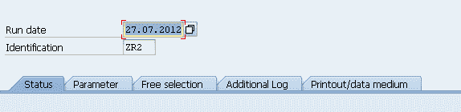](/images/sap/2012/07/Autopay17.png)

在“参数”选项卡中，我们必须定义以下内容

1.  需支付的费用-文件 最多输入
2.  将使用哪种付款方式-付款方式
3.  付款时间-付款日期
4.  将考虑哪些公司代码-公司代码
5.  如何付款-付款方式顺序决定付款方式的优先级

[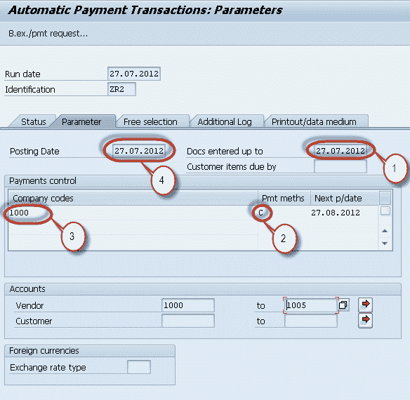](/images/sap/2012/07/Autopay18.png)

保存输入的参数

[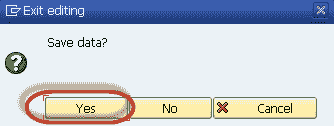](/images/sap/2012/07/Autopay19.png)

输入参数后，我们通过按“应用程序工具栏”中的投标按钮执行程序

在下一个对话框中，选中“立即启动”，然后按继续

[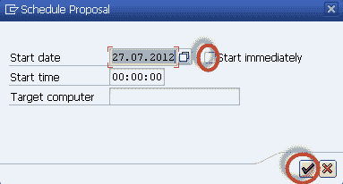](/images/sap/2012/07/Autopay21.png)

根据参数生成付款建议。

我们可以通过按提案日志按钮查看提案日志中可能存在的错误

[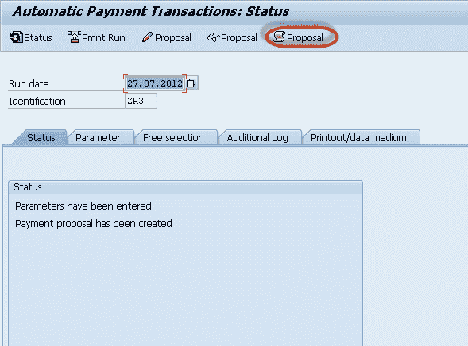](/images/sap/2012/07/AutoPay23.png)

如果需要，我们可以编辑提案以阻止部分付款，请按“编辑提案”按钮

[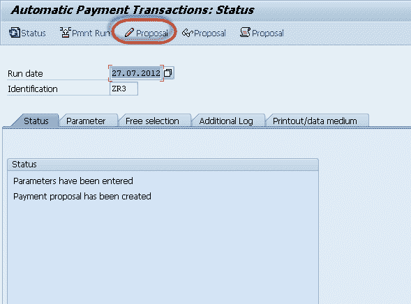](/images/sap/2012/07/AutoPay24.png)

在下一个屏幕中，将生成要接收付款的供应商建议清单

[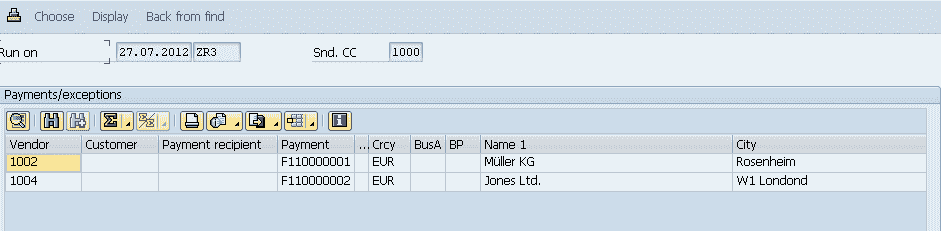](/images/sap/2012/07/AutoPay26.png)

在编辑投标之后，然后运行付款运行以释放付款。 我们可以通过按付款运行按钮回到主屏幕来安排付款运行

[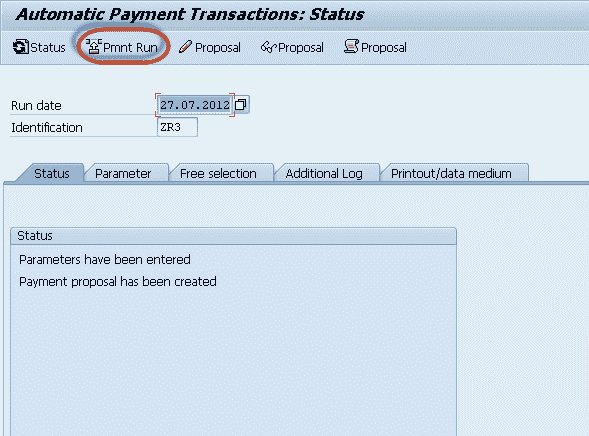](/images/sap/2012/07/AutoPay25.png)

在下一个对话框中，选中“立即开始”以立即开始付款，然后按继续

[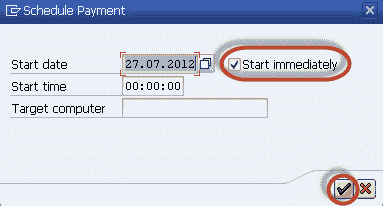](/images/sap/2012/07/AutoPay27.png)

我们可以在状态标签上查看付款运行的状态

[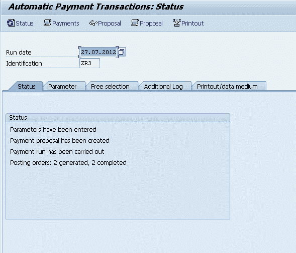](/images/sap/2012/07/AutoPay28.png)