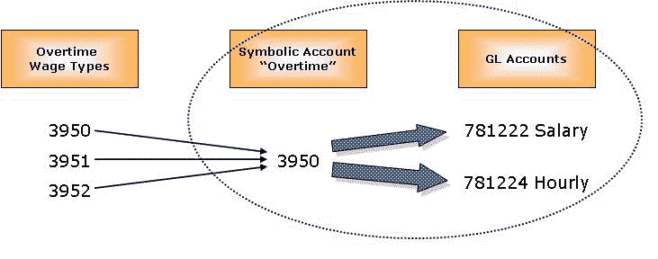
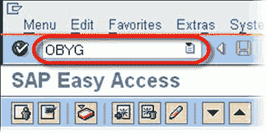
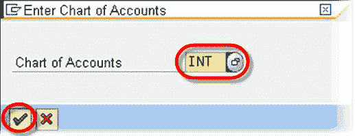
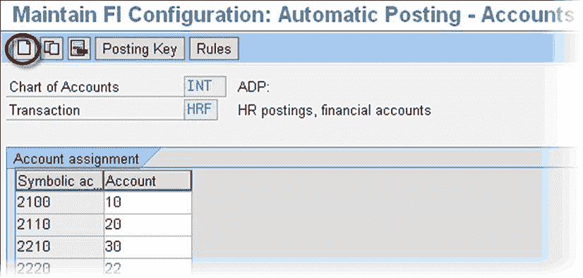
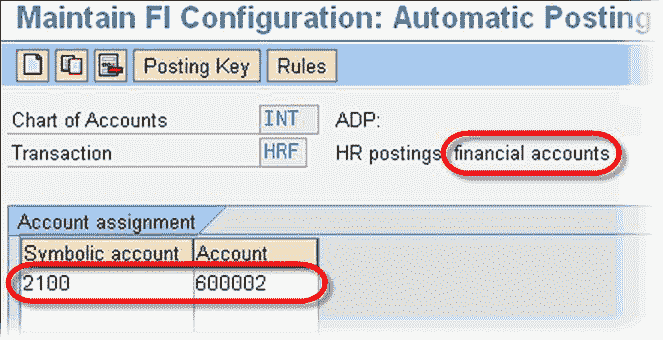
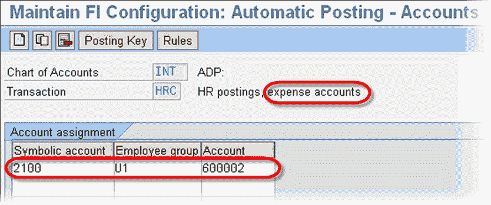

# 如何在 SAP 中将符号科目映射到总账科目

> 原文： [https://www.guru99.com/how-to-map-symbolic-account-to-gl-account.html](https://www.guru99.com/how-to-map-symbolic-account-to-gl-account.html)

以下 SAP 交易用于将符号科目映射到不同的总账科目

*   **OBYG** -将符号帐户映射到财务帐户（**负债**）
*   **OBYE** -将符号帐户映射到费用帐户（**费用**）

**步骤 1）**在 SAP 事务代码框中输入事务 **OBYG**

**步骤 2）**输入**会计科目表**。 点击回车

**步骤 3）**在下一个 SAP 屏幕中，单击创建

**步骤 4）**输入**符号帐户**和**总帐帐户**。 单击保存以完成任务。

**步骤 5）**对于事务**服从**，以上所有过程都是相同的，只是您还必须输入 Employee Group，如下所示。

