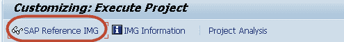
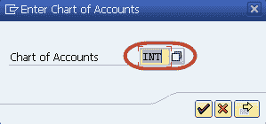
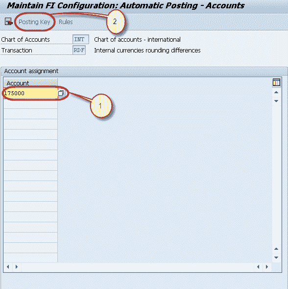
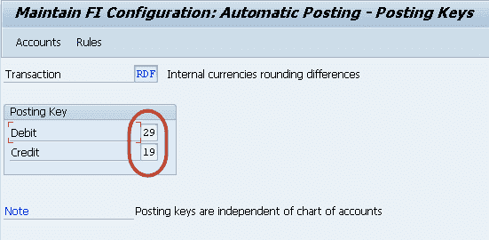
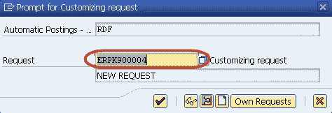

# 在 SAP 教程中发布舍入差异

> 原文： [https://www.guru99.com/posting-rounding-differences.html](https://www.guru99.com/posting-rounding-differences.html)

有时过帐清算凭证时，其金额会四舍五入。
舍入差额可以过账到总账科目。
可能是费用或收入。
在 SAP 中，我们可以按以下方式配置过帐舍入差异的科目。

**步骤 1）**在 SAP 命令字段中输入事务代码 SPRO

在下一个屏幕中，选择“ SAP Reference IMG”

**步骤 2）**在下一个屏幕中，显示 IMG 遵循菜单路径财务[会计](/accounting.html)->应收应付账款->商业交易->往来付款-[ >付款的全局设置->定义四舍五入差异的科目

**步骤 3）**在屏幕中，选择创建总账科目的科目表

**步骤 4）**在下一个屏幕中，输入以下内容

1.  输入过帐了舍入差异的总账科目
2.  选择过帐密钥按钮以设置过帐的贷方和借方密钥

**步骤 5）**在下一个屏幕中，输入贷方和借方过帐密钥

**步骤 6）**在 SAP 标准菜单中按“保存”

**步骤 7）**在下一个屏幕中，输入定制请求编号以保存配置

