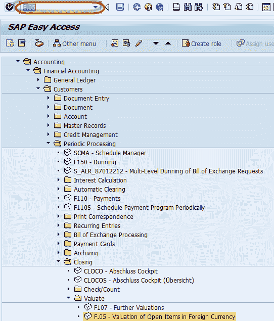
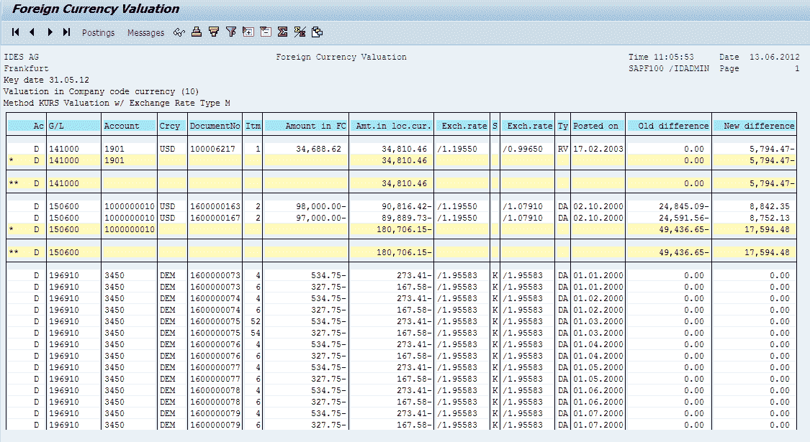

# SAP 中的外币重估：月末结算

> 原文： [https://www.guru99.com/month-end-closing-foreign-currency-revaluation.html](https://www.guru99.com/month-end-closing-foreign-currency-revaluation.html)

在创建财务报表之前，我们必须对以外币进行的交易执行外币评估。

这些交易可以是应收票据或应付票据，也可以是涉及总账科目，客户或供应商的公司间汇款。

可以打开或清除行项目。

对于已清算的行项目，汇率为清算之日的汇率。

对于尚未清算的未清项目，汇率可以视为当前汇率，也可以视为月末汇率，并且可以作为每月结账活动执行。

因此，在年底，由于汇率波动，可能会有一些收入或费用，这将反映在财务报表中。

汇率差异的费用和收入帐户可以在定制交易代码 SPRO 中维护。 在 SAP 中，我们可以通过以下方式进行外币重估：

**步骤 1）**在 SAP 命令字段中输入事务代码 F.05。

**步骤 2）**在下一个屏幕中，输入以下内容

1.  输入要执行外币评估的公司代码
2.  输入评估关键日期
3.  输入汇率对价的评估方法
4.  在币种类型中输入评估（默认为 10：公司代码币种）
5.  您可以通过在选项卡屏幕中输入适当的参数来过滤评估活动。

按执行

**步骤 3）**在下一个屏幕中，将生成总账科目清单，这些报表将由报表 SAPF100 选择用于外币评估。 它评估外币未清项目以及外币资产负债表科目。

