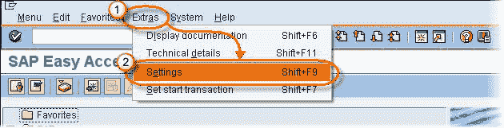
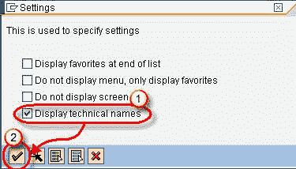
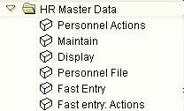
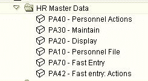

# 如何在 SAP 中显示技术名称

> 原文： [https://www.guru99.com/how-to-display-technical-names-in-sap.html](https://www.guru99.com/how-to-display-technical-names-in-sap.html)

以下 SAP 教程将允许您在 SAP Easy Access 菜单和“用户”菜单中查看交易名称旁边的**交易代码**。

在 SAP 菜单栏中

1.  点击附加
2.  点击设置

在下一个“设置”屏幕中

1.  标记-显示技术名称复选框
2.  点击回车

您将在用户菜单中看到以下变化：

| **之前的** | **之后** 之后 |
|  |  |