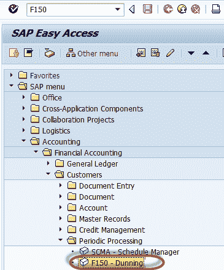
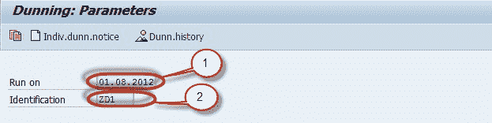
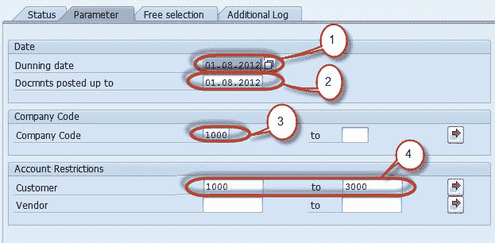
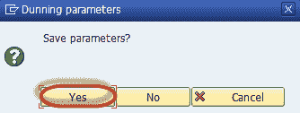
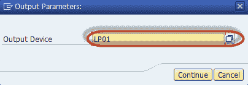
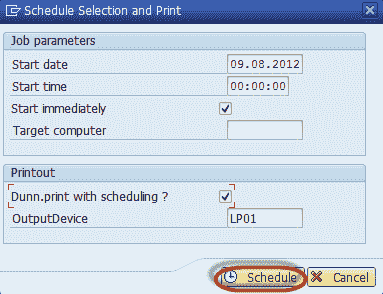
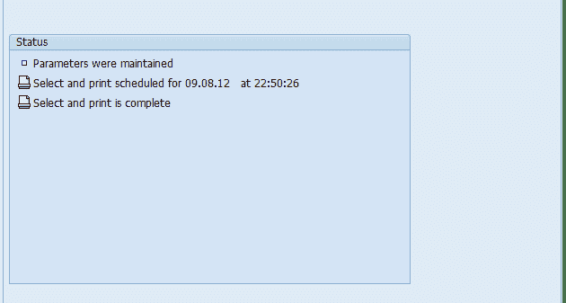
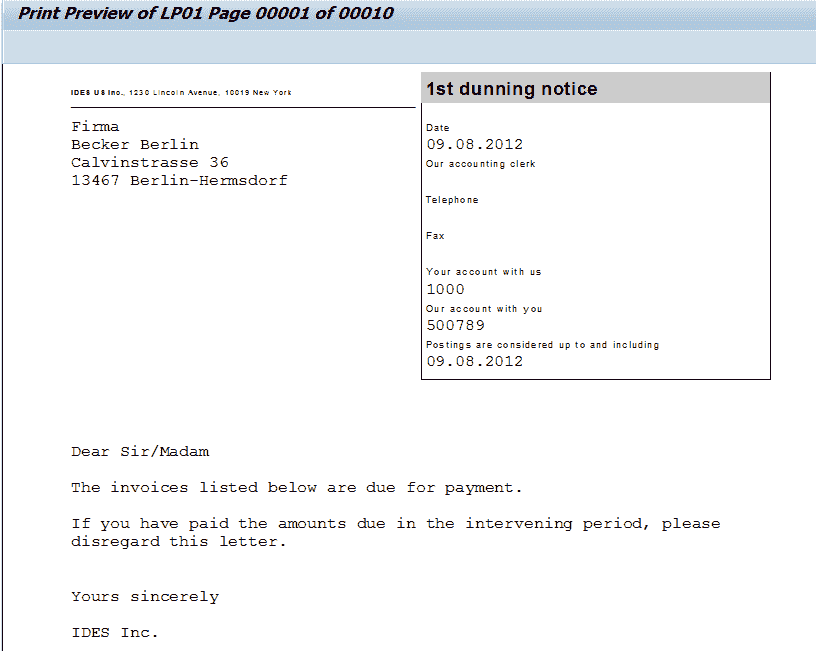
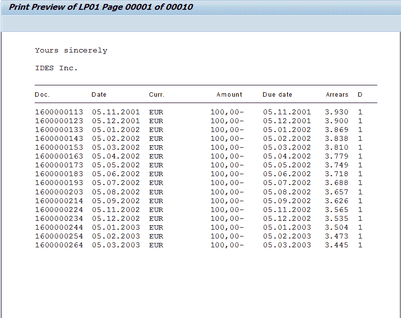
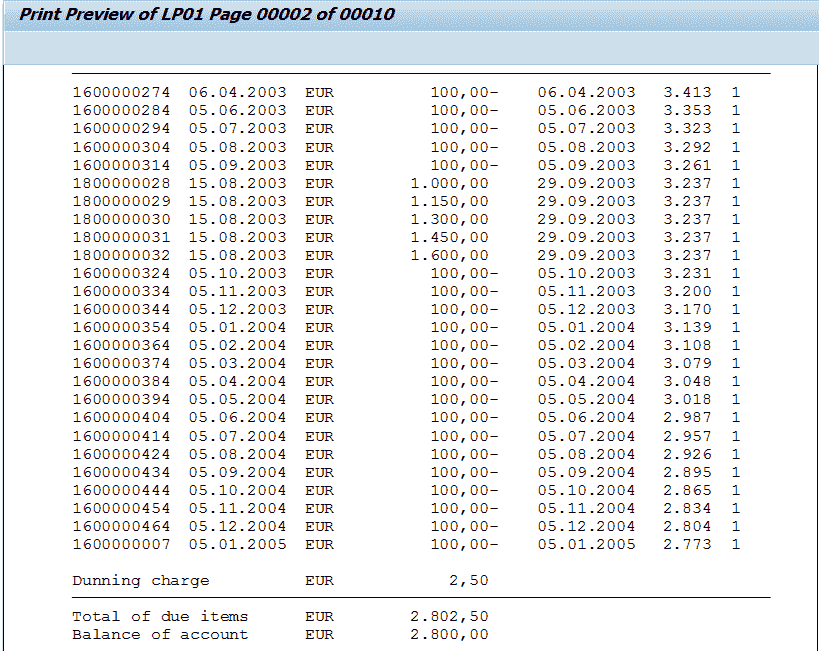

# 如何执行催款：SAP F150

> 原文： [https://www.guru99.com/how-to-perform-dunning.html](https://www.guru99.com/how-to-perform-dunning.html)

**催款**

这是与客户/供应商对未结汇票进行对应的过程（在树液中，我们称其为未清项目）。 在 SAP 中，我们可以安排催款流程并为催款运行维护不同的催款级别。催款流程涉及以下步骤：

1.  在催款程序中输入参数。可以复制旧催款的参数并可以调整日期。
2.  催款运行选择科目，检查它们的过期项目，检查是否必须将其催款，并为其分配催款级别。所有催款数据都存储在催款建议中。
3.  催款提案可以根据需要进行多次编辑，删除和重新创建，直到催款书记对结果满意为止。
4.  如果需要，可以跳过此步骤，可以直接打印出催款通知，然后进行催款运行。
5.  一键式打印出催款通知，并在主记录和相关文档中更新催款数据。

**步骤 1）**我们将执行完全催款运行作为后台计划作业-在 SAP 命令字段中输入事务 F150

**步骤 2）**在下一个屏幕中，输入以下内容

1.  输入催款运行日期
2.  输入催款运行标识

**Step 3)** In the Parameters Tab

1.  输入催款日期
2.  输入要考虑催款凭证的日期
3.  输入公司代码进行催款
4.  输入要取消的客户和供应商

](/images/sap/2012/09/Dunning1.jpg)**Step 4)** Save the Dunning Parameters[**Step 5)** Schedule the Dunning run by pressing the Schedule button**Step 6)** In the next screen select the printer to print the dunning notices generated**Step 7)** In the next screen schedule the time of dunning run**Step 8)** Check the Status of the Dunning run**Step 9)** We can check the Dunning Notice in Spool Requests

