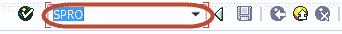
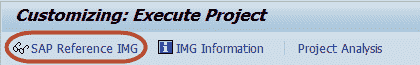
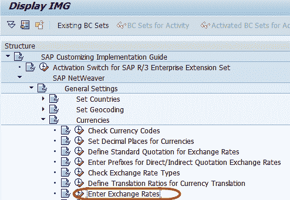
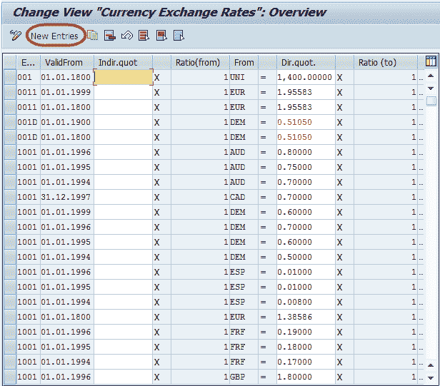
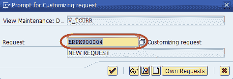

# 如何在 SAP 中维护汇率

> 原文： [https://www.guru99.com/how-to-maintain-exchange-rates.html](https://www.guru99.com/how-to-maintain-exchange-rates.html)

在本教程中，我们将学习在 SAP 中维护汇率

**步骤 1）**在 SAP 命令字段中输入事务代码 SPRO

**步骤 2）**在下一个屏幕中，选择“ SAP Reference IMG”按钮

**步骤 3）**在下一个屏幕“ Display IMG”中，选择菜单路径

SAP Netweaver->常规设置->货币->输入汇率

汇率可以直接或间接报价输入

在直接报价中，我们将基础货币的倍数指定为外币

例如：

1 USD = 56 X 1 INR

对于间接报价，它将是

1/56 USD = 1 INR 在下一个屏幕中，我们可以通过直接/间接报价维护汇率。

在这种情况下，我们将使用间接报价

对于新条目，请选择``新条目''按钮

**步骤 4）**在下一个屏幕中，输入以下内容

1.  输入汇率类型
2.  输入有效的起始日期，即适用税率的起始日期
3.  输入第一货币
4.  输入报价率
5.  输入第二种货币

**步骤 5）**在 SAP 标准菜单中按“保存”按钮

**步骤 6）**在下一个屏幕中，输入定制请求编号，以添加新汇率。

