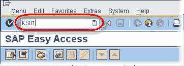
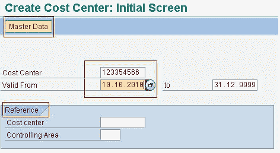
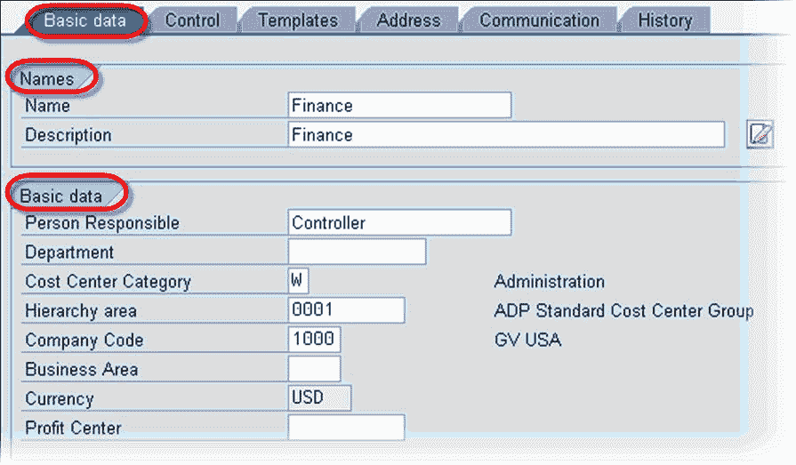
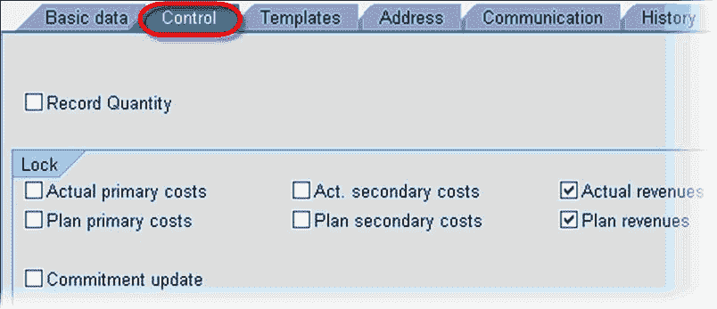
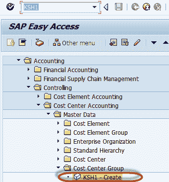
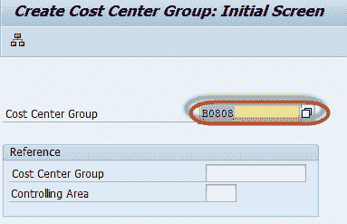
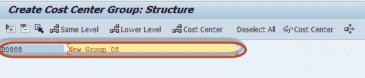

# 如何创建一个新的成本中心：SAP KS01

> 原文： [https://www.guru99.com/how-to-create-a-new-cost-center.html](https://www.guru99.com/how-to-create-a-new-cost-center.html)

在本教程中，我们将学习如何创建一个新的 COST 中心

**步骤 1）**要创建成本中心，请在 SAP 交易代码框中输入 **KS01** 。

**步骤 2）**在下一个 SAP 屏幕中

*   输入新的成本中心编号。
*   输入新成本中心的有效日期。

***可选-*** 在**参考**部分中：

*   在**成本** **中心**字段中，如果详细信息与新成本中心相似，则可以输入参考成本中心。
*   在**控制范围**字段中，您可以输入参考成本中心的控制范围。

在本教程中，我们将创建一个没有参考的成本中心。

**步骤 3）**单击主数据按钮

**步骤 4）**在**名称**部分中：

*   在**名称**字段中，输入新成本中心的名称。
*   在**描述**字段中，输入新成本中心的描述。
*   在**基本数据**部分中：
*   输入**负责人**。

**步骤 5）**在**基本数据**部分中：

*   输入**负责人**
*   为**成本** **中心** **类别**选择 **W（管理）**。
*   选择**层次结构区域**。
*   输入**公司代码**。
*   **货币**将根据之前的选择而默认设置。

**步骤 6）**在**控件**选项卡上，选择适当的指示器。

**步骤 7）**单击保存。 创建新成本中心。

**为什么需要成本中心？**

它是产生成本的地点。可以根据职责范围，功能要求，分配标准，地理位置或提供的活动或服务来设置成本。 其目的是在间接成本[会计](/accounting.html)中提供与成本相关的信息，这些成本中心分为决策，控制和责任单元。 为了映射此结构，将成本中心放置在成本中心标准层次结构中。

**如何创建成本中心组**

**步骤 1）**在 SAP 命令字段中输入事务代码 KSH1

**步骤 2）**在下一个屏幕中，输入要创建的成本中心组 ID

**步骤 3）**在下一个屏幕中，输入成本中心组描述

**步骤 4）**按下 SAP 标准工具栏中的“保存”按钮以创建成本中心组

其他值得注意的 SAP 交易-

**KS02** 到**更改**成本中心
**KS03** 到**显示**成本中心
**KS04** 到**删除**成本中心