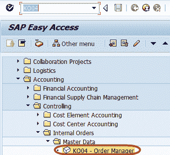
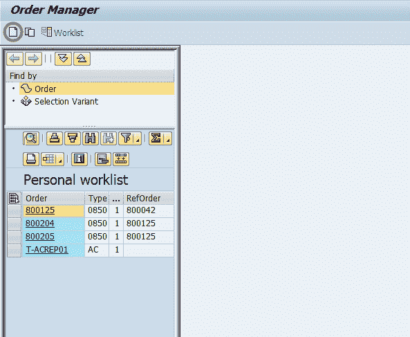
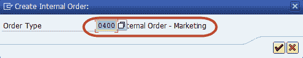
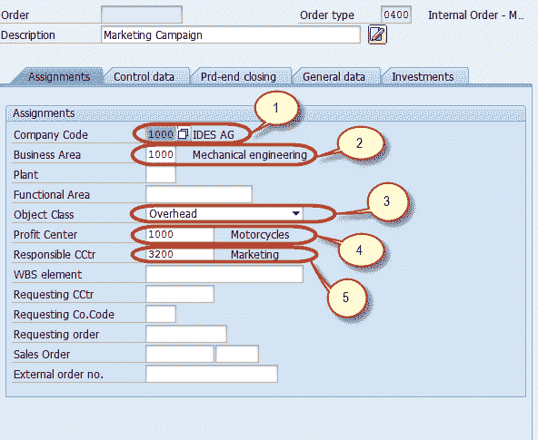

# 有关 SAP 内部订单的全部信息

> 原文： [https://www.guru99.com/all-about-internal-order.html](https://www.guru99.com/all-about-internal-order.html)

**为什么需要内部订单？**

内部订单描述了控制区域内的各个作业。 订单支持面向行动的计划，监视和成本分配。 您可以使用内部订单执行以下操作：

1.  监视结算到成本中心的内部工作（间接费用订单）
2.  监视结算为固定资产的内部职位（投资订单）
3.  抵消以 CO（应计订单）计算的应计成本过账
4.  显示销售和分销客户的成本控制部分，不影响公司的核心业务（有收入的订单）

我们可以使用间接费用订单对特定对象或活动进行详细控制。 与该对象或活动有关的所有成本都分配给相关订单。 我们可以将订单用作内部成本对象。

例如，如果公司参加了 2 个针对新客户的交易会。

如果没有订单，我们会将两个交易会的成本直接过帐到负责支持这些活动的成本中心。 由于外部成本和内部活动在同一成本中心具有相同的成本要素，因此我们无法轻松确定哪个事件创建了哪些成本，这意味着我们无法进行任何进一步分析以进行比较。

另一个优点是为订单提供了多种计划和预算功能。

与“订单”一样，每个事件都会收到自己的间接费用订单，费用是分别收取的。 结算功能将订单成本分配给负责支持交易会的成本中心，从而为您提供成本的组织视图。 这使我们能够分析和比较贸易展览会的结果，即使已经达成和解。

### 如何创建内部订单

**步骤：1** -在 SAP 命令字段中输入事务代码 KO04（订单管理器）

**步骤：2** -在下一个屏幕中，按应用程序工具栏中的“创建”按钮以创建新的内部订单

**步骤：3** -在下一个对话框中，选择要创建的订单类型

**步骤：4** -在下一个屏幕中，输入以下数据

1.  输入公司代码
2.  进入业务区域
3.  输入订单的对象类别
4.  进入利润中心
5.  输入负责内部订单的成本中心

**步骤：5** -按 SAP 标准工具栏中的“保存”按钮，以创建内部订单

**步骤：6** -在状态栏上查看新创建的内部订单号

