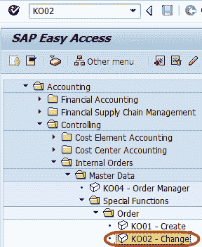
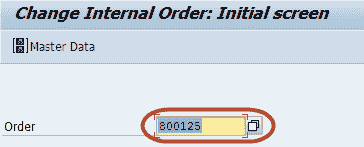
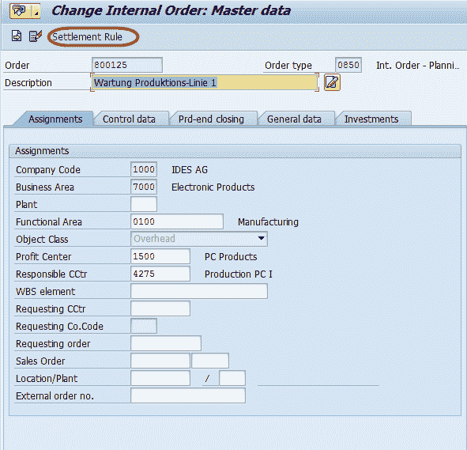
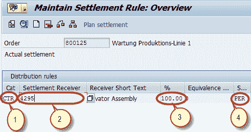
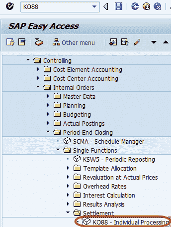
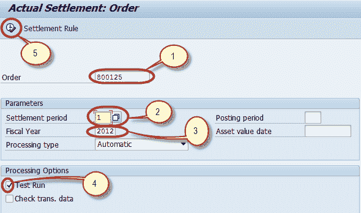

# 内部订单的结算教程：SAP 中的 KO02 & KO88

> 原文： [https://www.guru99.com/settlement-of-internal-orders-to-cost-centers-2.html](https://www.guru99.com/settlement-of-internal-orders-to-cost-centers-2.html)

在本教程中，我们将学习内部订单的结算

**步骤 1）**在 SAP 命令字段中输入事务代码 KO02

**步骤 2）**在下一个屏幕中，输入要进行结算的内部订单

**步骤 3）**在下一个屏幕中，从应用程序工具栏中选择“结算规则”按钮

**步骤 4）**在下一个屏幕中，输入以下内容

1.  在类别列中输入“ CTR”作为成本中心
2.  在“结算接收方”列中，输入要在其中结算订单的成本中心
3.  在百分比列中，输入要结算的百分比金额
4.  在结算类型中，输入“ PER”进行定期结算。

**步骤 5）**在 SAP Standard Toolbar 中按“保存”按钮以保存“结算规则”，然后返回到 SAP Main 菜单。

**步骤 6）**在 SAP 命令字段中输入事务代码 KO88

**步骤 7）**在下一个屏幕中，输入以下条目并运行结算

1.  输入维护结算规则的订单
2.  输入结算期
3.  输入会计年度
4.  取消选中测试运行
5.  按“执行”按钮运行结算

