# 如何执行 SAP 报表

> 原文： [https://www.guru99.com/how-to-execute-sap-reports.html](https://www.guru99.com/how-to-execute-sap-reports.html)

SAP 报告是一个可执行程序，可从数据库读取数据并根据最终用户选择的过滤条件生成输出。

执行 SAP 报表几乎永远不会导致数据库更新。

各种类别的报告是-

1.  标准 SAP 报告
2.  自定义报告-由您的组织开发
3.  临时查询

在执行 **ANY SAP** 报告时必须设置以下元素

## 选择一个时期

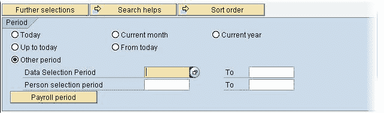

您需要选择一个报告运行的期间，例如**今天（仅当日数据），直到今天（过去直到今天的所有数据），**当月，当年等 。

您可以选择其他期间并为报告的期间指定自定义“自”和“截止”日期

您也可以单击[薪资](/sap-payroll.html)期间按钮 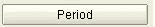 ，并指定工资核算期作为生成您的输出的时间段

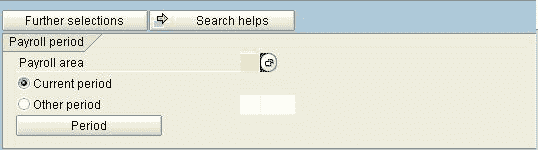

## 选择人口

您可以通过输入以下显示的不同选择条件来限制要为其运行报告的人数。

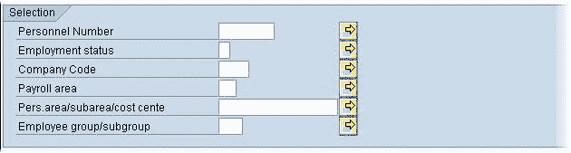

**您可以通过单击“其他选择”将其他选择条件字段**添加到报告中

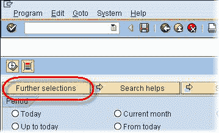

1.  在**选择选项**下，选择要添加到报告选择区域的字段
2.  单击箭头按钮将其发送到右侧

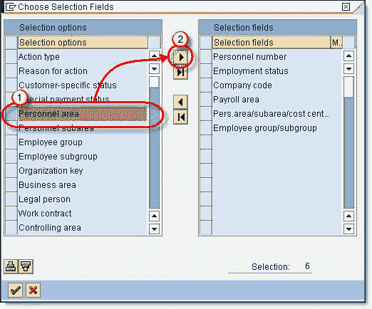

现在，所选字段将出现在**选择字段**列表中

点击复选标记返回

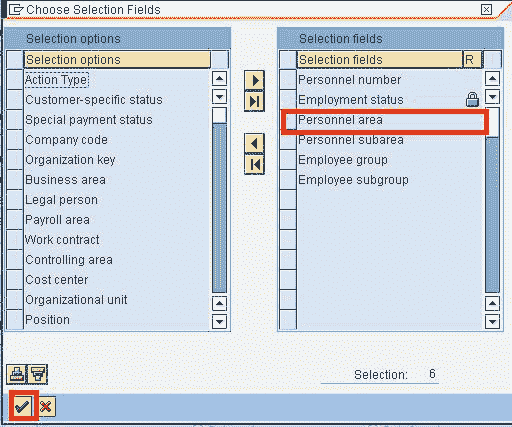

新的选择字段将出现在报告屏幕中。

## 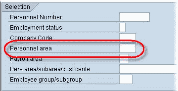

## 
在输入屏幕中限制选择值

您可以在报告中包含范围和单个值
单击“多项选择”按钮

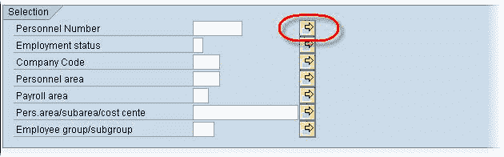

下一个 SAP 屏幕，使您可以

1.  输入将包含的多数值
2.  输入将包括的 vlaues 范围
3.  输入将被排除的多元值
4.  输入将被排除的 vlaues 范围

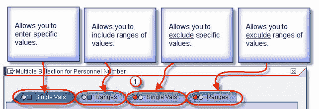

您可以通过使用选择选项（即等于，大于等）进一步限制选择条件。

## 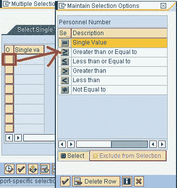

## 
格式化 SAP 报表输出

执行报告后，您可以使用以下工具栏轻松地修改（排序，求和，图形等）生成的输出布局。

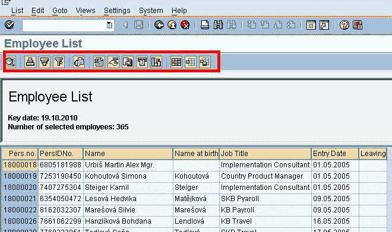

您也可以按照以下步骤将输出保存到本地硬盘

1.  点击列表
2.  出口
3.  本地文件

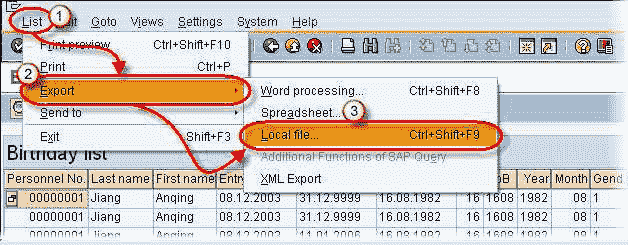

1.  选择所需的格式（文本，电子表格）
2.  点击回车

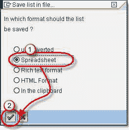

输入目录，文件名，然后单击生成。 该报告必须保存。

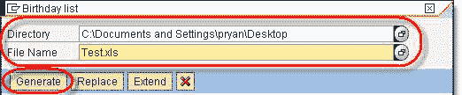