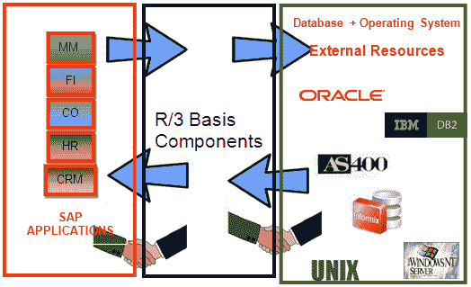

# 什么是 SAP BASIS？ 完整的教程

> 原文： [https://www.guru99.com/introduction-to-basis.html](https://www.guru99.com/introduction-to-basis.html)

##### 什么是基础？

基础是一组程序和工具，它们充当与数据库，操作系统，通信协议和业务应用程序（例如 FI，CO，MM 等）的接口。 BASIS 的完整形式是“业务应用软件集成解决方案”

SAP，FI，CO，PP 等应用程序可以在 BASIS 的帮助下跨不同的操作系统和数据库相互运行和通信。

如今，基础被称为 **Netweaver。**

BASIS 的别名是 SAP Application Server Technology，NetWeaver 的别名是 SAP Web Application Server。

添加了 **Java 堆栈（在 J2EE，BSP，JSP 等中开发的应用程序）后，增强了业务流程的安全标准。** ABAP 和 [Java](/java-tutorial.html) 堆栈均可从一个平台进行监视。 Netweaver 支持标准协议，例如 HTTP，SMTP，XML，SOAP，SSO，WEBDAV，WSDL，WMLSSO，SSL，X.509 和 Unicode 格式**（表示处理文本）**。

可以说**基础是 SAP 应用程序和 ABAP 的操作系统。** Basis 提供与操作系统的通信，数据库通信，内存管理，应用程序数据的运行时收集，Web 请求，交换业务数据等服务。

基础支持许多已知的操作系统（Unix 风格，Microsoft Windows Server 版本，AS400，z / OS 等）和数据库（Oracle，DB2，Informix，Maxdb，Microsoft SQL Server 等）。

 

**我们知道 BASIS 是一套工具。 该工具具有以下不同功能：-**

*   系统监视和管理工具
*   通用监视工具 CCMS（**计算中心管理系统**）可从一个地方监视 R / 3 系统的警报。
*   ABAP 和 Javascript 中的服务器端脚本。
*   使用业务服务器页面来构建在线商店和门户。
*   数据库监视和管理实用程序
*   资源管理，例如内存，缓冲区等。
*   用于用户管理的授权和配置文件管理工具。
*   对系统和业务对象的 Internet 访问控制。
*   通过**运输管理系统将屏幕，程序，布局中的修改从开发转移到生产系统，以确保准确性。**
*   客户端-服务器体系结构和配置。
*   用于表示层的图形用户界面设计。

**SAP Basis 顾问的职责：-**

SAP Basis 是用于应用程序，操作系统和数据库的中间件工具。SAPBasis 顾问应能够执行以下任务：

*   SAP 应用程序服务器监视，ABAP 转储和系统日志分析。
*   性能调优
*   数据库维护，数据库备份计划和还原
*   R / 3，NetWeaver，解决方案管理器安装等。
*   SAP 许可证维护。
*   SAP 环境，运输管理系统安装等
*   客户端创建，客户端复制，客户端删除等
*   创建用户，分配角色，锁定和解锁用户等
*   后台作业调度，作业监视，作业删除等
*   配置文件和操作模式维护
*   应用支持补丁，升级和安装附加组件
*   注意应用和消除错误。
*   系统复制，系统刷新等

这是一个通用列表。 基础顾问还肩负着许多其他责任。 每天您都会学到新东西！