# 如何下载&为 Windows 安装 SAP GUI（FrontEnd）

> 原文： [https://www.guru99.com/guide-to-install-sap-gui-aka-frontend.html](https://www.guru99.com/guide-to-install-sap-gui-aka-frontend.html)

在配置和使用 SAP GUI 之前，您需要按照以下步骤从 SAP Marketplace 下载软件-

**步骤 1）**转到 service.sap.com 以下载 SAP GUI Windows 7.40

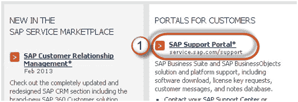

**步骤 2）**输入 SAP 提供的 S 用户和密码。

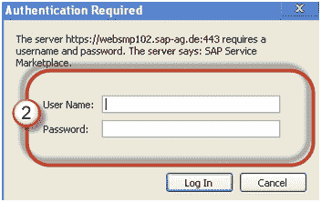

**步骤 3）**转到“软件下载”。

**步骤 4）C** 软管“浏览我们的下载目录”。

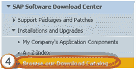

**步骤 5）**选择 SAP 前端组件

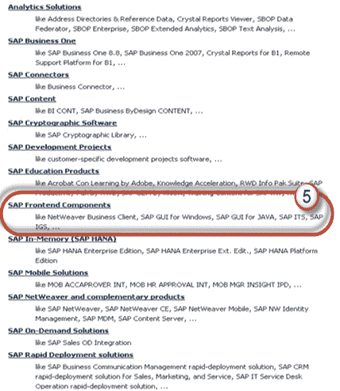

**步骤 6）**为您的操作系统选择 SAP GUI。 在此演示中，我们将选择 Windows-

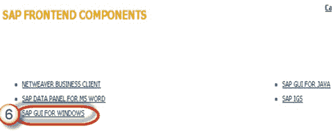

**步骤 7）**选择最新的 SAP GUI 7.30 Core。

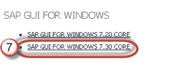

**步骤 8）**选择安装

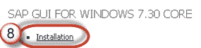

**步骤 9）**选择添加以下载购物篮

**步骤 10）**选择下载篮

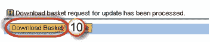

**步骤 11）**选择您的下载，它将开始。

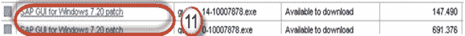

## 是时候配置您的 GUI

下载完成并安装了软件之后，就可以对其进行配置-

**步骤 1）**单击创建按钮，如下所示。

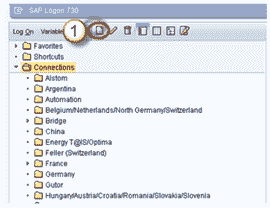

**步骤 2）**单击下一步按钮

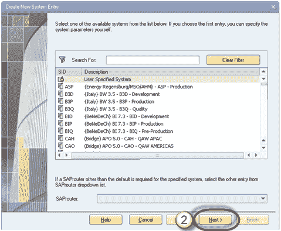

**步骤 3）**填写服务器详细信息

1.  **连接类型**：-自定义应用服务器（特定于一台主机）
2.  **描述**：-实例名称
3.  **应用程序服务器**：-远程应用程序服务器的 IP 地址
4.  **实例号**，可以从操作系统级别（Unix）中找到转到/ usr / sap / sid / DVEBGMS00 这里实例号= 00
5.  **系统 ID** ：-根据您在安装期间指定的设置。

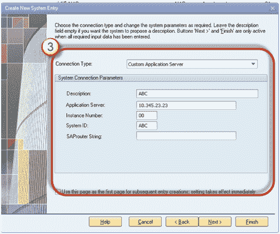

**步骤 4）**创建的系统将出现在列表中，如下所示。

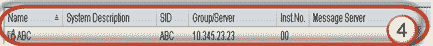

双击实例以登录到 SAP 服务器。