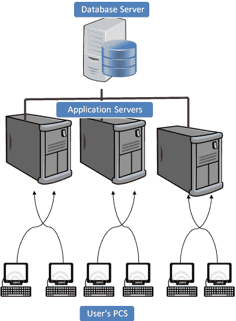
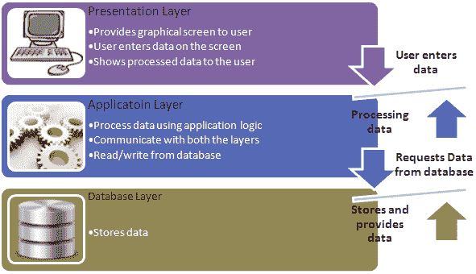
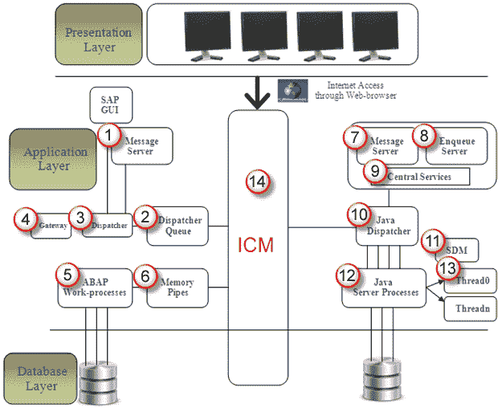
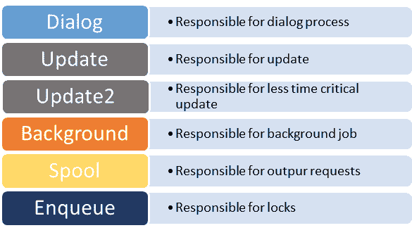
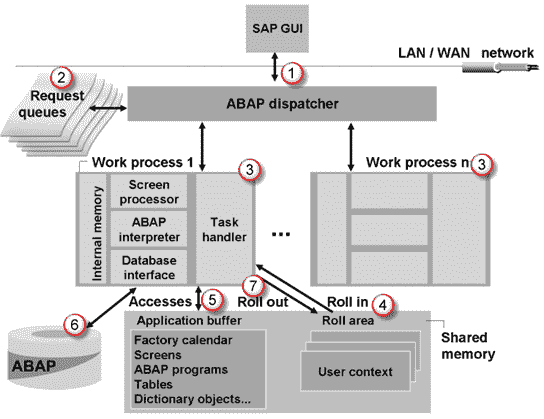

# SAP R / 3 体系结构教程

> 原文： [https://www.guru99.com/learning-sap-architecture.html](https://www.guru99.com/learning-sap-architecture.html)

### 什么是 SAP R / 3？

SAP R / 3 是 3 层架构，由 3 层组成

1.  介绍
2.  应用
3.  数据库

简而言之，它是一种客户端服务器架构。

*   **R** 表示实时系统
*   **3** 代表-3 层架构。

**用户的 PC：-**用户可以通过两种方式访问​​SAP 系统：-

1.  通过 SAP GUI
2.  通过网络浏览器

它称为前端。 仅将前端安装在用户的 PC 中，而不安装在应用程序/数据库服务器中。

前端将用户的请求发送到数据库服务器和应用程序服务器。

**应用程序服务器：-**应用程序服务器用于处理业务逻辑。 此工作负载分布在多个应用程序服务器之间。 使用多个应用程序服务器，用户可以更快地获得输出。

与用户 PC 的位置相比，应用服务器位于远程位置。

**数据库服务器：-**数据库服务器根据 ABAP 和 [Java](/java-tutorial.html) 应用程序生成的 [SQL](/sql.html) 查询来存储和检索数据。

数据库和应用程序可能存在于相同或不同的物理位置。

## 了解不同的 SAP 层

## 表示层**：**

**表示层**包含构成 SAPgui（图形用户界面）的软件组件。 该层是 R / 3 系统与其用户之间的接口。 R / 3 系统使用 SAPgui 为输入和显示数据提供直观的图形用户界面。

表示层将用户的输入发送到应用程序服务器，并从该服务器接收用于显示的数据。 当 SAPgui 组件运行时，它仍链接到 R / 3 系统中用户的终端会话。

## 应用层：

**应用层**由一个或多个应用服务器和消息服务器组成。 每个应用程序服务器包含一组用于运行 R / 3 系统的服务。 从理论上讲，您只需要一台应用服务器即可运行 R / 3 系统。 实际上，服务分布在一个以上的应用服务器上。 消息服务器负责应用程序服务器之间的通信。 它将请求从一台应用程序服务器传递到系统内的另一台服务器。 它还包含有关应用程序服务器组及其中当前负载平衡的信息。 当用户登录系统时，它将使用此信息来分配适当的服务器。

## 数据库层：

**数据库层**由包含 R / 3 系统中所有数据的中央数据库系统组成。 数据库系统具有两个组件-数据库管理系统（DBMS）和数据库本身。 SAP 制造了自己的名为 [Hana](/sap-hana-tutorial.html) 的数据库，但与所有主要数据库（例如 Oracle）兼容。所有 R / 3 数据都存储在该数据库中。 例如，数据库包含确定 R / 3 系统如何运行的控制和自定义数据。 它还包含您的应用程序的程序代码。 应用程序由程序代码，屏幕定义，菜单，功能模块和各种其他组件组成。 这些存储在数据库的一个特殊部分中，称为 R / 3 存储库，因此也称为存储库对象。 在 R / 3 资源库中，ABAP 工作台中使用了对象。

## 了解 SAP R / 3 3 层架构的组件：-

ABAP + Java 系统架构

1.  **消息服务器：**它处理 ABAP 系统**中的分布式调度程序之间的通信。**
2.  **调度程序队列：**各种工作流程类型存储在此队列中。
3.  **调度程序：**它将请求分发到工作流程。
4.  **网关：**它启用 SAP 系统之间以及 SAP 系统与外部系统**之间的通信。**
5.  **ABAP-Work processes: - **It separately executes dialog steps in R/3 applications.Types of work processes are given as below:-

    

6.  **内存管道：**它启用 ICM 和 ABAP 工作流程之间的通信。
7.  **消息服务器：**它处理 Java 调度程序和服务器进程。它允许在 Java 运行时环境中进行通信。
8.  **排队服务器：**它处理在服务器进程中由执行的 Java 应用程序设置的逻辑锁。
9.  **中央服务：** Java 集群需要中央服务的特殊实例，用于管理锁以及传输消息和数据。 Java 集群是一组协同工作以构建可靠系统的过程。 实例是一组资源，例如内存，工作流程等。
10.  **Java Dispatcher：**它接收客户端请求并将其转发到服务器进程**。**
11.  **SDM：** Software Deployment Manager 用于安装 J2EE 组件。
12.  **Java Server 处理：**它可以同时处理大量请求。
13.  **线程：**多个进程在后台分别执行，这个概念称为线程。
14.  **ICM：**启用 SAP 系统与 HTTP，HTTPS，SMTP 协议之间的通信。 这意味着，通过在浏览器中输入系统 URL，您也可以从浏览器访问 SAP。

JCO 是另一个组件。 当系统配置为 ABAP + Java 时，JCO 用于处理 Java 调度程序和 ABAP 调度程序之间的通信。

## SAP 登录过程如何工作？

**步骤 1）**用户从 GUI 单击 SAP 系统后，用户请求将转发到 **Dispatcher。**
**步骤 2）**请求首先存储在**请求队列中。** 分派器遵循**先进先出**规则。 它将找到自由的工作流程，如果有的话，将进行分配。

**步骤 3）**根据用户请求，将特定的工作过程分配给用户。 例如，当用户登录到系统时，对话框工作过程将分配给该用户。 如果用户在后台运行报告，则将后台工作流程分配给该用户。当在数据库级别进行一些修改时，将分配更新工作流程。因此根据用户的操作分配工作流程。

**步骤 4）**一旦为用户分配了对话工作流程，然后进行了用户授权，则用户的当前设置将进入共享内存中的工作流程以访问用户数据。一旦执行对话步骤，便执行 用户数据从工作流程中推出。 这样将清除共享内存，并将其他用户的数据保存在共享内存区域中。 对话步骤表示屏幕移动。 在事务中，当用户从一个屏幕跳到另一个屏幕时，该过程称为对话步骤。

**步骤 5）**第一个工作过程将在缓冲区中找到数据。 如果它在缓冲区中找到数据，则无需从数据库中检索数据。 因此，缩短了响应时间，此过程称为命中。如果未在缓冲区中找到数据，则将在数据库中找到数据，此过程称为未命中。 命中率应始终高于未命中率。 它提高了系统的性能。

**步骤 6）**从数据库中查询其他请求的数据，一旦处理完成，结果将通过调度程序发送回 **GUI。**

**步骤 7）**最终用户的数据将从共享内存中删除，因此其他用户可以使用该内存。此过程称为**部署。**