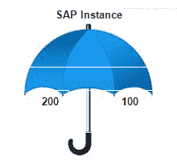
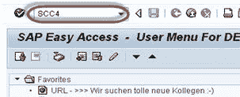
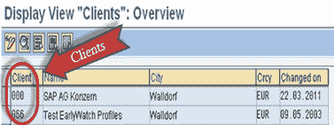
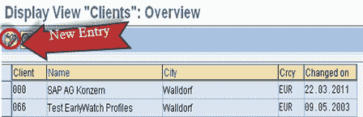
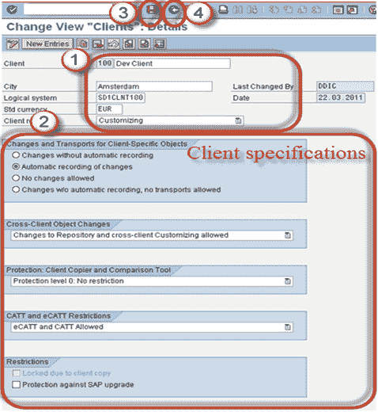
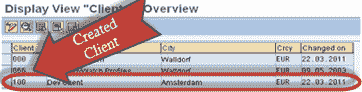

# 什么是客户？ 如何在 SAP SCC4 中创建新客户端

> 原文： [https://www.guru99.com/create-new-client.html](https://www.guru99.com/create-new-client.html)

### 什么是 SAP 客户端？

**客户端**是“客户”。 在 SAP 中。 我们可以说每个客户都映射到一个客户。 在一个 SAP 实例中，可以创建多个客户端。 无需为每个客户安装单独的软件。它提供了隔离，一个客户端无法看到另一个客户端的数据。

如图所示，一个屋顶下有 100 个和 200 个客户。 我们可以在 SAP Application 中创建许多客户端（从 000 到 999）

**客户端包含什么？**

1.  **应用程序数据-**应用程序数据是存储在数据库表中的数据。
2.  **定制数据-**定制数据是客户在定制系统时创建的数据
3.  **用户主记录-**用户主记录定义分配给用户的授权。 基础顾问负责维护用户主记录并分配授权。

**客户概念的优势：-**

1.  客户端使 SAP SAS 提供程序可以安装少量 SAP 系统，但仍可以满足大量客户的需求。
2.  不仅可以通过共享硬件和软件来节省成本，而且多个客户还可以使用相同的应用程序解决方案，包括管理和支持。
3.  客户可以帮助您建立 SAP 环境。 例如，您可以有一个开发团队的客户，一个测试团队的客户和一个生产客户。

**SAP 随附了三个“标准客户端”：-**

1.  000
2.  001
3.  066

**000 客户端：-**一旦安装 SAP r / 3 软件，便可以在系统中找到该客户端。 这称为主客户端。 客户端 000 包含测试公司的简单组织结构，并包括所有应用程序的参数，标准设置以及用于控制标准交易的配置以及将在业务应用程序的许多不同配置文件中使用的示例。 它包含与客户无关的数据。

**001 客户：-**此客户是 000 客户（包括测试公司）的副本。 如果已配置或自定义此客户端的设置，则与客户端无关。 人们通常使用 001 个客户端来创建新客户端。

**066 客户端：-**此客户端称为早期监视客户端。 SAP Earlywatch 警报是一项诊断服务，用于在 SAP Solution Manager 中监视 SAP 和非 SAP 系统的解决方案。 警报可能包含性能问题，平均响应时间，当前系统负载，数据库管理等。

## 如何创建一个新客户？

从理论上讲，我们可以创建 000 到 999 个客户。但是要维护如此大量的客户就成为了一个挑战。
**步骤 1）**执行 T 代码 SCC4

**步骤 2** ）将带您进入 SAP 客户端的初始屏幕。

单击新建条目以创建新的 SAP 客户端

**步骤 3）**

1.  输入以下基本信息。

*   客户编号&说明
*   客户所属的城市（纽约，纽约等）
*   逻辑系统可以是< SID > CLNT <客户编号>
*   标准货币可能是（等欧元）
*   客户角色可以是定制，演示，培训/教育，制作等。

2.  输入您的客户特定数据并根据您的要求设置客户权限
3.  保存
4.  按 F3 返回 **SCC4**

 

**步骤 4）**新客户端将出现在列表中。在这里，我们创建了客户端 100。

