# SAP 客户端副本：本地，远程，导入/导出

> 原文： [https://www.guru99.com/all-about-client-copy-localremote-importexport.html](https://www.guru99.com/all-about-client-copy-localremote-importexport.html)

## 客户副本

我们可以使用 SCC4 生成空白客户端。 ***但是如何在客户端中填充数据？* “答案是客户端副本。”**

客户端副本表示在同一实例（SID）内或不同实例（SID）之间的“ **传输客户端特定数据”** 。

可以使用三种不同的方法执行客户端复制-

1.  本地客户端副本。
2.  远程客户端副本。
3.  客户端导入/导出。

以下是有关客户端复制方法的简短详细信息。

**本地客户端复制：-**此方法用于在同一实例（SID）中复制客户端。此方法通过 T 代码 **SCCL** 完成。

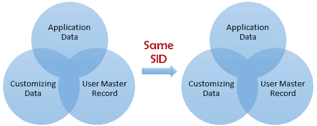

**远程客户端复制：-**此方法用于在不同实例（SID）之间复制客户端。此方法由 T 代码 SCC9 执行。

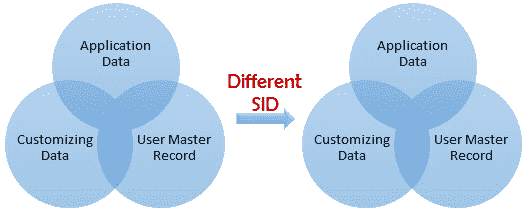

**客户端导入/导出：-**此方法用于在不同实例（SID）之间复制客户端。此方法由 T 代码执行 **SCC8**

## **客户端复制的预备步骤**

为避免数据**不一致**，在开始复制客户端之前，需要执行的前几个步骤：-
**1）断开并锁定业务用户（SU10）。** 您可以通过 **SM04 结束系统中的活动用户会话。** 所有用户注销后，请检查系统中是否没有取消或挂起的更新请求。

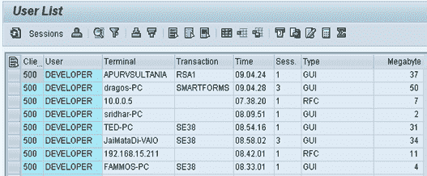

**2）暂停所有后台作业**

*   执行以下**给出的 **SE38** 。**

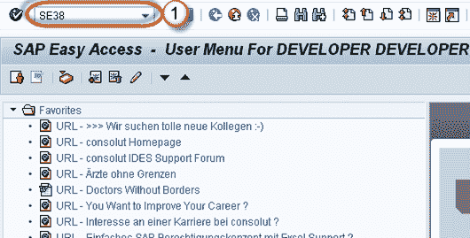

*   如上图，用“ BTCTRNS1”填充程序名称。
*   按执行。

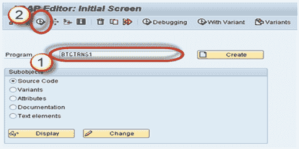 

**3）对于本地副本，系统必须在数据库或表空间**中有足够的空间。
对于远程复制，目标系统必须在数据库或表空间中具有足够的空间。 使用 Tx **DB02 检查空间。**

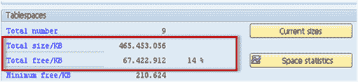 

**4）**为避免客户端复制期间出现不一致，不应允许用户在源客户端中工作。

**5）作为 SAP 建议，rdisp / max_wprun_time** 参数应更改为 2000 秒。 尽管您在后台使用并行进程并计划作业，但仍将使用对话进程。

## 本地客户副本

本地客户端复制使用 **Tcode SCCL 执行。**
**场景：-**

*   源实例&客户端：= DKM-000
*   目标实例&客户端：= DKM-202

**步骤 1）**使用 **SCC4** 为新的目标客户端创建一个条目。 在我们的场景中，我们将在 DKM 系统中创建客户端 202。使用用户 SAP *和默认密码通过登录到这个新创建的目标客户端（ **DKM-202** ）。

**步骤 2）**执行 T 代码 **SCCL。**

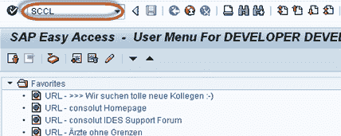

**步骤 3）**

*   选择您想要的个人资料
*   输入源客户端。
*   输入说明

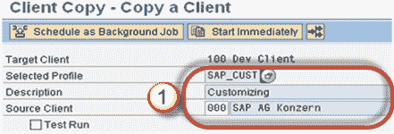

**步骤 4）**默认情况下，客户端复制作为单个进程执行。 单个过程将花费大量时间。 我们会将单个流程的工作负载分配给并行（多个）流程，这将减少复制客户端的时间。

1.  从菜单栏中选择**转到**。
2.  选择**并行进程**。并行进程用于更好地利用数据库的容量

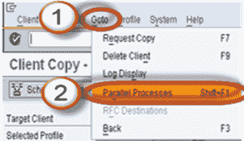

**步骤 5）**始终在后台模式而不是前台/对话框模式下执行长时间运行的进程。 实际上，某些进程在后台运行得更快。

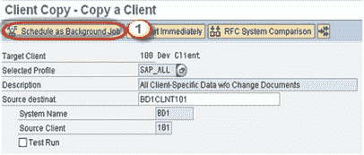

**步骤 6）**客户端复制日志位于 **SCC3** 中。 状态-“ **成功完成”** 表示客户端副本已完成。

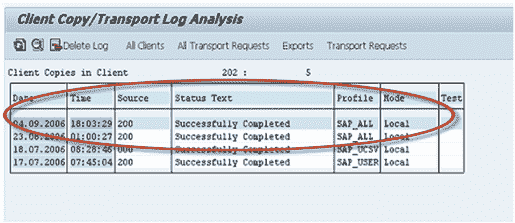

## 远程客户端副本：-

此技术使用远程功能调用。 您可以从 SM59 查看 RFC。 此技术取决于网络，因此网络连接必须足够牢固。

**场景：-**
源实例&客户端：= **BD1-101**
目标实例&客户端：= **DKM -202**
**步骤 1）**登录到目标系统。 在这里，我们将登录到 DKM 系统。 使用 **SCC4 创建一个新的目标客户端条目（202）。** 使用用户 **SAP *** 和默认密码“ **pass** ”登录到此新的目标客户端。在这里，我们将登录 DKM-200 系统。

**步骤 2）**执行交易代码 SCC9。

**[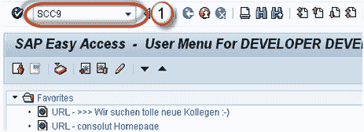 ](/images/sap/2013/02/022613_0657_Introductio24.png)** 

**步骤 3）**根据您的要求填写基本详细信息。

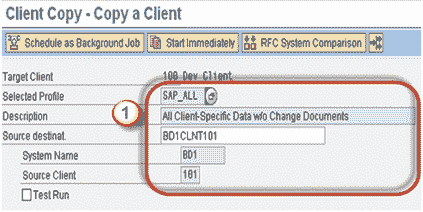 

**步骤 4）**选择并行进程。并行进程用于更好地利用数据库的容量。

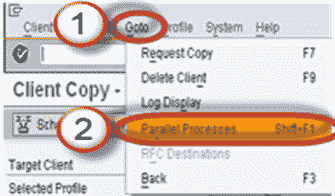 

**步骤 5）**在后台计划客户端副本

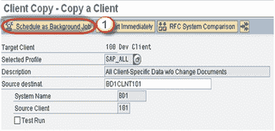 

**步骤 6）**如下所示，客户端复制日志在 **SCC3** 中可用。

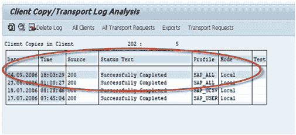 

## 客户导入/导出

对于大型数据库，建议使用客户端导入/导出而不是远程客户端副本。
**场景：-**
源实例&客户端：= **PKT-300**
目标实例&客户端：= **DKM-202**
此技术始终从客户端 ***导出*** 步骤开始。

**注**：-/ usr / sap / trans_SID 文件系统中必须具有足够的空间才能执行客户机导出。

## 如何出口客户？

**步骤 1）**登录到目标系统（DKM）。 使用 **SCC4 为新的目标客户端创建一个条目。** 登录到源系统/源客户端（PKT）。

**步骤 2）在导入客户端之前，您需要导出**。导出只是将数据文件和共同文件从源系统的数据库传输到目标系统的导入缓冲区。执行 T 代码 **SCC8。**

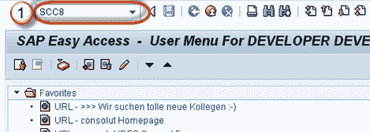 

**步骤 3）**

*   选择个人资料
*   选择目标系统。

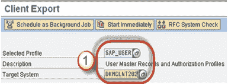 

**步骤 4）**安排后台导出

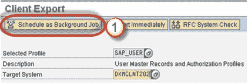 

**步骤 5）**一旦执行了作业，来自 **PKT 系统数据库的数据文件和配置文件的共同文件就会传输到** **DKM** 系统的导入缓冲区中。一旦导入 仅在 DKM 中请求，然后它将反映在 **DKM** 系统的数据库中。

根据所选的导出配置文件，最多可以创建 3 个传输请求：

*   请求 PKTKO00151 将保存跨客户数据，
*   请求 PKTKT00151 将保存客户端相关数据，
*   请求 PKTKX00151 还将保存一些客户端相关的数据。

## 如何导入客户端？

**步骤 1）**使用 SAP *和密码通过登录到新创建的目标客户端（DKM-202）。

**步骤 2）**启动 **STMS_IMPORT** 交易

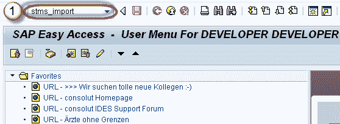 

如下所示，导入队列将打开

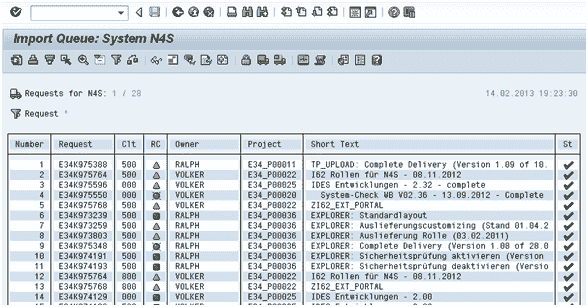 

**步骤 2）** Select 选择客户端导出生成的传输请求。将这些传输请求导入目标客户端。

传输请求应按以下顺序导入：

1.  请求 PKTKO00151
2.  要求 PKTKT00151
3.  请求 PKTKX00151

系统自动检测到这些是客户端导出传输请求，并自动执行 3 个请求的导入。
导入日志可以在 **STMS_IMPORT 中看到。**

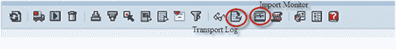 

**步骤 3）导入后阶段：-**
导入完成后，执行 **SCC7** 来执行客户端后导入操作，

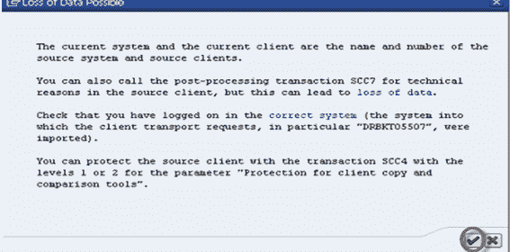 

在后台安排导入后的作业。

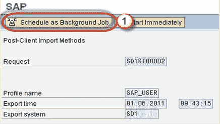 

**步骤 4）**导入日志将在 **SCC3 中可用。** 已成功导入客户端。