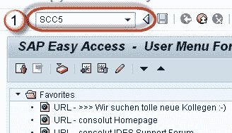
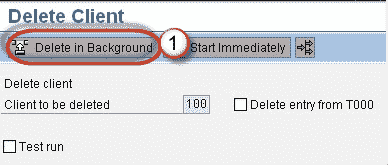
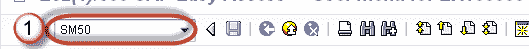
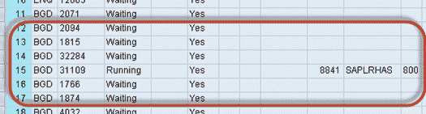

# 如何在 SAP SM50 中删除客户端

> 原文： [https://www.guru99.com/how-to-delete-a-client.html](https://www.guru99.com/how-to-delete-a-client.html)

以下是在 SAP 中删除客户端的详细步骤

**步骤 1）用于客户端删除的** T 代码是 **SCC5** 。

**步骤 2）**单击“在后台删除”以将客户端删除作为后台作业运行。 您还可以检查选项**“从 T000 删除条目”** 表。

表“ T000”包含我们在 **SCC4 中创建的客户条目。**

**步骤 3）**使用 **SM50 检查客户端删除过程的状态。**

将打开工作流程概述。 **“ BGD”** 表示后台工作流程。

完成后。 客户端将被删除