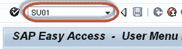
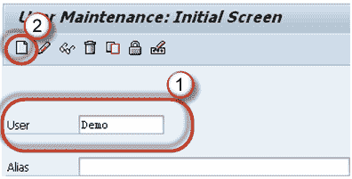
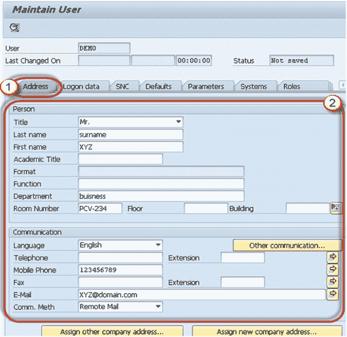
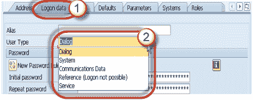
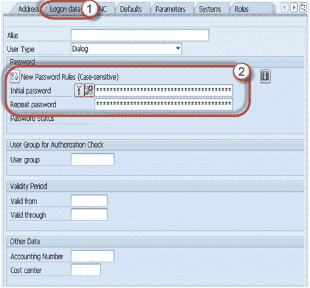
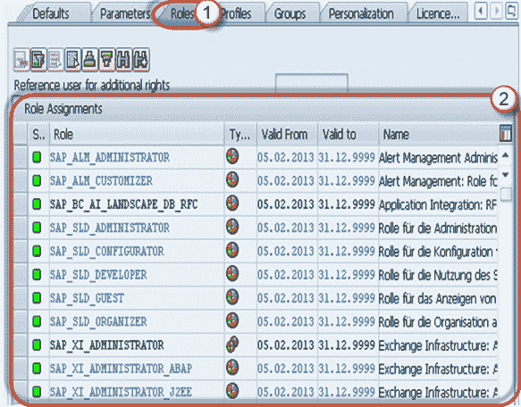
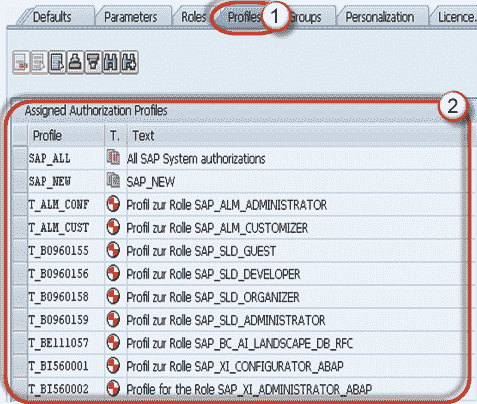

# SU01：如何在 SAP 中创建新用户

> 原文： [https://www.guru99.com/how-to-create-a-user-2.html](https://www.guru99.com/how-to-create-a-user-2.html)

以下是在 SAP 中创建用户的详细步骤

**步骤 1）**执行 T 代码 SU01

**步骤 2）**

1.  输入您要创建的**用户名**。
2.  点击创建按钮

**步骤 3）**在下一个屏幕中

1.  单击**地址**选项卡。
2.  输入细节

**步骤 4）**在**登录数据**选项卡中选择用户类型。

树液中有 5 种类型的用户：

1.  **对话框用户**：-通常用于从 GUI 进行交互式系统访问（用于人类用户）
2.  **系统用户**：-通常，它用于后台处理，系统内的通信。
3.  **通信用户**：-用于外部 RFC 调用。
4.  **服务用户**：-对话框用户可用于较大的匿名用户组。
5.  **参考用户**：-允许分配其他授权的非个人通用用户。 例如，使用事务 SU01 创建的 Internet 用户。 无法登录。

**步骤 5）**键入 2 次**初始密码**。

在新用户首次登录时，系统将要求重新设置密码。

**步骤 6）**

1.  选择角色标签
2.  根据要求分配角色

**步骤 7）**

1.  选择**配置文件**选项卡
2.  根据要求分配配置文件

您可以为用户分配 **SAP_ALL** 和 **SAP_New** 配置文件，以获得**的完全授权。**

*   **SAP_ALL** ：您将此概要文件分配给将具有所有 R / 3 授权（包括超级用户授权）的用户。
*   **SAP_NEW** ：您将此配置文件分配给有权访问所有当前不受保护的组件的用户。 SAP_NEW 概要文件可无限制地访问已引入了附加授权检查的所有现有功能。 因此，用户可以继续使用不受以前执行过的新授权检查的功能而继续工作。

**步骤 8）**

1.  按**保存**
2.  然后**后退按钮（F3）**按钮

用户将被创建！