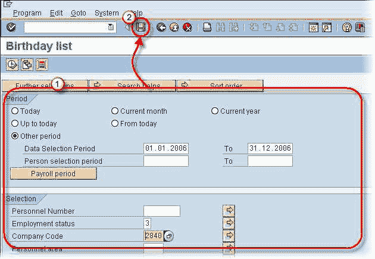
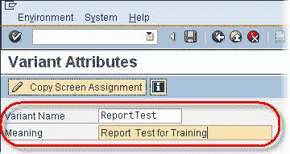
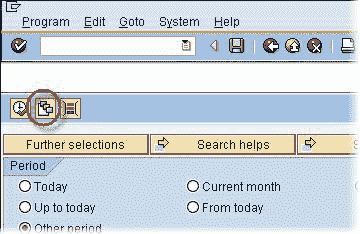
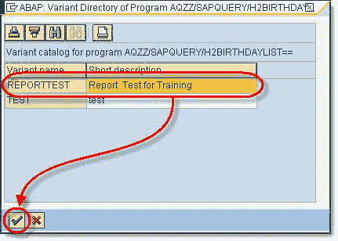
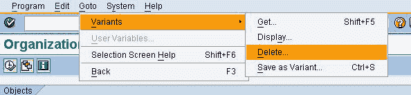
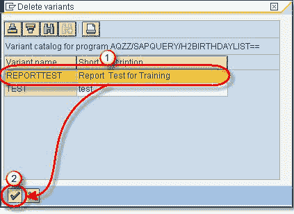
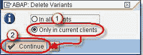

# 如何在 SAP 中创建变式

> 原文： [https://www.guru99.com/what-is-a-variant.html](https://www.guru99.com/what-is-a-variant.html)

变量允许您**将选择参数**保存在输入屏幕中。

It minimizes the need to enter selection parameters each time you run a SAP report.Variants can be stored for **ANY SAP REPORT** as long as the  Save Button is available in the SAP Menu bar for the report.Note: Many a transactions may be proctected due to security reasons by your administrator and save button may not be available

## 创建一个变体

1.  在任何 SAP 报告中时，输入选择标准的值。
2.  填写所有选择条件后，单击“保存”按钮

1.  输入变体名称
2.  变体的类型含义（描述）

单击  保存按钮。

## 检索变体

点击获取变体按钮

1.  突出显示您要使用的变体
2.  单击复选标记

该报告将使用选择标准填充。

## 删除变体

在 ANY SAP 报表中时，选择**转到>变式>删除**

1.  突出显示您要删除的变体
2.  单击确定

在下一个 SAP 弹出窗口中

1.  选择“仅在当前客户端中”单选按钮。 （“所有客户端”选项将删除所有客户端的变体）
2.  点击继续

变体已删除。