# 如何锁定（SU01）&解锁（SU10）SAP 用户

> 原文： [https://www.guru99.com/how-to-lockunlock-a-user-2.html](https://www.guru99.com/how-to-lockunlock-a-user-2.html)

### 锁定用户

锁定用户的目的是暂时停用用户，以使他们无法再访问系统。

用户可以通过两种方式锁定：-

*   自动地
*   明确/强制

自动**：-**用户自动锁定时有两种可能性

*   失败尝试的最大次数：-通过参数 **login / fails_to_user_lock 进行控制。** 如果将值设置为 3，则意味着 3 次尝试失败后，用户将被锁定。
*   自动解锁时间：-“ **login / failed_user_auto_unlock** ”定义是否应在午夜自动删除由于未成功登录而锁定的用户。

**明确/强制：**我们可以通过 2 种方式锁定和解锁用户-

1.  锁定单个用户（ **SU01** ）
2.  锁定多个用户（ **SU10** ）

## 锁定单个用户的过程

**步骤 1）**执行 T 代码 **SU01**

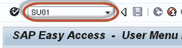

**步骤 2）**在**用户**字段中输入用户名。

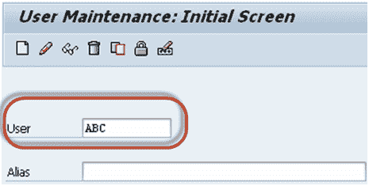

**步骤 3）**按下**锁定/解锁**按钮

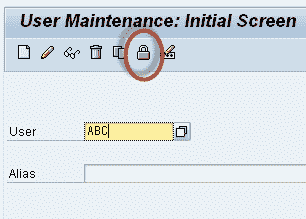

**步骤 4）**在下一个屏幕中，再次按 **Lock** 按钮可锁定用户。

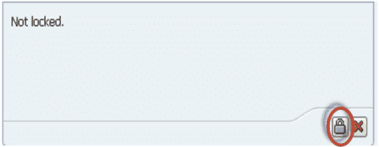

## 锁定多个用户的过程

**步骤 1）**执行 T 代码 **SU10**

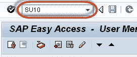

**步骤 2）**在**用户**字段中输入用户名。

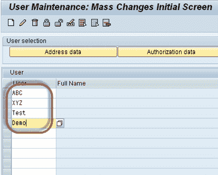

**Step 3)** Press **Lock/Unlock** button

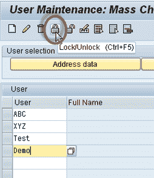

列出的所有用户将被锁定

## 解锁用户的步骤

**步骤 1）**执行 T 代码 **su01**

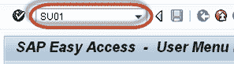

**步骤 2）**在**用户**字段中输入用户名。

**步骤 3）**按下**锁定** / **解锁**按钮

**步骤 4）**按下**解锁**按钮

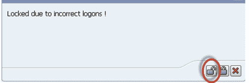

## 解锁多个用户的过程

**Step 1)** Execute T-code **SU10**

**步骤 2）**在**用户**字段中输入用户的用户名。

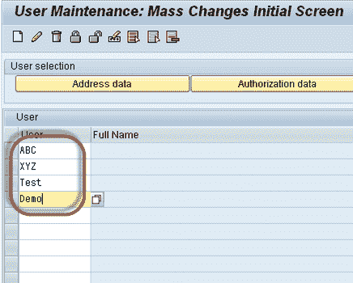

**步骤 3）**按下**解锁**按钮

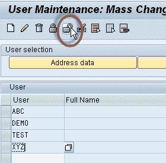

用户将被解锁