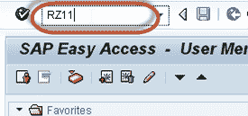
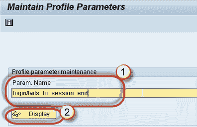
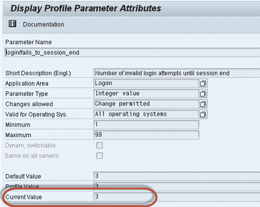

# SAP RZ11：参数（login / fails_to_session_end）限制登录尝试

> 原文： [https://www.guru99.com/how-to-limit-logon-attempts.html](https://www.guru99.com/how-to-limit-logon-attempts.html)

在学习限制登录尝试之前，我们需要了解参数-

## 什么是参数？

**参数**是用于管理 SAP 系统的一组键和值。参数有两种类型-

1.  **静态：-**它需要重新启动。 一旦设置了它的值，它就不会立即对系统产生影响。
2.  **动态：-**不需要重新启动。 一旦设置了它的值，它将立即对系统生效。

## 如何查看参数？

**步骤 1）**执行 T 代码 RZ11。

 
**步骤 2）**

1.  在文本字段中输入参数名称“ ***login / fails_to_session_end”*** 。您可以输入任何参数名称。
2.  点击显示

**步骤 3）**以下屏幕显示管理员
为参数设置的当前值

为了更改参数，请单击铅笔图标并进行所需的更改

## *重要参数，用于限制登录尝试*

*   ***login / fails_to_session_end*** ：此参数指定用户在系统结束登录尝试之前可以输入错误密码的次数。 该参数的值应小于参数的值
*   ***login / fails_to_user_lock*** ：此参数指定用户在系统锁定用户防止其再次尝试登录之前可以输入错误密码的次数。 默认值为 12。您可以将其设置为 1 到 99 之间的任何值。