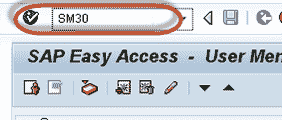
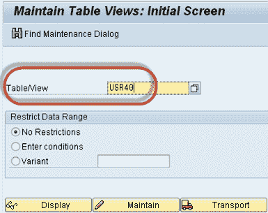
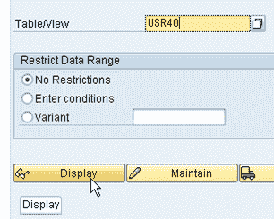
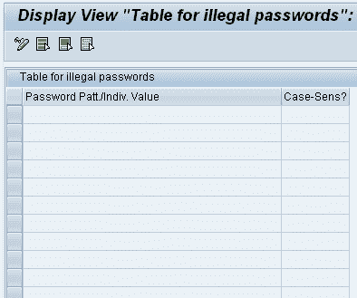

# SAP USR40：如何设置密码限制

> 原文： [https://www.guru99.com/how-to-set-password-restrictions.html](https://www.guru99.com/how-to-set-password-restrictions.html)

您可以使用以下系统配置文件参数来指定密码的最小长度以及用户更改密码的频率。

*   ***login / min_password_lng*** ：最小密码长度。默认值：三个字符。 您可以将其设置为 3 到 8 之间的任何值。
*   ***login / password_expiration_time*** ：密码过期的天数。要允许用户不受限制地保留密码，请将值设置为默认值 0。

## 指定不允许的密码

您可以阻止用户选择您不想允许的密码。 要禁止使用密码，请在表 USR40 中输入密码。 您可以使用事务 SM30 维护表 USR40。 如果需要，可以在 **USR40** 中指定不允许的密码。 有两个通配符：

1.  **？** 代表一个字符
2.  ***** 代表任意长度的任意组合字符的序列。

表 USR40 中的 **123 *** 禁止任何以序列“ 123”开头的密码。

*** 123 *** 禁止任何包含序列“ 123”的密码。

**AB？** 禁止所有以“ AB”开头且具有一个附加字符的密码：“ ABA”，“ ABB”，“ ABC”等。

**要设置密码限制，请按照以下步骤操作：-**

**步骤 1）**执行 T 代码 SM30。

**步骤 2）**在“表格/视图”字段中输入表格名称 USR40。

**步骤 3）**单击显示按钮。

**步骤 4）**输入密码表达字符串。

密码管理就是这样！